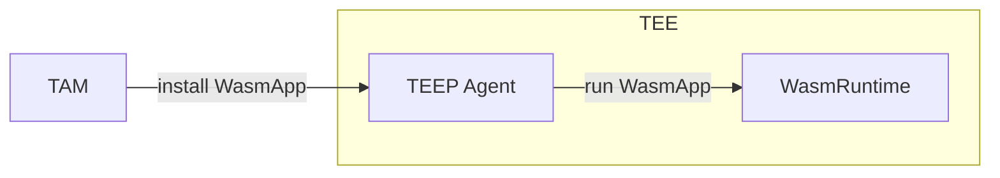
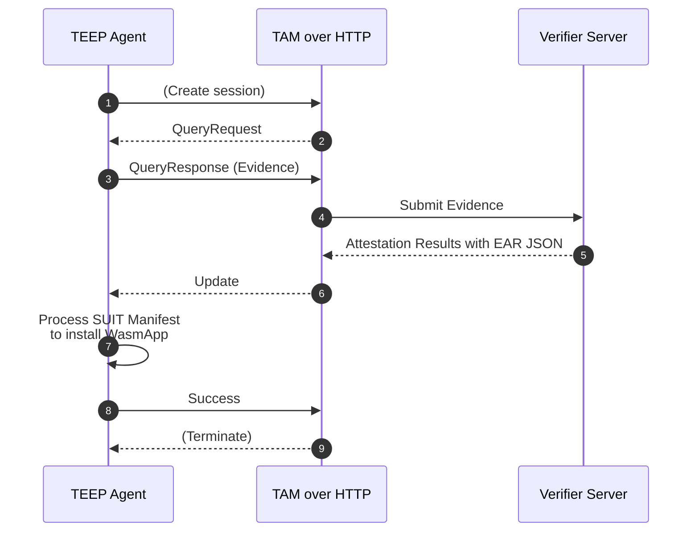

# tam-over-http

`tam-over-http` is a lightweight Trusted Application Manager (TAM) server for exercising WebAssembly-based TEEP (Trusted Execution Environment Provisioning) clients. It serves deterministic QueryRequest / QueryResponse / Update behavior so client implementations can validate COSE/CBOR handling without production infrastructure.



## Quick Start

```bash
go run ./cmd/tam-over-http
```

The mock server listens on `localhost:8080` by default and exposes `POST /tam`.
Send TEEP messages (COSE Sign1) as the request body and inspect logs for response behavior. When a verifier endpoint is configured (via `-challenge-server` or `TAM4WASM_CHALLENGE_SERVER`), the server forwards attestation payloads and logs decoded verifier responses. No attestation files are written to disk.

### Command Options

`tam-over-http` accepts the following CLI flags (also configurable via environment variables exported in the Docker image):

| Flag | Env Var | Default | Description |
| ---- | ------- | ------- | ----------- |
| `-addr` | `TAM4WASM_ADDR` | `:8080` | Listen address for the HTTP server. |
| `-disable-cose` | `TAM4WASM_DISABLE_COSE` | `false` | Serve unsigned CBOR artefacts instead of COSE-wrapped ones where available. |
| `-challenge-server` | `TAM4WASM_CHALLENGE_SERVER` | `https://localhost:8443` | Base URL for the verifier challenge-response endpoint. Leave empty to disable verifier submission. |
| `-challenge-content-type` | `TAM4WASM_CHALLENGE_CONTENT_TYPE` | `application/eat+cwt; eat_profile="urn:ietf:rfc:rfc9711"` | `Content-Type` header used when posting attestation payloads to the verifier. `application/psa-attestation-token` is another supported profile but dynamic TEEP Agent key authentication with Remote Attestation will not be supported. |
| `-challenge-insecure-tls` | `TAM4WASM_CHALLENGE_INSECURE_TLS` | `true` | Skip TLS verification when contacting the verifier; set to `false` in production-like environments. |
| `-challenge-timeout` | `TAM4WASM_CHALLENGE_TIMEOUT` | `1m` | Timeout for the end-to-end verifier interaction. |

Use `go run ./cmd/tam-over-http -h` to see the latest defaults.

## Docker

```bash
docker build -t tam-over-http .
docker run --rm -p 8080:8080 tam-over-http
```

Set environment variables to mirror the CLI flags when you need verifier connectivity, for example:

```bash
docker run --rm -p 8080:8080 \
  -e TAM4WASM_CHALLENGE_SERVER="https://verifier.example.com" \
  -e TAM4WASM_CHALLENGE_CONTENT_TYPE="application/psa-attestation-token" \
  tam-over-http
```

When testing against a verifier running on the host machine, map `host.docker.internal` and forward TLS traffic back to the host:

```bash
docker run --rm -p 8080:8080 \
  --add-host=host.docker.internal:host-gateway \
  -e TAM4WASM_CHALLENGE_SERVER=https://host.docker.internal:8443 \
  tam-over-http
```

The container bundles the embedded CBOR fixtures under `/app/resources` but no attestation response files are persisted during runtime.

## API Endpoints

Method | Endpoint | Purpose
--|--|--
`POST` | `/tam` | TEEP over HTTP session endpoint (empty body, QueryResponse, Success, Error).
`GET` | `/admin/getAgents` | Return TEEP agent status in CBOR for TAM admin.
`GET` | `/admin/getManifests` | Return manifest overviews in CBOR.
`POST` | `/tc-developer/addManifest` | Register a signed SUIT manifest.

See [`doc/EXTERNAL_DESIGN.md`](./doc/EXTERNAL_DESIGN.md) for the API-level design.

## Architecture Overview



Detailed design docs:
- [External Design](./doc/EXTERNAL_DESIGN.md)
  - [TEEP Message Handling](./doc/TEEP_MESSAGE_HANDLE.md)
  - [SUIT Manifest Store](./doc/SUIT_MANIFEST_STORE.md)
  - [TEEP Agent Status](./doc/TEEP_AGENT_STATUS.md)
- [Internal Design](./doc/INTERNAL_DESIGN.md)

## Repository Layout

- `cmd/tam-over-http/` – entrypoint wiring configuration, logging, and HTTP server startup.
- `internal/server/` – HTTP handler
- `internal/tam/` - TAM server
- `internal/infra/sqlite/` - SQLite DBMS managing the TAM status, such as TEEP Agent keys, SUIT Manifests, etc.
- `resources/` – embedded CBOR fixtures (query/update payloads) and generated artefacts surfaced by the test tools.

## Development Workflow

```bash
make run              # Start server locally
make test             # Run unit tests (go test ./...)
make test-integrated  # Run integration-tagged tests (requires provisioned VERAISON server)

# Equivalent direct Go commands:
go run ./cmd/tam-over-http
go test ./...
go test -tags=integration ./...
```

The handler logs every received TEEP message. Verifier responses are decoded and logged, and confirmed TEEP Agent keys are stored in SQLite.

### Get Dummy TEEP Agent status

You can get dummy TEEP Agent status with:

```bash
$ curl -X GET http://localhost:8080/admin/getAgents -H "Accept: application/cbor" -s | cbor2diag.rb
[[h'64756D6D792D746565702D6167656E742D6B69642D666F722D6465762D313233', {"attributes": {256: h'016275696C64696E672D6465762D313233'}, "wapp_list": [[h'8149617070312E7761736D', 3], [h'8149617070322E7761736D', 2]]}]]
```
The result is equivalent to:
```cbor-diag
[
  [
    'dummy-teep-agent-kid-for-dev-123',
    {
      "wapp_list": [
        [
          / SUIT_Component_Identifier: / << ['app1.wasm'] >>,
          / manifest-sequence-number: / 3
        ],
        [
          / SUIT_Component_Identifier: / << ['app2.wasm'] >>,
          / manifest-sequence-number: / 2
        ]
      ],
      "attributes": {
        / ueid / 256: h'016275696C64696E672D6465762D313233' / 0x01 + 'building-dev-123' /
      }
    }
  ]
]
```

See [TEEP_AGENT_STATUS](./doc/TEEP_AGENT_STATUS.md) for more detail.

### Get SUIT Manifests

You can get dummy SUIT manifests with:

```bash
$ curl -X GET http://localhost:8080/admin/getManifests -H "Accept: application/cbor" -s | cbor2diag.rb
[[h'8149617070312E7761736D', 3], [h'8149617070322E7761736D', 2]]
```

The result is equivalent to:
```cbor-diag
[
  [
    / component: / << ['app1.wasm'] >>,
    / manifest-sequence-number: / 3
  ],
  [
    / component: / << ['app2.wasm'] >>,
    / manifest-sequence-number: / 2
  ]
]
```

See [SUIT_MANIFEST_STORE.md](./doc/SUIT_MANIFEST_STORE.md) for more detail.

## Contributing

1. Write focused changes organized under `internal/` packages; keep shared code small and single-purpose.
2. Format with `gofmt`/`goimports`, use PascalCase for exported identifiers, and wrap errors with context (`fmt.Errorf("...: %w", err)`).
3. Add or update tests alongside the code in `*_test.go` files; store golden fixtures under `testdata/`.
4. Ensure `gofmt`/`goimports`, `go test ./...`, and `go vet ./...` succeed before submitting a PR.
5. Use imperative commit messages (e.g., `Add QueryResponse attestation logging`) and include motivation plus verification details in the pull request description.

## Call Graph


