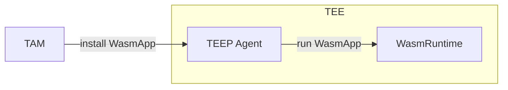
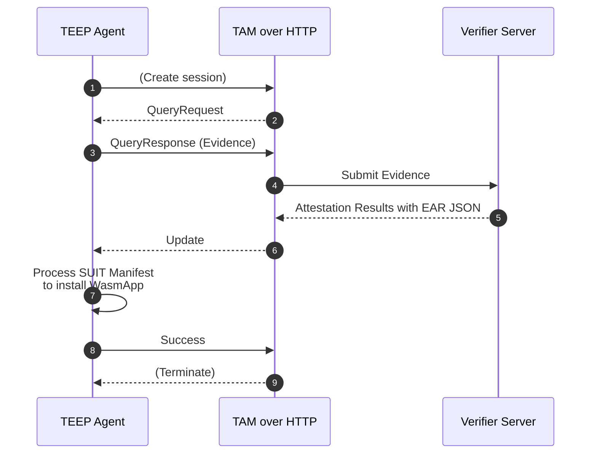
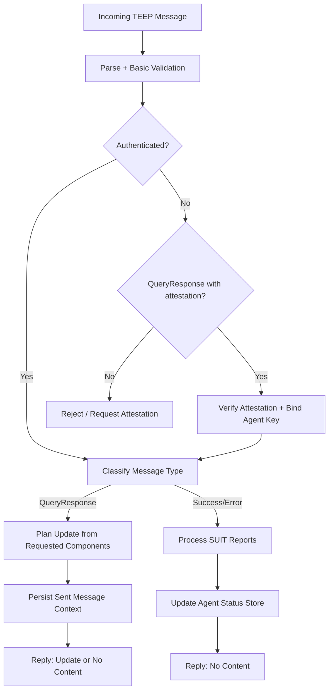

# tam-over-http

`tam-over-http` is a lightweight Trusted Application Manager (TAM) server for exercising WebAssembly-based TEEP (Trusted Execution Environment Provisioning) clients. It serves deterministic QueryRequest / QueryResponse / Update behavior so client implementations can validate COSE/CBOR handling without production infrastructure.



## Quick Start

```bash
go run ./cmd/tam-over-http
```

The mock server listens on `localhost:8080` by default and exposes `POST /tam`.
Send TEEP messages (COSE Sign1) as the request body and inspect logs for response behavior. When a verifier endpoint is configured (via `-challenge-server` or `TAM4WASM_CHALLENGE_SERVER`), the server forwards attestation payloads and logs decoded verifier responses. No attestation files are written to disk.

Use `go run ./cmd/tam-over-http -h` to see available CLI options.
Detailed flag/environment option references are documented in [`doc/USER_MANUAL.md`](./doc/USER_MANUAL.md).

### Docker

```bash
docker build -t tam-over-http .
docker run --rm -p 8080:8080 tam-over-http
```

Set environment variables to mirror the CLI flags when you need verifier connectivity, for example:

```bash
docker run --rm -p 8080:8080 \
  -e TAM4WASM_CHALLENGE_SERVER="https://verifier.example.com" \
  -e TAM4WASM_CHALLENGE_CONTENT_TYPE="application/psa-attestation-token" \
  tam-over-http
```

When testing against a verifier running on the host machine, map `host.docker.internal` and forward TLS traffic back to the host:

```bash
docker run --rm -p 8080:8080 \
  --add-host=host.docker.internal:host-gateway \
  -e TAM4WASM_CHALLENGE_SERVER=https://host.docker.internal:8443 \
  tam-over-http
```

The container bundles the embedded CBOR fixtures under `/app/resources` but no attestation response files are persisted during runtime.

## API Endpoints

Method | Endpoint | Purpose
--|--|--
`POST` | `/tam` | TEEP over HTTP session endpoint (empty body, QueryResponse, Success, Error).
`GET` | `/admin/getAgents` | Return TEEP agent status in CBOR for TAM admin.
`GET` | `/admin/getManifests` | Return manifest overviews in CBOR.
`POST` | `/tc-developer/addManifest` | Register a signed SUIT manifest.

See [`doc/EXTERNAL_DESIGN.md`](./doc/EXTERNAL_DESIGN.md) for the API-level design.
For usage examples (`curl`, endpoint behavior, test commands), see [`doc/USER_MANUAL.md`](./doc/USER_MANUAL.md).

## Documentation

- [User Manual](./doc/USER_MANUAL.md)
- [External Design](./doc/EXTERNAL_DESIGN.md)
  - [TEEP Message Handling](./doc/TEEP_MESSAGE_HANDLE.md)
  - [SUIT Manifest Store](./doc/SUIT_MANIFEST_STORE.md)
  - [TEEP Agent Status](./doc/TEEP_AGENT_STATUS.md)
- [Internal Design](./doc/INTERNAL_DESIGN.md)
  - [TAM Status SUIT Manifest Store](./doc/TAM_STATUS_SUIT_MANIFEST_STORE.md)
  - [TAM Status TEEP Agent Status](./doc/TAM_STATUS_TEEP_AGENT_STATUS.md)

## Architecture Overview



## Repository Layout

- `cmd/tam-over-http/` – entrypoint wiring configuration, logging, and HTTP server startup.
- `internal/server/` – HTTP handler.
- `internal/tam/` – TAM core orchestration.
- `internal/infra/sqlite/` – SQLite persistence for TAM state (TEEP Agent keys, SUIT manifests, tokens, etc.).
- `resources/` – embedded CBOR fixtures (query/update payloads) and generated artefacts surfaced by the test tools.

## Development Workflow

```bash
make run              # Start server locally
make test             # Run unit tests (go test ./...)
make test-integrated  # Run integration-tagged tests (requires provisioned VERAISON server)

# Equivalent direct Go commands:
go run ./cmd/tam-over-http
go test ./...
go test -tags=integration ./...
```

The handler logs every received TEEP message. Verifier responses are decoded and logged, and confirmed TEEP Agent keys are stored in SQLite.

## Contributing

1. Write focused changes organized under `internal/` packages; keep shared code small and single-purpose.
2. Format with `gofmt`/`goimports`, use PascalCase for exported identifiers, and wrap errors with context (`fmt.Errorf("...: %w", err)`).
3. Add or update tests alongside the code in `*_test.go` files; store golden fixtures under `testdata/`.
4. Ensure `gofmt`/`goimports`, `go test ./...`, and `go vet ./...` succeed before submitting a PR.
5. Use imperative commit messages (e.g., `Add QueryResponse attestation logging`) and include motivation plus verification details in the pull request description.

## TEEP Message Handling Overview



See [TEEP_MESSAGE_HANDLE.md](./doc/TEEP_MESSAGE_HANDLE.md) for more detail.
