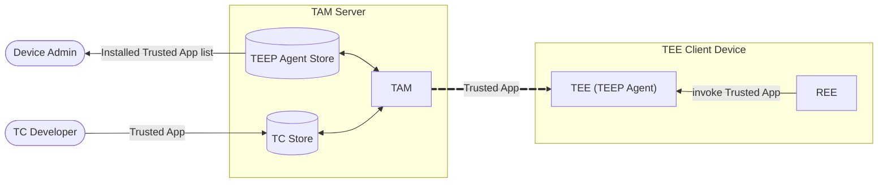

# tam-over-http

`tam-over-http` is a lightweight Trusted Application Manager (TAM) server defined in [RFC 9397 (TEEP Architecture)](https://datatracker.ietf.org/doc/html/rfc9397) for exercising TEEP (Trusted Execution Environment Provisioning) clients over HTTP.

A TAM serves as an intermediary that communicates with TEE-equipped devices, specifically the TEEP Agent inside the TEE, when **a Trusted Component (TC) Developer wants to run a Trusted Application in a remote device's TEE while protecting it from tampering or unauthorized access**.

Although the TEEP Architecture requires that a Device Administrator be able to learn which Trusted Applications are installed in the TEE, it does not assign that responsibility to the TAM. In this implementation, however, **the TAM also provides this information as a design choice**.



To support the architecture shown above, the TAM provides three primary communication channels:
1. SUIT Manifest Service API: Receives Trusted Applications from the TC Developer. (see [SUIT_MANIFEST_STORE.md](./doc/SUIT_MANIFEST_STORE.md))
2. TAM's TEEP-over-HTTP API: Delivers Trusted Applications to the TEE. (see [TEEP_MESSAGE_HANDLE.md](./doc/TEEP_MESSAGE_HANDLE.md))
3. TEEP Agent Service API: Provides the Device Admin with a list of Trusted Applications installed in the device's TEE. (see [TEEP_AGENT_STATUS.md](./doc/TEEP_AGENT_STATUS.md))

## Quick Start

See [USER_MANUAL.md](./doc/USER_MANUAL.md) for details.

### A) Native

```bash
go run ./cmd/tam-over-http -insecure-demo-mode
```

The mock server listens on `localhost:8080` by default and exposes `POST /tam`.
Send TEEP messages (COSE Sign1) as the request body and inspect logs for response behavior. When a verifier endpoint is configured (via `-challenge-server` or `TAM4WASM_CHALLENGE_SERVER`), the server forwards attestation payloads and logs the decoded verifier responses. No attestation files are written to disk.

Use `go run ./cmd/tam-over-http -h` to see available CLI options.
Detailed references for flags and environment variables are documented in [`doc/USER_MANUAL.md`](./doc/USER_MANUAL.md).

### B) Docker

```bash
docker build -t tam-over-http .
docker run --rm -p 8080:8080 -e TAM4WASM_INSECURE_DEMO_MODE=true tam-over-http
```

## Documentation

- [User Manual](./doc/USER_MANUAL.md)
- [External Design](./doc/EXTERNAL_DESIGN.md)
  - [TEEP Message Handling](./doc/TEEP_MESSAGE_HANDLE.md)
  - [SUIT Manifest Store](./doc/SUIT_MANIFEST_STORE.md)
  - [TEEP Agent Status](./doc/TEEP_AGENT_STATUS.md)
- [Internal Design](./doc/INTERNAL_DESIGN.md)
  - [TAM Status SUIT Manifest Store](./doc/TAM_STATUS_SUIT_MANIFEST_STORE.md)
  - [TAM Status TEEP Agent Status](./doc/TAM_STATUS_TEEP_AGENT_STATUS.md)

## Development Workflow

```bash
make run-demo         # Start server locally with Demo purpose initialization (not for production use)
make test             # Run unit tests (go test ./...)
make test-integrated  # Run integration-tagged tests (requires provisioned VERAISON server)

# Equivalent direct Go commands:
go run ./cmd/tam-over-http -insecure-demo-mode
go test ./...
go test -tags=integration ./...
```

The handler logs every received TEEP message. Verifier responses are decoded and logged, and confirmed TEEP Agent keys are stored in SQLite.

## Contributing

1. Write focused changes organized under `internal/` packages; keep shared code small and single-purpose.
2. Format with `gofmt`/`goimports`, use PascalCase for exported identifiers, and wrap errors with context (`fmt.Errorf("...: %w", err)`).
3. Add or update tests alongside the code in `*_test.go` files; store golden fixtures under `testdata/`.
4. Ensure `gofmt`/`goimports`, `go test ./...`, and `go vet ./...` succeed before submitting a PR.
5. Use imperative commit messages (e.g., `Add QueryResponse attestation logging`) and include motivation plus verification details in the pull request description.

# Acknowledgement

This work was supported by JST K Program Grant Number JPMJKP24U4, Japan.
