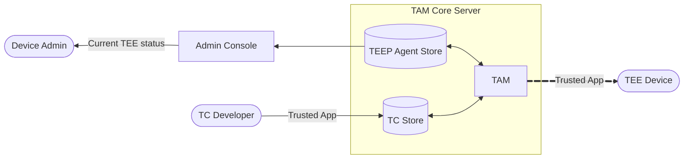

# AttesTAM

**AttesTAM trusts a TEEP Agent only after Remote Attestation proves the agent is genuine and running in a genuine TEE.**
AttesTAM is a TAM implementation that acts as a [TEEP-over-HTTP](https://datatracker.ietf.org/doc/html/draft-ietf-teep-otrp-over-http-15) server to communicate with TEEP Agents.
See [RFC 9397 (TEEP Architecture)](https://datatracker.ietf.org/doc/html/rfc9397) for terminology, [TEEP Protocol v26](https://datatracker.ietf.org/doc/html/draft-ietf-teep-protocol-26) for message format, and [TEEP Message Handling](./doc/TEEP_MESSAGE_HANDLE.md) for protocol usage details.

**AttesTAM is the intermediary that securely delivers Trusted Components from TC Developers to TEEP Agents in TEEs.**
In general, a TAM serves as an intermediary that communicates with TEE-equipped devices, specifically the TEEP Agent inside the TEE, when a Trusted Component (TC) Developer wants to run a Trusted Application in a remote device's TEE while protecting it from tampering or unauthorized access.

**Remote Attestation flow: challenge from TAM, evidence from agent, verifier decision, then key trust in TAM.**
The TAM sends a fresh challenge in `QueryRequest`, the TEEP Agent returns attestation evidence in `QueryResponse`, the TAM forwards the evidence to a verifier and accepts only an affirming result, and then the TAM confirms the same attested key signs the live TEEP message before trusting that agent key.

**This implementation also exposes agent status to administrators as an explicit design choice.**
Although the TEEP Architecture requires that a Device Administrator be able to learn which Trusted Applications are installed in the TEE, it does not assign that responsibility to the TAM. In this implementation, however, the TAM also provides this information as a design choice.

This repository also includes a TAM console (`cmd/admin-console`), shown as the `Admin Console` in the diagram below. The console acts as a backend-for-frontend for the TAM Administrator and Device Administrator: it calls the TAM core server's TEEP Agent Service API, reads the agent/manifest status data returned in CBOR, and converts it into JSON (and HTML UI responses) that are easier for browser-based tools and operators to consume.



To support the architecture shown above, the TAM provides three primary communication channels:
1. SUIT Manifest Service API: Receives Trusted Applications from the TC Developer. (see [SUIT_MANIFEST_REPOSITORY.md](./doc/SUIT_MANIFEST_REPOSITORY.md))
2. TAM's TEEP-over-HTTP API: Delivers Trusted Applications to the TEE. (see [TEEP_MESSAGE_HANDLE.md](./doc/TEEP_MESSAGE_HANDLE.md))
3. TEEP Agent Service API: Provides the Device Admin with a list of Trusted Applications installed in the device's TEE. (see [TEEP_AGENT_STATUS.md](./doc/TEEP_AGENT_STATUS.md))

## Quick Start

See [USER_MANUAL.md](./doc/USER_MANUAL.md) for details.

> [!WARNING]
> The commands below start the server in insecure demo mode for local testing and evaluation only.
> Do not use this configuration in production.

### A) Native

```bash
go run ./cmd/attestam -insecure-demo-mode
```

The mock server listens on `localhost:8080` by default and exposes `POST /tam`.
Send TEEP messages (COSE Sign1) as the request body and inspect logs for response behavior. When a verifier endpoint is configured (via `-challenge-server` or `ATTESTAM_CHALLENGE_SERVER`), the server forwards attestation payloads and logs the decoded verifier responses. No attestation files are written to disk.
Use `go run ./cmd/attestam -h` to see available CLI options.
Detailed references for flags and environment variables are documented in [`doc/USER_MANUAL.md`](./doc/USER_MANUAL.md).

```bash
go run ./cmd/admin-console --tam-api-base http://127.0.0.1:8080/
```

`cmd/admin-console` uses `http://127.0.0.1:8080/` as the default `--tam-api-base` and no longer supports local testvector fallback mode.

### B) Docker

```bash
docker build -t attestam .
docker run --rm \
  -p 8080:8080 -p 9090:9090 \
  -e ATTESTAM_INSECURE_DEMO_MODE=true \
  -e ADMIN_CONSOLE_PORT=9090 \
  -e ADMIN_CONSOLE_TAM_API_BASE=http://127.0.0.1:8080 \
  attestam
```

This container starts both services:

- TAM core server on `http://localhost:8080` (`POST /tam`)
- TAM admin console on `http://127.0.0.1:9090`

Then open `http://127.0.0.1:9090` in your Web browser.

## Documentation

- [User Manual](./doc/USER_MANUAL.md)
- [External Design](./doc/EXTERNAL_DESIGN.md)
  - [TAM Admin Console and TAM Server](./doc/ADMIN_CONSOLE_EXTERNAL_DESIGN.md)
  - [TEEP Message Handling](./doc/TEEP_MESSAGE_HANDLE.md)
  - [SUIT Manifest Store](./doc/SUIT_MANIFEST_REPOSITORY.md)
  - [TEEP Agent Status](./doc/TEEP_AGENT_STATUS.md)
- [Internal Design](./doc/INTERNAL_DESIGN.md)
  - [TAM Admin Console BFF Server](./doc/ADMIN_CONSOLE_INTERNAL_DESIGN.md)
  - [TAM Status SUIT Manifest Store](./doc/TAM_STATUS_SUIT_MANIFEST_REPOSITORY.md)
  - [TAM Status TEEP Agent Status](./doc/TAM_STATUS_TEEP_AGENT_STATUS.md)
  - [Database Design](./doc/DATABASE_DESIGN.md)

## Development Workflow

```bash
make run-demo         # Start server locally in insecure demo mode (evaluation only; not for production)
make test             # Run unit tests (go test ./...)
make test-integrated  # Run integration-tagged tests (requires provisioned VERAISON server)

# Equivalent direct Go commands:
go run ./cmd/attestam -insecure-demo-mode
go test ./...
go test -tags=integration ./...
```

The handler logs every received TEEP message. Verifier responses are decoded and logged, and confirmed TEEP Agent keys are stored in SQLite.

## Contributing

1. Write focused changes organized under `internal/` packages; keep shared code small and single-purpose.
2. Format with `gofmt`/`goimports`, use PascalCase for exported identifiers, and wrap errors with context (`fmt.Errorf("...: %w", err)`).
3. Add or update tests alongside the code in `*_test.go` files; store golden fixtures under `testdata/`.
4. Ensure `gofmt`/`goimports`, `go test ./...`, and `go vet ./...` succeed before submitting a PR.
5. Use imperative commit messages (e.g., `Add QueryResponse attestation logging`) and include motivation plus verification details in the pull request description.

# Acknowledgement

This work was supported by JST K Program Grant Number JPMJKP24U4, Japan.
