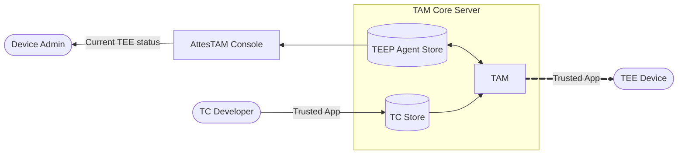

# AttesTAM

**AttesTAM trusts a TEEP Agent only after Remote Attestation proves the agent is genuine and running in a genuine TEE.**
AttesTAM is a TAM implementation that acts as a [TEEP-over-HTTP](https://datatracker.ietf.org/doc/html/draft-ietf-teep-otrp-over-http-15) server to communicate with TEEP Agents.
See [RFC 9397 (TEEP Architecture)](https://datatracker.ietf.org/doc/html/rfc9397) for terminology, [TEEP Protocol v26](https://datatracker.ietf.org/doc/html/draft-ietf-teep-protocol-26) for message format, and [TEEP Message Handling](./doc/TEEP_MESSAGE_HANDLE.md) for protocol usage details.

**AttesTAM is the intermediary that securely delivers Trusted Components from TC Developers to TEEP Agents in TEEs.**
In general, a TAM serves as an intermediary that communicates with TEE-equipped devices, specifically the TEEP Agent inside the TEE, when a Trusted Component (TC) Developer wants to run a Trusted Application in a remote device's TEE while protecting it from tampering or unauthorized access.

**Remote Attestation flow: challenge from TAM, evidence from agent, verifier decision, then key trust in TAM.**
The TAM sends a `challenge` in `QueryRequest`, the TEEP Agent returns attestation evidence in `QueryResponse`, and the verifier (VERAISON or Intel QVL path) is responsible for attesting the Attesting Environment and the Evidence itself. In TEEP, `challenge` is the protocol term and does not by itself require nonce-style freshness or forbid Evidence reuse. This AttesTAM implementation makes a stricter choice: it issues a fresh one-time nonce as `challenge`, requires the attestation to bind that exact value, and rejects replayed / reused Evidence. After an affirming verifier result, the TAM, as Relying Party, confirms the challenge and only trusts a new TEEP Agent verifying key when the evidence format actually binds one: `cnf.key` for EAT-based evidence or `report_data` plus `raw-report-data` for the SGX bundle path.

**This implementation also exposes agent status to administrators as an explicit design choice.**
Although the TEEP Architecture requires that a Device Administrator be able to learn which Trusted Applications are installed in the TEE, it does not assign that responsibility to the TAM. In this implementation, however, the TAM also provides this information as a design choice.

This repository also includes a TAM console (`cmd/admin-console`), shown as the `AttesTAM Console` in the diagram below. The console acts as a backend-for-frontend for the TAM Administrator and Device Administrator: it calls the TAM core server's TEEP Agent Service API, reads the agent/manifest status data returned in CBOR, and converts it into JSON (and HTML UI responses) that are easier for browser-based tools and operators to consume.


```mermaid
flowchart LR
    TCDeveloper([TC Developer]) -- Trusted App--> ManifestStore

    DeviceAdmin ~~~ BFF
    BFF -- Current TEE status --> DeviceAdmin([Device Admin])
    BFF ~~~ DeviceAdmin

    BFF[AttesTAM Console] ~~~ AgentStore
    AgentStore --> BFF
    AgentStore ~~~ BFF

    subgraph TAM Core Server
        TAM
        AgentStore[(TEEP Agent Store)] <--> TAM
        ManifestStore[(TC Store)] --> TAM
    end

    TAM e1@== Trusted App ==> TEEPAgent
    e1@{ animate: true }

    TEEPAgent([TEE Device])
```

To support the architecture shown above, the TAM provides three primary communication channels:
1. SUIT Manifest Service API: Receives Trusted Applications from the TC Developer. (see [SUIT_MANIFEST_REPOSITORY.md](./doc/SUIT_MANIFEST_REPOSITORY.md))
2. TAM's TEEP-over-HTTP API: Delivers Trusted Applications to the TEE. (see [TEEP_MESSAGE_HANDLE.md](./doc/TEEP_MESSAGE_HANDLE.md))
3. TEEP Agent Service API: Provides the Device Admin with a list of Trusted Applications installed in the device's TEE. (see [TEEP_AGENT_STATUS.md](./doc/TEEP_AGENT_STATUS.md))

## Quick Start

See [USER_MANUAL.md](./doc/USER_MANUAL.md) for details.

> [!WARNING]
> The commands below start the server in insecure demo mode for local testing and evaluation only. Do not use this configuration in production.
> With demo mode, the TAM uses a public insecure demo private key embedded in the binary and trusts [a demo TEEP Agent private key](./doc/examples/keys/agent_priv.diag) to communicate with this TAM.
> Outside insecure demo mode, you must provide `-tam-teep-private-key-path` (or `ATTESTAM_TAM_TEEP_PRIVATE_KEY_PATH`).
> Otherwise, the TAM requires an Remote Attestation Evidence binding a public key. See [teep-wasm-demo](https://github.com/s-miyazawa/teep-wasm-demo) how to configure the Verifier and how the TEEP Agent acts.

### A) Native without Intel Quote Verification

```bash
go run ./cmd/attestam -insecure-demo-mode
```

The mock server listens on `localhost:8080` by default and exposes `POST /tam`.
Send TEEP messages (COSE Sign1) as the request body and inspect logs for response behavior. In this mode, AttesTAM does not use Intel QVL and does not require cgo, Intel DCAP libraries, Intel PCCS, or Node.js. TAM communicates with a Verifier endpoint configured with `-challenge-server` command line argument (default value is `https://localhost:8443/`), forwarding attestation payloads and logging the decoded Verifier responses. No attestation files are written to disk.
If `-challenge-server` is set to an empty string, verifier-backed attestation is unavailable and requests that require attestation verification return HTTP `503 Service Unavailable`.
The SQLite state database defaults to `tam_state.db` in the current working directory and can be overridden with `-db-path`.
Use `go run ./cmd/attestam -h` to see available CLI options.
Detailed references for flags and environment variables are documented in [`doc/USER_MANUAL.md`](./doc/USER_MANUAL.md).

You can use TAM Admin Console with following command:

```bash
go run ./cmd/admin-console --tam-api-base http://127.0.0.1:8080/
```

`cmd/admin-console` uses `http://127.0.0.1:8080/` as the default `--tam-api-base` and no longer supports local testvector fallback mode.
Add `--tam-api-debug` when you want the console to log AttesTAM API requests and responses to stderr. For `Register TC`, the upload body itself is not dumped; the log shows the uploaded filename instead.

### B) Docker without Intel Quote Verification (Recommended)

```bash
docker build -t attestam .
docker run --rm --net=host -e ATTESTAM_INSECURE_DEMO_MODE=true attestam
```

This container starts both services:

- TAM core server on `http://localhost:8080` (`POST /tam`)
- AttesTAM Console on `http://127.0.0.1:9090`

`--net=host` is used so the containerized TAM can reach a verifier running on `https://localhost:8443` on the host. Then open `http://127.0.0.1:9090` in your Web browser.

This is the recommended way to run AttesTAM for normal local evaluation.

### C) Intel Quote Verification with Docker (Experimental)

Intel Quote verification is currently an experimental AttesTAM-local path. It builds AttesTAM with cgo and the `intel_qvl` build tag, installs Intel DCAP quote verification libraries.

You can configure Intel PCS URL with `ATTESTAM_INTEL_QVL_PCS_URL`, API key with `ATTESTAM_INTEL_QVL_SUBSCRIPTION_KEY` and the collateral (Endorsements) cache directory with `ATTESTAM_INTEL_QVL_COLLATERAL_CACHE_DIR`.

```bash
docker build -f docker/sgx-verifier.Dockerfile -t attestam-sgx .
docker run --rm --net=host -e ATTESTAM_INSECURE_DEMO_MODE=true attestam-sgx
```

## Documentation

- [User Manual](./doc/USER_MANUAL.md)
- [External Design](./doc/EXTERNAL_DESIGN.md)
  - [AttesTAM Console and TAM Server](./doc/ADMIN_CONSOLE_EXTERNAL_DESIGN.md)
  - [TEEP Message Handling](./doc/TEEP_MESSAGE_HANDLE.md)
  - [SUIT Manifest Store](./doc/SUIT_MANIFEST_REPOSITORY.md)
  - [TEEP Agent Status](./doc/TEEP_AGENT_STATUS.md)
- [Internal Design](./doc/INTERNAL_DESIGN.md)
  - [AttesTAM Console BFF Server](./doc/ADMIN_CONSOLE_INTERNAL_DESIGN.md)
  - [TAM Status SUIT Manifest Store](./doc/TAM_STATUS_SUIT_MANIFEST_REPOSITORY.md)
  - [TAM Status TEEP Agent Status](./doc/TAM_STATUS_TEEP_AGENT_STATUS.md)
  - [Database Design](./doc/DATABASE_DESIGN.md)

## Contributing

1. Write focused changes organized under `internal/` packages; keep shared code small and single-purpose.
2. Format with `gofmt`/`goimports`, use PascalCase for exported identifiers, and wrap errors with context (`fmt.Errorf("...: %w", err)`).
3. Add or update tests alongside the code in `*_test.go` files; store golden fixtures under `testdata/`.
4. Ensure `gofmt`/`goimports`, `go test ./...`, and `go vet ./...` succeed before submitting a PR.
5. Use imperative commit messages (e.g., `Add QueryResponse attestation logging`) and include motivation plus verification details in the pull request description.

# Acknowledgement

This work was supported by JST K Program Grant Number JPMJKP24U4, Japan.
