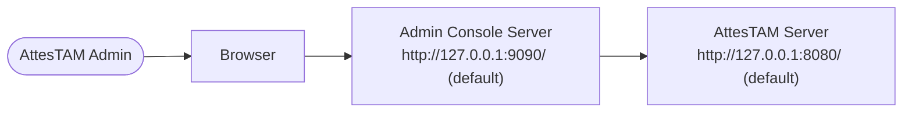
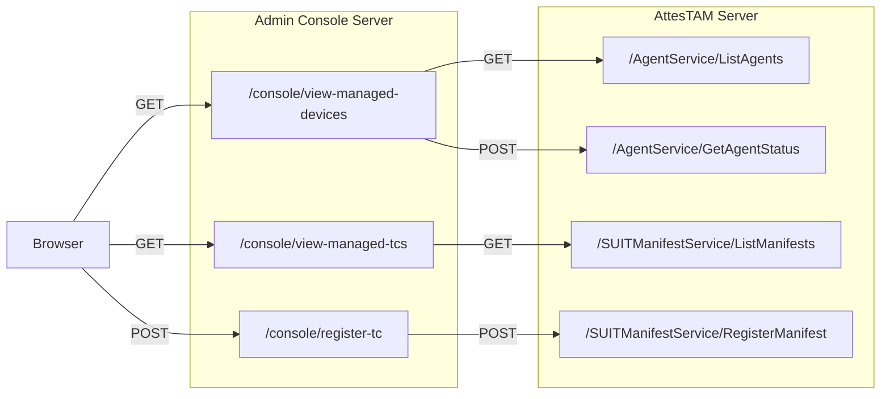

# Admin Console External Design

## 1. Purpose

`cmd/admin-console` provides an operator UI and HTTP endpoints for:
- Listing managed devices
- Listing managed trusted components (TC manifests)
- Registering a TC manifest

This document defines externally visible behavior.

Current limitation:
- Authentication/authorization for console users is not implemented in the current version. This is planned for a future Admin Console revision.

Covered scope:
- Public interface of admin-console:
  - `GET /`
    - Admin console page
  - `GET /console/view-managed-devices`
    - Listing managed devices
  - `GET /console/view-managed-tcs`
    - Listing managed trusted components
  - `POST /console/register-tc`
    - Registering a TC manifest
  - `GET /static/*`
    - UI static assets

Not covered:
- AttesTAM internal business logic and persistence behavior

## 2. Admin Console Base URL And AttesTAM Dependency

Admin Console Base URL:
- `http://<host>:<port>`

Notes:
- Current implementation listens on all interfaces (`:<port>`).
- Operators are expected to access the console via loopback (`127.0.0.1`) or another explicitly controlled host route.
- `port` is determined by command-line flag `--port` (default: `9090`).
- `--tam-api-base` defaults to `http://127.0.0.1:8080/`.



## 3. Admin Console API

### API call flow


### 3.1 `GET /console/view-managed-devices`

Purpose:
- Return managed device list with installed TC info.
- Admin console calls AttesTAM APIs `GET /AgentService/ListAgents` and `POST /AgentService/GetAgentStatus` to build this response.

Request:
- Method: `GET`
- Body: none
- Content-Type: none

Success response:
- Status: `200 OK`
- Content-Type: `application/json; charset=utf-8`
- Body: JSON array of agents

Agent response schema:
- `kid`: string
- `last_update`: RFC3339 string
- `attribute.ueid`: hex string
- `installed-tc`: array of trusted components

Trusted component schema:
- `name`: CBOR diagnostic string
- `version`: unsigned integer

Example:
```json
[
  {
    "kid": "dev-1",
    "last_update": "2026-02-18T10:00:00Z",
    "attribute": {
      "ueid": "10"
    },
    "installed-tc": [
      {
        "name": "['app-1']",
        "version": 1
      }
    ]
  }
]
```

Errors:
- `405` when method is not `GET`
- `502` when AttesTAM API call fails
- `500` when console is misconfigured

### 3.2 `GET /console/view-managed-tcs`

Purpose:
- Return managed TC manifest list.
- Admin console calls AttesTAM API `GET /SUITManifestService/ListManifests` and returns the result in JSON form.

Request:
- Method: `GET`
- Body: none

Success response:
- Status: `200 OK`
- Content-Type: `application/json; charset=utf-8`
- Body: JSON array

Manifest schema:
- `name`: CBOR diagnostic string
- `version`: unsigned integer

Example:
```json
[
  {
    "name": "['manifest-a']",
    "version": 7
  }
]
```

Errors:
- `405` when method is not `GET`
- `502` when AttesTAM API call fails
- `500` when console is misconfigured

### 3.3 `POST /console/register-tc`

Purpose:
- Register uploaded manifest to AttesTAM API.
- Admin console relays the uploaded file to AttesTAM API `POST /SUITManifestService/RegisterManifest`.

Request:
- Method: `POST`
- Content-Type: `multipart/form-data`
- Form field:
  - `file`: required

Success response:
- Status: `200 OK`
- Content-Type: `application/json; charset=utf-8`
- Body:
```json
{
  "success": true
}
```

Errors:
- `405` when method is not `POST`
- `502` when multipart parse fails, `file` is missing, or AttesTAM register call fails
- `500` when console is misconfigured

## 4. UI Behavior Related To API

- Upload status message:
  - On success: `Upload complete.`
  - On failure: `Upload failed: <error>`
- After successful upload, UI refreshes managed TC list by calling:
  - `GET /console/view-managed-tcs`

## 5. Common Response / Header Rules

- JSON responses are pretty-printed.
- CORS headers are always added:
  - `Access-Control-Allow-Origin: *`
  - `Access-Control-Allow-Methods: GET, POST, OPTIONS`
  - `Access-Control-Allow-Headers: Content-Type`
- `OPTIONS` returns `204 No Content`.
