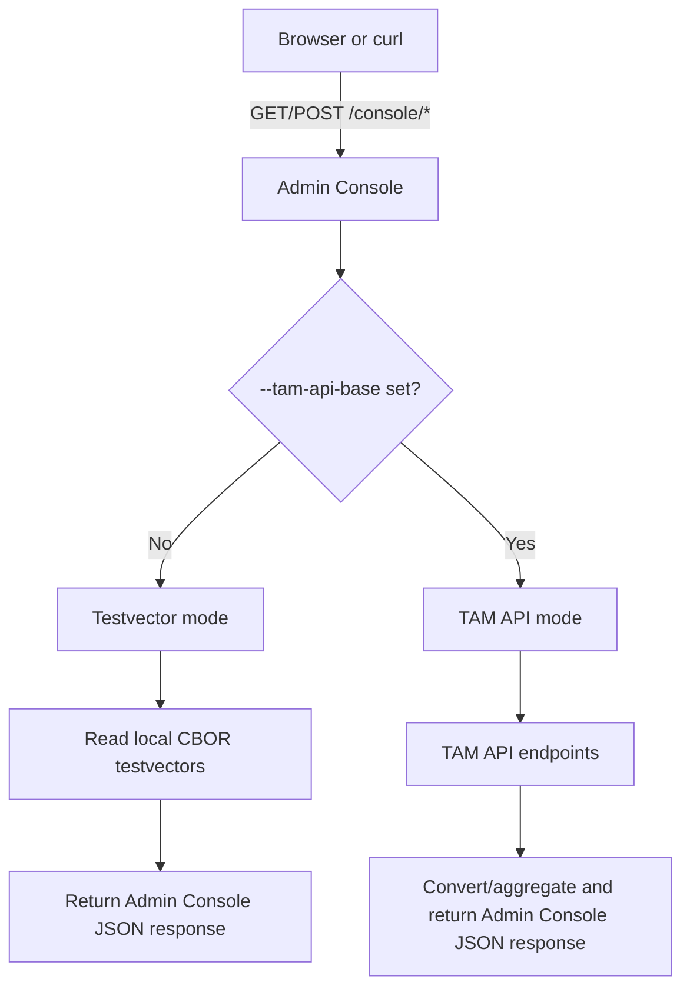

# Admin Console External Design

## 1. Purpose

`cmd/admin-console` provides an operator UI and HTTP endpoints for:
- Listing managed devices
- Listing managed trusted components (TCs / manifests)
- Registering a TC manifest

This document defines externally visible behavior (HTTP contracts and response shapes).

Covered scope:
- Public interface of admin-console:
  - `GET /` (console page)
  - `GET /console/view-managed-devices`
  - `GET /console/view-managed-tcs`
  - `POST /console/register-tc`
  - `GET /static/*` (UI static assets)

Not covered:
- TAM internal business logic and persistence behavior
- Authentication/authorization design for console users

## 2. Admin Console Base URL And Modes

Admin Console Base URL:
- `http://localhost:<port>`

Notes:
- `host` is fixed to `localhost` for intended access.
- `port` is determined by command-line flag `--port` (default: `9090`).

Modes:
- TAM API mode (`--tam-api-base` set): console proxies/aggregates TAM data.
- Testvector mode (`--tam-api-base` empty): console returns local sample data.

Mode-dependent behavior overview:



## 3. Admin Console HTTP API Contract

### 3.1 `GET /console/view-managed-devices`

Purpose:
- Return managed device list with installed TC info.

Request:
- Method: `GET`
- Body: none
- Content-Type: none

Success response:
- Status: `200 OK`
- Content-Type: `application/json; charset=utf-8`
- Body: JSON array of agents

Agent response schema:
- `kid`: string
- `last_update`: RFC3339 string (optional)
- `attribute.ueid`: hex string
- `installed-tc`: array of trusted components

Trusted component schema:
- `name`: CBOR diagnostic string
- `version`: unsigned integer

Example:
```json
[
  {
    "kid": "dev-1",
    "last_update": "2026-02-18T10:00:00Z",
    "attribute": {
      "ueid": "10"
    },
    "installed-tc": [
      {
        "name": "['app-1']",
        "version": 1
      }
    ]
  }
]
```

Errors:
- `405` when method is not `GET`
- `502` when TAM API call fails (TAM API mode)
- `500` when local testvector loading fails (testvector mode)

### 3.2 `GET /console/view-managed-tcs`

Purpose:
- Return managed TC manifest list.

Request:
- Method: `GET`
- Body: none

Success response:
- Status: `200 OK`
- Content-Type: `application/json; charset=utf-8`
- Body: JSON array

Manifest schema:
- `name`: CBOR diagnostic string
- `version`: unsigned integer

Example:
```json
[
  {
    "name": "['manifest-a']",
    "version": 7
  }
]
```

Errors:
- `405` when method is not `GET`
- `502` when TAM API call fails (TAM API mode)
- `500` when local testvector loading fails (testvector mode)

### 3.3 `POST /console/register-tc`

Purpose:
- Register uploaded manifest to TAM API (or validate upload in testvector mode).

Request:
- Method: `POST`
- Content-Type: `multipart/form-data`
- Form field:
  - `file`: required
  - `version`: optional (currently accepted but not returned)

Success response:
- Status: `200 OK`
- Content-Type: `application/json; charset=utf-8`
- Body:
```json
{
  "ok": true
}
```

Errors:
- `405` when method is not `POST`
- `400` when multipart parse fails or `file` is missing
- `502` when TAM register call fails (TAM API mode)

## 4. UI Behavior Related To API

- Upload status message:
  - On success: `Upload complete.`
  - On failure: `Upload failed: <error>`
- After successful upload, UI refreshes managed TC list by calling:
  - `GET /console/view-managed-tcs`

## 5. Common Response / Header Rules

- JSON responses are pretty-printed.
- CORS headers are always added:
  - `Access-Control-Allow-Origin: *`
  - `Access-Control-Allow-Methods: GET, POST, OPTIONS`
  - `Access-Control-Allow-Headers: Content-Type`
- `OPTIONS` returns `204 No Content`.

## 6. Compatibility Notes

- External JSON field names are stable:
  - `kid`, `last_update`, `attribute.ueid`, `installed-tc`, `name`, `version`, `ok`
- Internal typed representations may evolve independently as long as this external contract is preserved.
