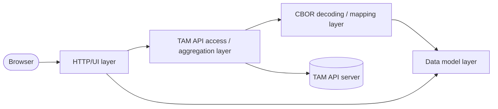

# Admin Console Internal Design

## 1. Purpose And Scope

`cmd/admin-console` provides a browser-based operation console for TAM.
It serves the admin UI, calls TAM APIs, and converts TAM CBOR responses into JSON/HTML that are easier for browsers and operators to consume.

Current scope:
- Serve the admin console UI and static assets.
- Show managed devices and their installed trusted components.
- Show managed trusted components (manifests).
- Register a trusted component by relaying uploaded manifests to the TAM API.
- Operate only with a reachable TAM API backend; no standalone mode is provided.

Out of scope:
- Authentication/authorization for console users in the current version. This is planned for a future Admin Console revision.
- TAM server-side business logic, persistence, and policy decisions.
- Fetching device or manifest state except through TAM APIs.

Operational assumption:
- The console is intended for trusted environments or deployments protected by external access control.

## 2. Architecture Overview

Entry point:
- `cmd/admin-console/main.go`

### 2.1 Main request/data flow

### 2.2 Main layers

- Bootstrap / wiring layer:
  - `cmd/admin-console/main.go`
  - `cmd/admin-console/config.go`
- HTTP/UI layer:
  - `cmd/admin-console/handlers.go`
  - `cmd/admin-console/http_utils.go`
  - `cmd/admin-console/templates/index.html`
  - `cmd/admin-console/static/app.js`
  - `cmd/admin-console/static/styles.css`
- TAM API access / aggregation layer:
  - `cmd/admin-console/tam_api.go`
  - Calls TAM APIs and maintains per-TAM in-memory cache for device status assembly.
- CBOR decoding / mapping layer:
  - `cmd/admin-console/agent_codec.go`
  - `cmd/admin-console/manifest_codec.go`
- Data model layer:
  - `cmd/admin-console/types.go`

Runtime dependency:
- `--tam-api-base` defaults to `http://127.0.0.1:8080/`.

## 3. Data Model And Transformation Policy

### 3.1 Internal model (CBOR-derived)

Defined in `cmd/admin-console/types.go`.

- `Agent.KID`: `[]byte` (CBOR `bstr`)
- `Agent.LastUpdate`: `time.Time`
- `Agent.Attributes`: `Attribute`
- `Agent.InstalledTCList`: `[]TrustedComponent`
- `Attribute.Ueid`: `eat.UEID` (byte-string based UEID type)
- `TrustedComponent.Name`: `suit.ComponentID`
- `TrustedComponent.Version`: `uint64`

### 3.2 JSON output policy

Internal model keeps precise raw-typed data, and JSON encoding applies display-oriented conversion.

- `Agent.MarshalJSON`:
  - `kid`: `[]byte` -> string
  - `last_update`: `time.Time` -> RFC3339 string (`formatUpdatedAt`), always included even when zero-valued
- `Attribute.MarshalJSON`:
  - `ueid`: `eat.UEID` -> hex string
- `TrustedComponent.MarshalJSON`:
  - `name`: `suit.ComponentID` -> CBOR diagnostic string
  - `version`: `uint64` as-is

Decode/mapping note:
- If a trusted component ID cannot be decoded from CBOR into `suit.ComponentID`, that entry is skipped during agent/manifest mapping.

Rationale:
- Preserve correctness and type fidelity internally.
- Provide stable, easy-to-render JSON fields for UI.

## 4. Endpoint Flows

### 4.1 `GET /console/view-managed-devices`

Handler:
- `handleListAgents` (`cmd/admin-console/handlers.go`)

Flow:
1. `handleListAgents` validates the HTTP method and checks that `tam-api-base` is configured.
2. `fetchTAMDevices` requests:
   - `GET /AgentService/ListAgents`
   - `POST /AgentService/GetAgentStatus` (delta fetch with in-memory cache)
3. `decodeAgentsFromCBOR` converts status records to internal `[]Agent`.
4. `respondJSON` returns converted JSON.

### 4.2 `GET /console/view-managed-tcs`

Handler:
- `handleListManifestsService` (`cmd/admin-console/handlers.go`)

Flow:
1. `handleListManifestsService` validates the HTTP method and checks that `tam-api-base` is configured.
2. `fetchTAMManifests` calls `GET /SUITManifestService/ListManifests`.
3. `decodeManifestsFromCBOR` decodes overviews and maps to `[]TrustedComponent`.
4. `respondJSON` returns JSON.

### 4.3 `POST /console/register-tc`

Handler:
- `handleRegisterManifest` (`cmd/admin-console/handlers.go`)

Flow:
1. `handleRegisterManifest` validates the HTTP method and checks that `tam-api-base` is configured.
2. `postTAMManifest` parses multipart input and reads the uploaded file from form field `file`.
3. `postTAMManifest` relays uploaded bytes to TAM API:
   - `POST /SUITManifestService/RegisterManifest`
4. On success, `postTAMManifest` returns JSON success response (`{"success": true}`).

## 5. Error Handling Policy

- Invalid method returns `405 Method Not Allowed`.
- Startup validation normally prevents empty `tam-api-base`; if request handling somehow proceeds with invalid runtime configuration, handlers return `500 Internal Server Error`.
- Non-`2xx` from TAM API is converted to `502 Bad Gateway`.
- Multipart parsing failures, missing upload file, and TAM upload relay failures in `POST /console/register-tc` are currently surfaced as `502 Bad Gateway`.
- Unsupported TAM response `Content-Type` (non-CBOR where CBOR is expected) is treated as an upstream error and surfaced as `502 Bad Gateway`.
- CBOR decode failures return explicit wrapped errors for troubleshooting and are surfaced as `502 Bad Gateway`.

## 6. Configuration

Defined in `cmd/admin-console/config.go`.

Primary flags:
- `--port`
- `--tam-api-base`

Behavior:
- `port` defaults to `9090`.
- `tam-api-base` defaults to `http://127.0.0.1:8080/`.
- Startup validation requires non-empty `tam-api-base`.

## 7. Test Strategy

Key tests:
- `agent_codec_test.go`:
  - Agent CBOR decode correctness.
- `manifest_codec_test.go`:
  - Manifest CBOR decode correctness.
  - Decode failure handling for invalid CBOR input.
- `types_test.go`:
  - JSON marshaling shape checks for `Agent`, including `last_update`.
- `tam_api_test.go`:
  - TAM API integration behavior (CBOR contract, error handling, cache/delta behavior).
- `handlers_test.go`:
  - HTTP handler behavior for register endpoint configuration error path.

Test objective:
- Keep CBOR decoding, JSON conversion contracts, and TAM API integration behavior stable while refactoring internals.
