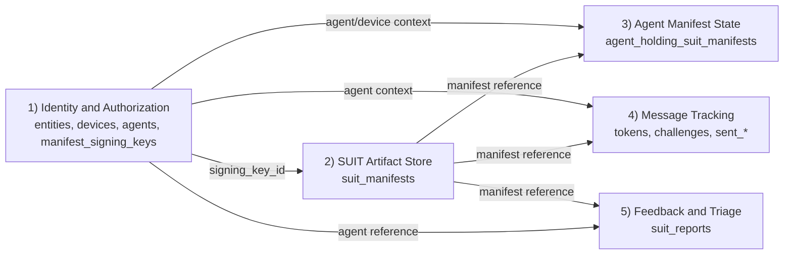
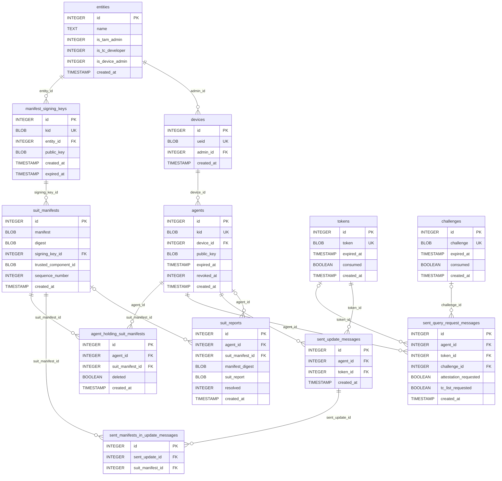

# Database Design (SQLite)

## Scope
This document describes the internal SQLite schema used by TAM-over-HTTP.

Source used:
- `internal/tam/tam_state.db` (schema introspected via `sqlite3`)
- Runtime schema builder: `internal/infra/sqlite/database.go`

Note:
- A runtime DB (`tam_state.db`) exists at repository root and may be WAL-locked while the server is running.

## Database Configuration
Runtime initialization (`internal/infra/sqlite/database.go`) applies:
- `PRAGMA foreign_keys = ON`
- `PRAGMA journal_mode = WAL`
- `PRAGMA synchronous = NORMAL`
- `PRAGMA busy_timeout = 5000`

Design implication:
- Although SQLite defaults `foreign_keys` to off per connection, application connections enforce FK constraints.

## Domain Model Overview
The schema is organized into five main areas with clear lifecycle boundaries.

### Internal Links
- [Overview Diagram](#overview-diagram)
- [Area 1: Identity and Authorization](#area-1-identity-and-authorization)
- [Area 2: SUIT Artifact Store](#area-2-suit-artifact-store)
- [Area 3: Agent Manifest State](#area-3-agent-manifest-state)
- [Area 4: Message Tracking](#area-4-message-tracking)
- [Area 5: Feedback and Triage](#area-5-feedback-and-triage)
- [Entity-Relationship Diagram (Table Level)](#er-diagram)

Table quick links:
- [`entities`](#entities), [`devices`](#devices), [`agents`](#agents), [`manifest_signing_keys`](#manifest_signing_keys)
- [`suit_manifests`](#suit_manifests)
- [`agent_holding_suit_manifests`](#agent_holding_suit_manifests)
- [`tokens`](#tokens), [`challenges`](#challenges), [`sent_query_request_messages`](#sent_query_request_messages), [`sent_update_messages`](#sent_update_messages), [`sent_manifests_in_update_messages`](#sent_manifests_in_update_messages)
- [`suit_reports`](#suit_reports)

### Overview Diagram

### Area 1: Identity and Authorization
Core actor model and trust anchors:
- `entities` defines human/organizational principals and role flags.
- `devices` binds managed endpoints by `ueid`.
- `agents` represents attesting/updatable identities (keyed by `kid`) attached to devices.
- `manifest_signing_keys` binds developer/admin entities to signing public keys.

Internal links:
- Outbound to [Area 2](#area-2-suit-artifact-store) via `manifest_signing_keys -> suit_manifests`.
- Outbound to [Area 3](#area-3-agent-manifest-state) via `agents`.
- Outbound to [Area 4](#area-4-message-tracking) via `agents`.
- Outbound to [Area 5](#area-5-feedback-and-triage) via `agents`.

### Area 2: SUIT Artifact Store
Artifact repository:
- `suit_manifests` stores signed payloads plus lookup keys (`digest`, `trusted_component_id`, `sequence_number`).
- Acts as the canonical manifest source for assignment, update logging, and report correlation.

Internal links:
- Inbound from [Area 1](#area-1-identity-and-authorization) via `signing_key_id`.
- Outbound to [Area 3](#area-3-agent-manifest-state) via `suit_manifest_id`.
- Outbound to [Area 4](#area-4-message-tracking) via `sent_manifests_in_update_messages`.
- Outbound to [Area 5](#area-5-feedback-and-triage) via `suit_manifest_id` or `manifest_digest`.

### Area 3: Agent Manifest State
Per-agent installation/holding state:
- `agent_holding_suit_manifests` is a relation table between `agents` and `suit_manifests`.
- `deleted` enables soft deletion while preserving assignment history.
- Partial unique index enforces one active (`deleted = 0`) pair per agent/manifest.

Internal links:
- Inbound from [Area 1](#area-1-identity-and-authorization) via `agent_id`.
- Inbound from [Area 2](#area-2-suit-artifact-store) via `suit_manifest_id`.

### Area 4: Message Tracking
Outbound protocol history and replay/nonce state:
- `tokens` and `challenges` track one-time values and consumption/expiry.
- `sent_query_request_messages` logs outbound QueryRequest context.
- `sent_update_messages` logs outbound Update messages.
- `sent_manifests_in_update_messages` links each update message to one or more manifests.

Internal links:
- Inbound from [Area 1](#area-1-identity-and-authorization) via `agent_id`.
- Inbound from [Area 2](#area-2-suit-artifact-store) via `suit_manifest_id`.
- Token/challenge records are referenced by message rows and partially nullified on deletion (`SET NULL`) for query logs.

### Area 5: Feedback and Triage
Inbound status/evidence store:
- `suit_reports` stores raw SUIT report payloads with optional `agent_id`, `suit_manifest_id`, and `manifest_digest`.
- `resolved` supports operational triage and backlog handling.
- `ON DELETE SET NULL` keeps reports even if upstream identity/artifact rows are removed.

Internal links:
- Inbound from [Area 1](#area-1-identity-and-authorization) via optional `agent_id`.
- Inbound from [Area 2](#area-2-suit-artifact-store) via optional `suit_manifest_id` and `manifest_digest`.

## Table Design

### `entities`
Represents administrative/developer principals.

Columns:
- `id` INTEGER PK AUTOINCREMENT
- `name` TEXT NOT NULL
- `is_tam_admin` INTEGER DEFAULT 0
- `is_tc_developer` INTEGER DEFAULT 0
- `is_device_admin` INTEGER DEFAULT 0
- `created_at` TIMESTAMP NOT NULL DEFAULT CURRENT_TIMESTAMP

Indexes:
- `idx_entity_name(name)`

Relationships:
- One-to-many to `manifest_signing_keys` (`ON DELETE CASCADE`).
- One-to-many to `devices` via `admin_id` (`ON DELETE CASCADE`).

### `manifest_signing_keys`
Stores public keys used to sign SUIT manifests.

Columns:
- `id` INTEGER PK AUTOINCREMENT
- `kid` BLOB UNIQUE NOT NULL
- `entity_id` INTEGER NOT NULL
- `public_key` BLOB NOT NULL
- `created_at` TIMESTAMP NOT NULL DEFAULT CURRENT_TIMESTAMP
- `expired_at` TIMESTAMP NOT NULL

Indexes:
- `idx_manifest_signing_keys_kid(kid)`
- `idx_manifest_signing_keys_expired_at(expired_at)`

Relationships:
- Belongs to `entities` via `entity_id` (`ON DELETE CASCADE`).
- One-to-many to `suit_manifests` via `signing_key_id` (`ON DELETE CASCADE`).

### `suit_manifests`
Stores raw SUIT manifest blobs and lookup metadata.

Columns:
- `id` INTEGER PK AUTOINCREMENT
- `manifest` BLOB NOT NULL
- `digest` BLOB NOT NULL
- `signing_key_id` INTEGER NOT NULL
- `trusted_component_id` BLOB NOT NULL
- `sequence_number` INTEGER NOT NULL
- `created_at` TIMESTAMP NOT NULL DEFAULT CURRENT_TIMESTAMP

Indexes:
- `idx_suit_manifests_digest(digest)`
- `idx_suit_manifests_trusted_component_id(trusted_component_id)`
- `idx_suit_manifests_sequence_number(sequence_number)`
- `idx_suit_manifests_tc_seq(trusted_component_id, sequence_number)`
- `idx_suit_manifests_signing_key_id(signing_key_id)`

Relationships:
- Belongs to `manifest_signing_keys` via `signing_key_id` (`ON DELETE CASCADE`).
- Referenced by `agent_holding_suit_manifests`, `sent_manifests_in_update_messages`, and `suit_reports`.

### `devices`
Represents managed devices (UEID-based identity).

Columns:
- `id` INTEGER PK AUTOINCREMENT
- `ueid` BLOB UNIQUE NOT NULL
- `created_at` TIMESTAMP NOT NULL DEFAULT CURRENT_TIMESTAMP
- `admin_id` INTEGER NULL

Relationships:
- Optional owner/admin is `entities.id` via `admin_id` (`ON DELETE CASCADE`).
- One-to-many to `agents` via `device_id` (`ON DELETE CASCADE`).

### `agents`
Represents agent keys/identities associated with devices.

Columns:
- `id` INTEGER PK AUTOINCREMENT
- `kid` BLOB UNIQUE NOT NULL
- `device_id` INTEGER NULL
- `public_key` BLOB NOT NULL
- `created_at` TIMESTAMP NOT NULL DEFAULT CURRENT_TIMESTAMP
- `expired_at` TIMESTAMP NOT NULL
- `revoked_at` INTEGER NULL

Indexes:
- `idx_agents_kid(kid)`
- `idx_agents_expired_at(expired_at)`
- `idx_agents_revoked_at(revoked_at)`

Relationships:
- Optional belongs-to `devices` via `device_id` (`ON DELETE CASCADE`).
- Referenced by `agent_holding_suit_manifests`, `sent_query_request_messages`, `sent_update_messages`, `suit_reports`.

### `agent_holding_suit_manifests`
Tracks manifests held by each agent; supports soft-delete of assignments.

Columns:
- `id` INTEGER PK AUTOINCREMENT
- `agent_id` INTEGER NOT NULL
- `suit_manifest_id` INTEGER NOT NULL
- `created_at` TIMESTAMP NOT NULL DEFAULT CURRENT_TIMESTAMP
- `deleted` BOOLEAN NOT NULL DEFAULT 0

Indexes:
- `idx_agent_holding_suit_manifests_agent_id_deleted(agent_id, deleted)`
- `idx_agent_holding_suit_manifests_suit_manifest_id(suit_manifest_id)`
- `uniq_agent_manifest_active(agent_id, suit_manifest_id) WHERE deleted = 0`

Relationships:
- Belongs to `agents` (`ON DELETE CASCADE`).
- Belongs to `suit_manifests` (`ON DELETE CASCADE`).

Design implication:
- The partial unique index allows historical rows with `deleted = 1` while preventing duplicate active assignments.

### `tokens`
One-time token store for message flows.

Columns:
- `id` INTEGER PK AUTOINCREMENT
- `token` BLOB UNIQUE NOT NULL
- `created_at` TIMESTAMP NOT NULL DEFAULT CURRENT_TIMESTAMP
- `expired_at` TIMESTAMP NOT NULL
- `consumed` BOOLEAN NOT NULL DEFAULT 0

Indexes:
- `idx_tokens_token(token)`

Relationships:
- Referenced by `sent_query_request_messages` (`ON DELETE SET NULL`).
- Referenced by `sent_update_messages` (`ON DELETE CASCADE`).

### `challenges`
Challenge nonce store for attestation/query flows.

Columns:
- `id` INTEGER PK AUTOINCREMENT
- `challenge` BLOB UNIQUE NOT NULL
- `created_at` TIMESTAMP NOT NULL DEFAULT CURRENT_TIMESTAMP
- `expired_at` TIMESTAMP NOT NULL
- `consumed` BOOLEAN NOT NULL DEFAULT 0

Indexes:
- `idx_challenges_challenge(challenge)`

Relationships:
- Referenced by `sent_query_request_messages` via `challenge_id` (`ON DELETE SET NULL`).

### `sent_query_request_messages`
Audit/log of outbound QueryRequest messages.

Columns:
- `id` INTEGER PK AUTOINCREMENT
- `agent_id` INTEGER NULL
- `attestation_requested` BOOLEAN NOT NULL
- `tc_list_requested` BOOLEAN NOT NULL
- `token_id` INTEGER NULL
- `challenge_id` INTEGER NULL
- `created_at` TIMESTAMP NOT NULL DEFAULT CURRENT_TIMESTAMP

Indexes:
- `idx_sent_qr_token_id(token_id)`
- `idx_sent_qr_challenge_id(challenge_id)`

Relationships:
- Optional belongs-to `agents` (`ON DELETE CASCADE`).
- Optional belongs-to `tokens` (`ON DELETE SET NULL`).
- Optional belongs-to `challenges` (`ON DELETE SET NULL`).

Design implication:
- Either token-based or challenge-based request context can be recorded.

### `sent_update_messages`
Audit/log of outbound Update messages.

Columns:
- `id` INTEGER PK AUTOINCREMENT
- `agent_id` INTEGER NOT NULL
- `token_id` INTEGER NOT NULL
- `created_at` TIMESTAMP NOT NULL DEFAULT CURRENT_TIMESTAMP

Relationships:
- Belongs to `agents` (`ON DELETE CASCADE`).
- Belongs to `tokens` (`ON DELETE CASCADE`).
- One-to-many to `sent_manifests_in_update_messages`.

### `sent_manifests_in_update_messages`
Join table between sent updates and SUIT manifests.

Columns:
- `id` INTEGER PK AUTOINCREMENT
- `sent_update_id` INTEGER NOT NULL
- `suit_manifest_id` INTEGER NOT NULL

Relationships:
- Belongs to `sent_update_messages` (`ON DELETE CASCADE`).
- Belongs to `suit_manifests` (`ON DELETE CASCADE`).

### `suit_reports`
Stores device/agent SUIT report blobs and triage state.

Columns:
- `id` INTEGER PK AUTOINCREMENT
- `agent_id` INTEGER NULL
- `suit_manifest_id` INTEGER NULL
- `manifest_digest` BLOB NULL
- `suit_report` BLOB NOT NULL
- `created_at` TIMESTAMP NOT NULL DEFAULT CURRENT_TIMESTAMP
- `resolved` INTEGER NOT NULL DEFAULT 0

Indexes:
- `idx_suit_reports_agent_id(agent_id)`
- `idx_suit_reports_suit_manifest_id(suit_manifest_id)`
- `idx_suit_reports_manifest_digest(manifest_digest)`
- `idx_suit_reports_resolved_created_at(resolved, created_at)`

Relationships:
- Optional belongs-to `agents` (`ON DELETE SET NULL`).
- Optional belongs-to `suit_manifests` (`ON DELETE SET NULL`).

Design implication:
- `ON DELETE SET NULL` preserves report history if related records are removed.

## Referential Actions Summary
- `ON DELETE CASCADE`: used where child rows are lifecycle-bound to parent records.
- `ON DELETE SET NULL`: used for audit/report records that should survive parent deletion.

## Current Design Notes
- Timestamps are stored as SQLite `TIMESTAMP` and default to `CURRENT_TIMESTAMP` where applicable.
- Most cryptographic identifiers and artifacts are stored as `BLOB` (`kid`, `ueid`, `token`, `challenge`, manifest/report payloads).
- No separate migration/version table is present; schema is managed via `CREATE TABLE IF NOT EXISTS` at startup.

## ER Diagram

