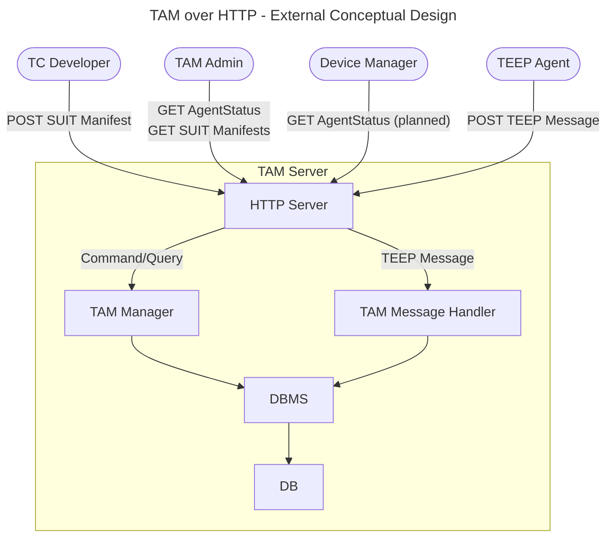

# TAM External Design

Method | Endpoint | Requester | Input | Output | Reference
--|--|--|--|--|--
GET | `/admin/getManifests` | TAM Admin | none | 200: `[overview of SUIT Manifest]` (CBOR) | [SUIT_MANIFEST_STORE](SUIT_MANIFEST_STORE.md)
POST | `/tc-developer/addManifest` | TC Developer | SUIT Manifest | 200: OK | [SUIT_MANIFEST_STORE](SUIT_MANIFEST_STORE.md)
GET | `/admin/getAgents` | TAM Admin | none | 200: Agent status (CBOR) | [TEEP_AGENT_STATUS](TEEP_AGENT_STATUS.md)
POST | `/tam` | TEEP Agent | empty QueryResponse Success Error | 200: QueryRequest 200: Update / QueryRequest 204: empty 204: empty | [TEEP_MESSAGE_HANDLE](TEEP_MESSAGE_HANDLE.md)

> [!NOTE]
> Current admin endpoints return fixed demo-oriented records. Request-specific filtering and role-based authorization are still TODO.
