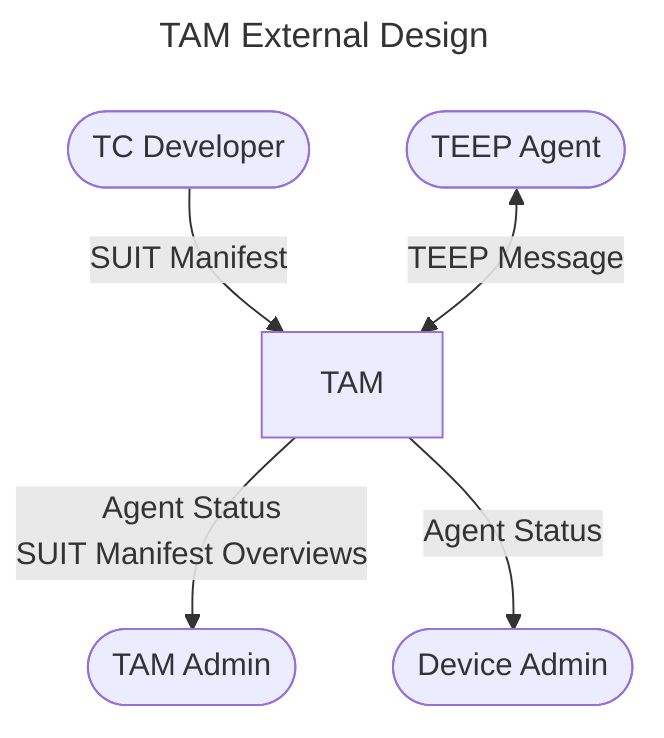

# TAM External Design

From terminology of [RFC 9397: Trusted Execution Environment Provisioning (TEEP) Architecture](https://datatracker.ietf.org/doc/html/rfc9397#name-terminology), we use TC Developer (Trusted Component Developer), TEEP Agent, TAM Admin (TAM Administrator), Device Admin (Device Administrator).
They communicates with our TAM to ....

Method | Endpoint | Requester | Input | Output | Reference
--|--|--|--|--|--
POST | `/tam` | TEEP Agent | empty QueryResponse Success Error | 200: QueryRequest 200: Update / QueryRequest 204: empty 204: empty | [TEEP_MESSAGE_HANDLE](TEEP_MESSAGE_HANDLE.md)
POST | `/SUITManifestService/RegisterManifest` | TC Developer | SUIT Manifest | 200: OK | [SUIT_MANIFEST_STORE](SUIT_MANIFEST_STORE.md)
GET | `/SUITManifestService/ListManifests` | TAM Admin | none | 200: `[overview of SUIT Manifest]` (CBOR) | [SUIT_MANIFEST_STORE](SUIT_MANIFEST_STORE.md)
GET | `/AgentService/GetAgentList` | TAM Admin/ Device Admin | none | 200: Agent status (CBOR) | [TEEP_AGENT_STATUS](TEEP_AGENT_STATUS.md)
POST | `/AgentService/GetAgentStatus` | TAM Admin/ Device Admin | `agent-kids` | 200: Agent status (CBOR) | [TEEP_AGENT_STATUS](TEEP_AGENT_STATUS.md)

> [!NOTE]
> Current `/*Service/` endpoints return fixed demo-oriented records. Request-specific filtering and role-based authorization are still TODO.
