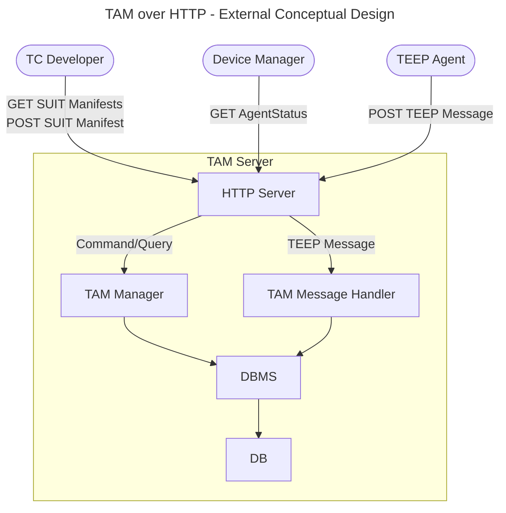

# TAM External Design

Method | Endpoint | Requester | Input | Output | Reference
--|--|--|--|--|--
GET | `/tc-developer/getManifests` | TC Developer | `{TBD}` | 200: `[overview of SUIT Manifest]` | [SUIT_MANIFEST_STORE](SUIT_MANIFEST_STORE.md)
POST | `/tc-developer/addManifest` | TC Developer | SUIT Manifest | 200: OK | [SUIT_MANIFEST_STORE](SUIT_MANIFEST_STORE.md)
GET | `/admin/getAgents` | TAM Admin | `{TBD}` | 200: `{TBD}` (status of Agents under this TAM) | [TEEP_AGENT_STATUS](TEEP_AGENT_STATUS.md)
POST | `/tam` | TEEP Agent | empty QueryResponse Success Error | 200: QueryRequest 200: Update / QueryRequest 204: empty 204: empty | [TEEP_MESSAGE_HANDLE](TEEP_MESSAGE_HANDLE.md)

> [!NOTE]
> Endpoints with `{TBD}` input currently return fixed demo data and do not yet fully reflect request-specific filters.
