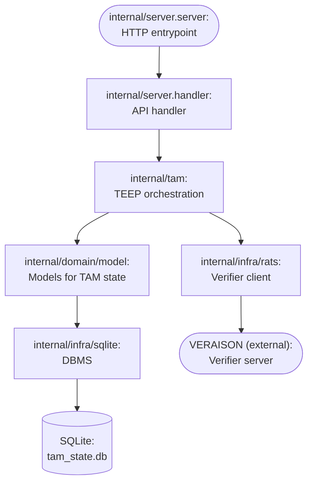
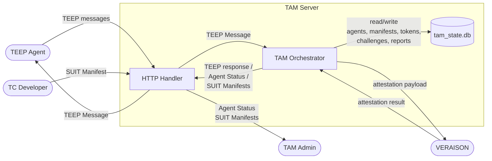
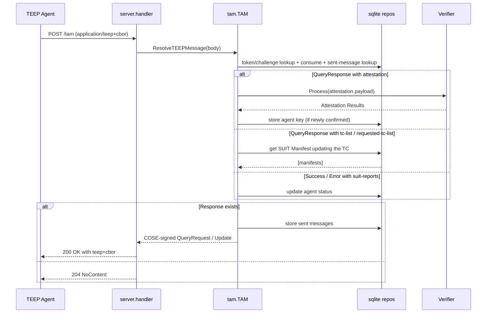

# Internal Design

## Purpose
This document explains the internal relationship between the HTTP server, TAM core logic, domain models, SQLite persistence, and verifier client.

## Layered Architecture

## Rough DFD

### Responsibilities
- `server` layer (`internal/server`): HTTP concerns only (routing, methods, headers, status codes, request/response encoding).
- `tam` layer (`internal/tam`): protocol state machine and business rules for TEEP, attestation handling, token/challenge lifecycle, and manifest selection.
- `model` layer (`internal/domain/model`): persistence-oriented data structures shared across TAM and repositories.
- `sqlite` layer (`internal/infra/sqlite`): SQL schema and CRUD/query logic.

## Startup and Wiring
1. `cmd/tam-over-http/main.go` builds `config.TAMConfig` from flags/env.
2. `server.New` creates verifier client (`rats.NewVerifierClient`).
3. `server.New` creates `tam.TAM`, then calls:
   - `tam.Init()` -> opens `tam_state.db`, applies schema/PRAGMA.
   - if `-insecure-demo-mode` is true:
     - `tam.EnsureDefaultEntity(true)` -> seeds demo entities/keys/manifests.
     - `tam.EnsureDefaultTEEPAgent(true)` -> seeds demo agent/device/status.
4. HTTP server starts with a single handler multiplexer implemented in `handler.ServeHTTP`.

## Request Flow and State Ownership

### 1) TEEP flow (`POST /tam`)

Key points:
- `TAM` is the orchestration boundary. HTTP layer never touches SQL directly.
- Tokens/challenges are one-time correlation handles; token is marked consumed when resolving response context.
  - `challenge` is used for QueryRequest with remote attestation, and the same value must be bound to attestation evidence.
  - `token` is used for regular QueryRequest/Update correlation.
- `sent_query_request_messages` and `sent_update_messages` let TAM validate that incoming messages are responses to TAM-originated messages.
  - The primary correlation key is `token`.
  - For QueryResponse without `token` but with `attestation-payload`, `challenge` can be used after affirming remote attestation results.

### 2) Admin and TC Developer endpoints
- `GET /AgentService/ListAgents`: handler resolves admin entity (TODO), calls `tam.GetAgentStatuses` (TODO: implement a low-cost lookup function), returns CBOR.
- `POST /AgentService/GetAgentStatus`: handler resolves admin entity (TODO), calls `tam.GetAgentStatus`, returns CBOR.
- `GET /SUITManifestService/ListManifests`: handler reads manifests via `tam.GetManifest` for target component IDs.
- `POST /SUITManifestService/RegisterManifest`: handler verifies SUIT envelope signature with `tam.GetEntityKey`, then persists via `tam.SetEnvelope`.

## Design Rules
- HTTP package depends on TAM, never on SQLite repositories.
- TAM may construct repositories directly (current pattern), but repository interfaces in `internal/domain/service` define the intended boundary.
- Domain models should remain transport/persistence neutral (no HTTP logic, no SQL logic).
- Multi-table state transitions (for example agent manifest reflection) should be transactional in repository layer.
