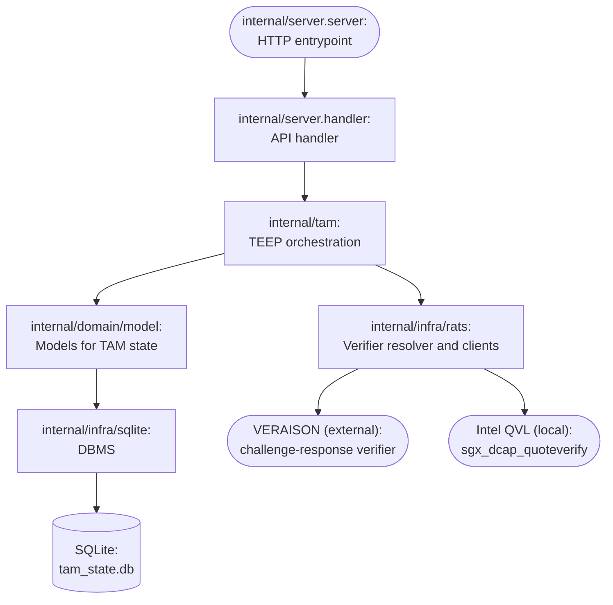
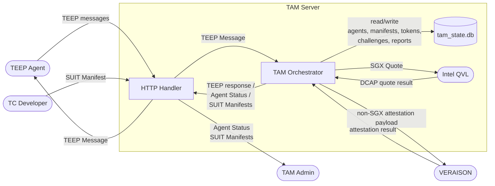
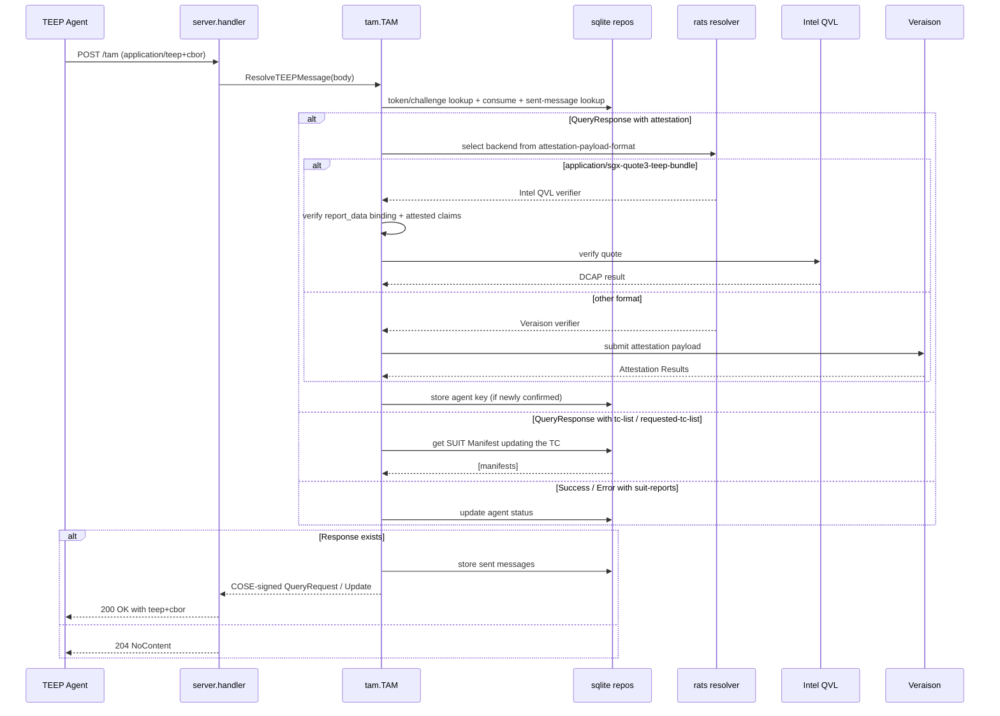
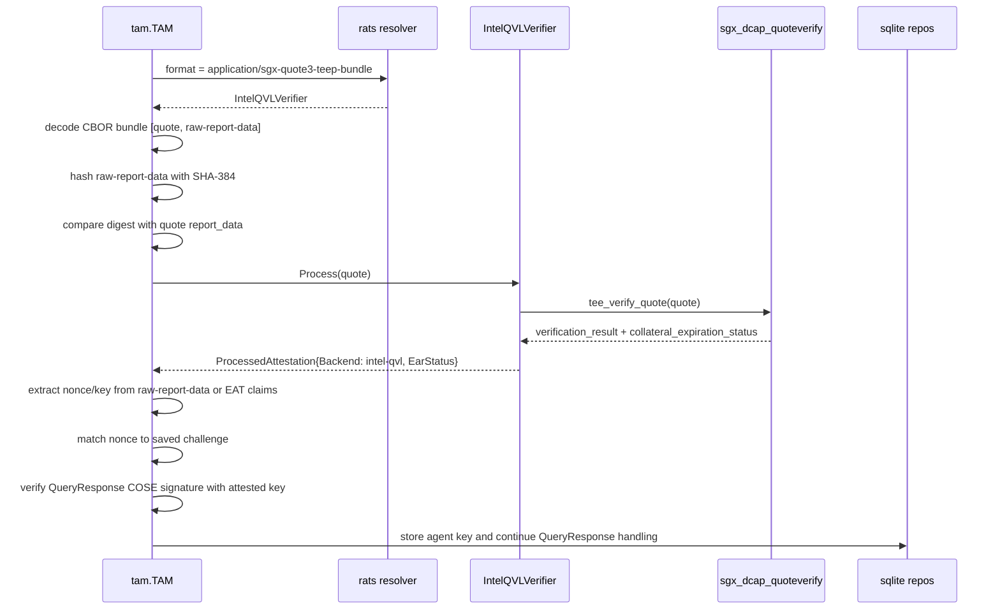

# Internal Design

## Purpose
This document explains the internal relationship between the HTTP server, TAM core logic, domain models, SQLite persistence, and attestation verifier backends.

## Related Internal Docs
- [Database Design](./DATABASE_DESIGN.md)
- [TAM Status: TEEP Agent Status](./TAM_STATUS_TEEP_AGENT_STATUS.md)
- [TAM Status: SUIT Manifest Repository](./TAM_STATUS_SUIT_MANIFEST_REPOSITORY.md)

## Terminology
- **Agent Status**: protocol/API-facing status representation returned by `/AgentService/*`.
- **Repository**: persistence abstraction/component (code-level storage access).

## Layered Architecture

```mermaid
flowchart TD
    B([internal/server.server: <br/>HTTP entrypoint])
    B --> C[internal/server.handler: <br/>API handler]
    C --> D[internal/tam: <br/>TEEP orchestration]
    D --> E[internal/domain/model: <br/>Models for TAM state]
    E --> F[internal/infra/sqlite: <br/>DBMS]
    F --> H[(SQLite: <br/>tam_state.db)]
    D --> G[internal/infra/rats: <br/>Verifier resolver and clients]
    G --> V(["VERAISON (external): <br/>challenge-response verifier"])
    G --> Q(["Intel QVL (local): <br/>sgx_dcap_quoteverify"])
```

## Rough DFD

```mermaid
flowchart LR
    Agent([TEEP Agent])
    TCDev([TC Developer])
    Admin([TAM Admin])
    Veraison([VERAISON])

    subgraph TAM Server
        H[HTTP Handler]
        TAM[TAM Orchestrator]
        DB[(tam_state.db)]
        QVL([Intel QVL])
    end

    Agent -- "TEEP messages" --> H
    H -- "TEEP Message" --> Agent

    H -- "Agent Status<br/>SUIT Manifests" --> Admin
    TCDev -- "SUIT Manifest" --> H

    H -- "TEEP Message" --> TAM
    TAM -- "non-SGX attestation payload" --> Veraison
    Veraison -- "attestation result" --> TAM
    TAM -- "SGX Quote" --> QVL
    QVL -- "DCAP quote result" --> TAM

    TAM -- "read/write<br/>agents, manifests, tokens,<br/>challenges, reports" --> DB
    TAM -- "TEEP response /<br/> Agent Status /<br/> SUIT Manifests" --> H
```

### Responsibilities
- `server` layer (`internal/server`): HTTP concerns only (routing, methods, headers, status codes, request/response encoding).
- `tam` layer (`internal/tam`): protocol state machine and business rules for TEEP, attestation handling, token/challenge lifecycle, and manifest selection.
- `model` layer (`internal/domain/model`): persistence-oriented data structures shared across TAM and repositories.
- `sqlite` layer (`internal/infra/sqlite`): SQL schema and CRUD/query logic.

## Startup and Wiring
1. AttesTAM entrypoint `cmd/attestam/main.go` builds `config.TAMConfig` from flags/env.
2. `server.New` builds `config.RAConfig` from the verifier-related flags/env.
3. `server.New` creates `tam.TAM`:
   - if `-insecure-demo-mode` is false:
     - `tam.NewTAMWithRAConfig(path, raCfg, logger)` loads the TAM private key from `-tam-teep-private-key-path`.
   - if `-insecure-demo-mode` is true:
     - `tam.NewDemoTAMWithRAConfig(raCfg, logger)` loads the public insecure demo TAM private key from `internal/demo`.
   - both constructors install a verifier resolver that lazily creates and caches a backend per attestation payload format.
4. `server.New` then calls:
   - `tam.Init()` -> opens `tam_state.db`, applies schema/PRAGMA.
   - if `-insecure-demo-mode` is true:
     - `tam.SeedDemoData()` -> seeds demo entities, signing keys, `['hello.txt']` manifest, demo device, demo agent, and demo status.
5. HTTP server starts with a single handler multiplexer implemented in `handler.ServeHTTP`.

## Request Flow and State Ownership

### 1) TEEP flow (`POST /tam`)

```mermaid
sequenceDiagram
    participant Client as TEEP Agent
    participant H as server.handler
    participant T as tam.TAM
    participant DB as sqlite repos
    participant R as rats resolver
    participant Q as Intel QVL
    participant V as Veraison

    Client->>H: POST /tam (application/teep+cbor)
    H->>T: ResolveTEEPMessage(body)
    T->>DB: token/challenge lookup + consume + sent-message lookup
    alt QueryResponse with attestation
        T->>R: select backend from attestation-payload-format
        alt application/sgx-quote3-teep-bundle
            R-->>T: Intel QVL verifier
            T->>T: verify report_data binding + attested claims
            T->>Q: verify quote
            Q-->>T: DCAP result
        else other format
            R-->>T: Veraison verifier
            T->>V: submit attestation payload
            V-->>T: Attestation Results
        end
        T->>DB: store agent key (if newly confirmed)
    else QueryResponse with tc-list / requested-tc-list
        T->>DB: get SUIT Manifest updating the TC
        DB-->>T: [manifests]
    else Success / Error with suit-reports
        T->>DB: update agent status
    end

    alt Response exists
        T->>DB: store sent messages
        T-->>H: COSE-signed QueryRequest / Update
        H-->>Client: 200 OK with teep+cbor
    else
        H-->>Client: 204 NoContent
    end
```

Key points:
- `TAM` is the orchestration boundary. HTTP layer never touches SQL directly.
- Tokens/challenges are one-time correlation handles; token is marked consumed when resolving response context.
  - `challenge` is used for QueryRequest with remote attestation, and the same value must be bound to attestation evidence.
  - `token` is used for regular QueryRequest/Update correlation.
- `sent_query_request_messages` and `sent_update_messages` let TAM validate that incoming messages are responses to TAM-originated messages.
  - The primary correlation key is `token`.
  - For QueryResponse without `token` but with `attestation-payload`, `challenge` can be used after affirming remote attestation results.
- Attestation verifier selection is based on `QueryResponse.attestation-payload-format`.
  - `application/sgx-quote3-teep-bundle` selects `rats.IntelQVLVerifier`.
  - All other formats select `rats.VerifierClient` for VERAISON challenge-response verification.
  - `newVerifierResolver` caches backend instances by backend name so a TAM process reuses clients across messages.

### 2) SGX Quote verification path

The Intel QVL path is implemented in `internal/infra/rats`.

```mermaid
sequenceDiagram
    participant T as tam.TAM
    participant R as rats resolver
    participant I as IntelQVLVerifier
    participant D as sgx_dcap_quoteverify
    participant DB as sqlite repos

    T->>R: format = application/sgx-quote3-teep-bundle
    R-->>T: IntelQVLVerifier
    T->>T: decode CBOR bundle [quote, raw-report-data]
    T->>T: hash raw-report-data with SHA-384
    T->>T: compare digest with quote report_data
    T->>I: Process(quote)
    I->>D: tee_verify_quote(quote)
    D-->>I: verification_result + collateral_expiration_status
    I-->>T: ProcessedAttestation{Backend: intel-qvl, EarStatus}
    T->>T: extract nonce/key from raw-report-data or EAT claims
    T->>T: match nonce to saved challenge
    T->>T: verify QueryResponse COSE signature with attested key
    T->>DB: store agent key and continue QueryResponse handling
```

SGX-specific rules:
- TAM expects the SGX bundle to contain `Quote` and `RawReportData`, verifies the AttesTAM-defined SHA-384 `report_data` binding, and submits only the SGX Quote bytes to `IntelQVLVerifier`.
- Quote `report_data` extraction supports quote versions 3, 4, and version 5 body types 1 through 4.
- Native DCAP verification is affirming only when collateral is not expired and the QVL result is one of the accepted success or recoverable configuration/out-of-date states.
- TAM first tries to parse `raw-report-data` as EAT claims. If that fails, it falls back to the layout where the first 64 bytes are the EC2 public key coordinates and any remaining bytes are the attestation nonce.
- The `intel-qvl` backend requires the `intel_qvl` build tag, cgo, and the native `sgx_dcap_quoteverify` library. Without that build configuration, selecting this backend returns a configuration error.

### 3) Admin and TC Developer endpoints
- `GET /AgentService/ListAgents`: handler resolves admin entity (TODO), calls `tam.GetAgentStatuses` (TODO: implement a low-cost lookup function), returns CBOR.
- `POST /AgentService/GetAgentStatus`: handler resolves admin entity (TODO), calls `tam.GetAgentStatus`, returns CBOR.
- `GET /SUITManifestService/ListManifests`: handler reads manifests via `tam.GetManifest` for target component IDs.
- `POST /SUITManifestService/RegisterManifest`: handler verifies SUIT envelope signature with `tam.GetEntityKey`, then persists via `tam.SetEnvelope`.

## Design Rules
- HTTP package depends on TAM, never on SQLite repositories.
- TAM may construct repositories directly (current pattern), but repository interfaces in `internal/domain/service` define the intended boundary.
- Domain models should remain transport/persistence neutral (no HTTP logic, no SQL logic).
- Multi-table state transitions (for example agent manifest reflection) should be transactional in repository layer.
