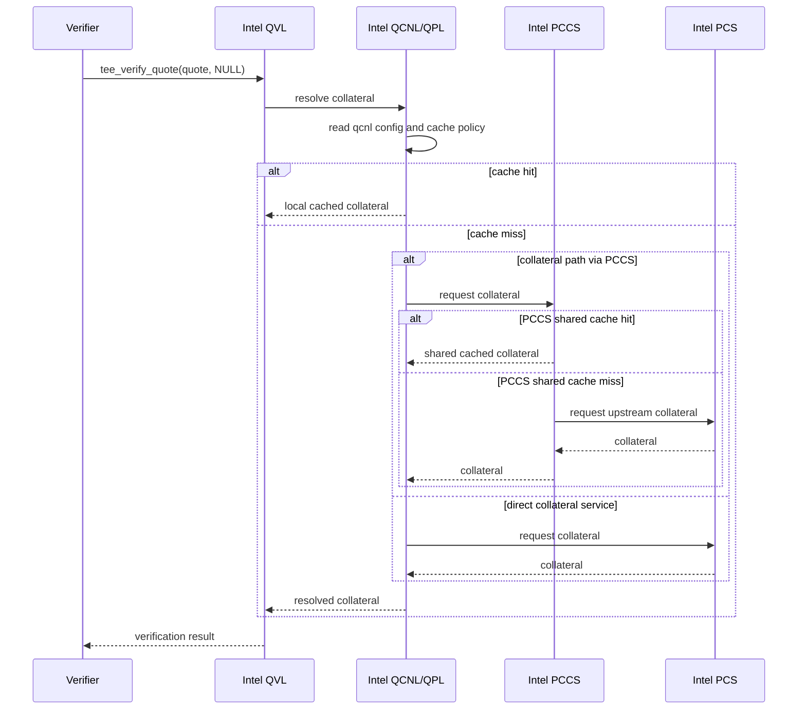
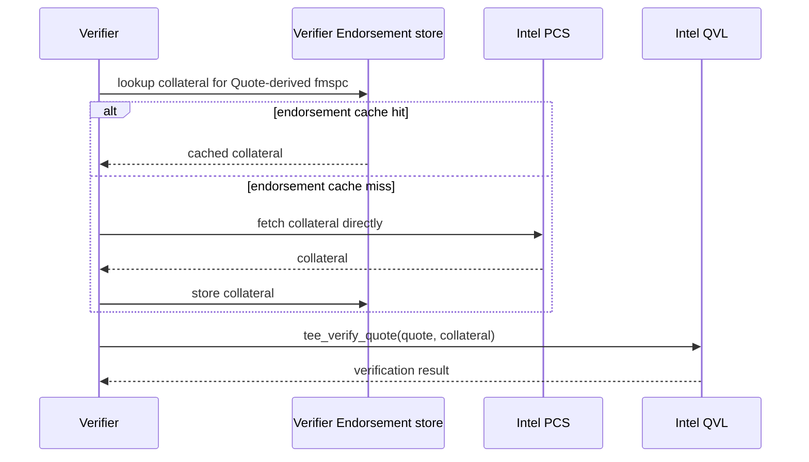
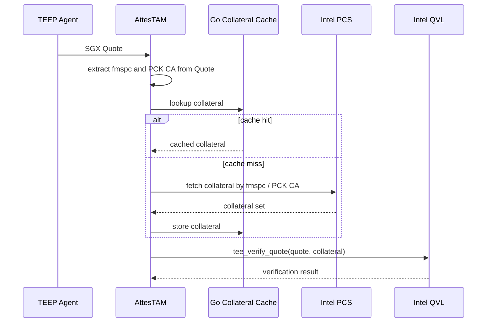

# SGX Quote Verification

## Purpose
This document describes the current AttesTAM implementation policy for Intel SGX Quote verification.

AttesTAM is primarily a Relying Party in RFC 9334 terms.
However, in the current implementation, AttesTAM also embeds the Verifier-side functionality needed to verify Intel SGX Quotes.

## Terminology

### Intel / SGX Terms and RFC 9334 RATS Terms

This document uses both Intel SGX/DCAP terms and RFC 9334 RATS terms.
The rough correspondence is as follows.

| Intel / SGX term | Rough RATS term | Notes |
| ---- | ---- | ---- |
| SGX Quote | Evidence | The Quote mainly contains the SGX `REPORT` contents and the Quoting Enclave signature over them. |
| `REPORT` content in the Quote | Evidence content | This is the core attestation payload about the Attester's state. |
| QE signature over the Quote contents | Part of Evidence | It is part of how the Evidence is carried and authenticated in the Intel SGX attestation format. |
| PCK Cert chain embedded in the Quote | Endorsement material | It is vendor-originated material used by the Verifier to validate the Quote signature chain. |
| CRLs fetched for Quote verification | Endorsement material | They are vendor-originated revocation statements used by the Verifier when appraising the Quote and its certification path. |
| `TCB Info` and `QE Identity` | Reference Values delivered as Intel-signed collateral | They are compared against Quote-derived values, while also being vendor-originated signed inputs delivered through the Intel collateral path. |
| SGX Root CA certificate | Verifier trust-anchor material | Conceptually it is a Verifier-side trust anchor, even when an implementation such as Intel QVL carries it internally. |
| Collateral fetched for Quote verification | Intel-supplied verification input | In practice this groups the CRLs, `TCB Info`, and `QE Identity` that AttesTAM fetches and passes into Intel QVL. |
| Intel PCS | Endorser | Intel PCS is the source from which the Verifier obtains Intel-generated endorsement data. |
| AttesTAM Intel QVL path | Verifier | AttesTAM acts as the Verifier in RFC 9334 terms. |

For Intel SGX Quote verification, the Verifier receives a Quote as Evidence, then uses Quote-derived information such as `fmspc` as a key to obtain Endorsements from the Endorser.

In the current AttesTAM design, that means:

- the SGX Quote is treated as Evidence
- the PCK Cert chain carried by the Quote is treated as Endorsement material
- the Verifier uses `fmspc` from the Quote to fetch collateral from Intel PCS

The fetched collateral includes items such as:

- CRLs relevant to PCK / TCB verification
- TCB Info
- QE Identity

For Intel SGX, it is useful to think of the PCK Cert chain together with the fetched collateral as the Intel-supplied verification input used by the Verifier to appraise the Quote.

More precisely in RFC 9334 terms:

- the PCK Cert chain and CRLs are best understood as Endorsement material
- `TCB Info` and `QE Identity` are best understood as Reference Values, even though AttesTAM obtains them as Intel-signed collateral
- the SGX Root CA certificate is best understood as Verifier trust-anchor material, even if an implementation detail places it inside Intel QVL

## Implementation Policy

AttesTAM currently adopts the following two design priorities.

1. AttesTAM uses Intel QVL, but does not use Intel PCCS or Intel QCNL as required runtime components in the Quote verification path.
2. AttesTAM manages SGX Quote collateral in Go code on the TAM side, using a Go cache and Intel PCS fetch path keyed by the Quote-derived FMSPC.

AttesTAM intentionally does not use Intel QCNL as the runtime component responsible for collateral retrieval policy.

These two points are intentional design choices, not incidental implementation details.

## Trade-off Summary

The current AttesTAM policy is not presented as universally better than using Intel QCNL/PCCS.
The goal is to make the trade-offs explicit.

| Viewpoint | Use Intel QCNL/PCCS | Current AttesTAM policy |
| ---- | ---- | ---- |
| Maintenance ownership | More of the collateral retrieval and cache behavior is maintained by Intel-provided components. | AttesTAM must maintain its own Go implementation for collateral retrieval, cache handling, and policy decisions. |
| Configuration flexibility | Intel-specific configuration can support multiple deployment patterns through files such as `/etc/sgx_default_qcnl.conf`. | Behavior is concentrated in one implementation path, which reduces hidden branches and can make environment setup easier to understand. |
| Operational simplicity | A standard Intel-style deployment may fit environments already using QCNL/PCCS. | Fewer Intel-specific runtime components are required in the normal Verifier path. |
| Visibility from Verifier code | Collateral source selection and cache behavior can be harder to see because they may be externalized into QCNL/PCCS configuration and runtime behavior. | Collateral source selection, cache lookup, and reuse policy are visible in the Verifier implementation. |
| Scaling collateral management | PCCS can act as a shared service and shared cache across multiple Verifier hosts. | The Verifier can apply an AttesTAM-specific Endorsement store policy, but distributed/shared cache strategy must be designed and maintained by AttesTAM. |
| Local host behavior | QCNL/QPL can use host-local cache and host-local policy such as `local_cache_only`. | The Verifier directly controls host-local collateral behavior instead of inheriting QCNL policy. |
| Runtime adaptability | Intel components may support different routing and caching topologies without changing Verifier code. | Fewer moving parts can make runtime behavior easier to reason about, but new topologies usually require code changes or explicit AttesTAM design work. |
| Verification input control | Convenient when the Verifier is comfortable delegating collateral management to Intel's runtime stack. | Better fit when the Verifier wants to directly control which collateral is fetched, cached, reused, and passed to Intel QVL. |

In short:

- using Intel QCNL/PCCS reduces the amount of Verifier-owned collateral management code, but pushes more behavior into Intel runtime components and configuration
- the current AttesTAM policy keeps behavior concentrated in the Verifier implementation, but requires AttesTAM to maintain more custom code

## Main Design Intent

### 1. Use Intel QVL, but do not rely on Intel PCCS or Intel QCNL

AttesTAM uses the native Intel DCAP quote verification library through `tee_verify_quote()` in [`internal/infra/rats/intel_qvl_verifier.go`](../internal/infra/rats/intel_qvl_verifier.go).

However, AttesTAM does not delegate collateral acquisition policy to Intel QPL / QCNL / PCCS at verification time.

This is a strong implementation policy:

- use Intel QVL for the verification primitive itself
- do not use Intel QCNL for collateral retrieval policy
- do not use Intel PCCS as the normal collateral-management component
- keep collateral lookup, fetch, cache, and reuse decisions in AttesTAM Go code

Instead, AttesTAM follows this policy:

- The TAM process prepares the collateral in Go code.
- The TAM process always passes the prepared collateral to `tee_verify_quote()`.
- Quote verification is performed only within the scope of the collateral explicitly supplied by AttesTAM.
- The collateral fetch path, cache lookup path, and reuse policy are all decided in Go code in the AttesTAM process.
- AttesTAM intentionally does not call `tee_verify_quote()` with `collateral = NULL`, because the Verifier-side Endorsement store is meant to directly control collateral selection and reuse.

This means the verifier path is intentionally split as follows:

- Native verification logic: Intel QVL / `tee_verify_quote()`
- Collateral retrieval, cache control, and reuse policy: AttesTAM Go code

The practical reason is to keep collateral lifecycle control in the TAM implementation, instead of depending on Intel PCCS deployment and QCNL runtime behavior.

More specifically, AttesTAM does not want SGX collateral behavior to be controlled by host-level configuration such as `/etc/sgx_default_qcnl.conf`.

If QCNL is used in the usual way, runtime behavior can depend on configuration such as:

- which PCCS URL is configured
- whether a separate collateral service is configured
- retry and backoff behavior
- local cache behavior
- local-cache-only mode

In that model, the Intel stack can involve two distinct cache layers:

- a QCNL/QPL-managed local cache on the Verifier host, for example files under `$HOME/.dcap-qcnl`
- a PCCS-managed shared cache in the Intel reference PCCS implementation, which is a Node.js server and can maintain its own service-side cache

AttesTAM intentionally avoids that model.

Instead, AttesTAM includes QCNL-equivalent collateral retrieval responsibilities in Go code so that:

- the source of collateral is explicit in the verifier implementation
- the cache policy is explicit in the verifier implementation
- runtime behavior does not silently change because the host has a different `/etc/sgx_default_qcnl.conf`
- the verification input boundary remains under TAM control

### 2. Derive FMSPC from the Quote, then use Go-managed cache and Intel PCS

AttesTAM derives the FMSPC from the externally supplied Quote and uses that value as the main key for collateral lookup.

The current flow is:

1. The TEEP Agent sends an SGX Quote.
2. AttesTAM extracts `fmspc` from the Quote.
3. AttesTAM derives the collateral cache key from that Quote, preferring an FMSPC-based key.
4. AttesTAM checks the Go-managed collateral cache.
5. If cached collateral is available, AttesTAM uses it for verification.
6. If cached collateral is missing, or if the cached collateral is no longer acceptable for use, AttesTAM fetches collateral from Intel PCS.
7. The fetched collateral is stored in the Go-managed cache.
8. AttesTAM calls `tee_verify_quote()` with the Quote and the explicitly prepared collateral.

The key point is that collateral management is owned by the TAM, not by Intel PCCS and not implicitly by the QVL library.

> [!NOTE]
> The intended policy is "cache hit and still usable -> reuse" and "cache miss or stale collateral -> refetch from Intel PCS".
> The current implementation already uses the Go-managed cache and Intel PCS fetch path, and it always passes explicit collateral to `tee_verify_quote()`.
> If cache freshness rules evolve further, that logic should remain in AttesTAM Go code rather than being delegated to Intel PCCS or QCNL runtime retrieval.

## Architecture Comparison

### Common Intel DCAP deployment model

A common deployment model is:

- Verifier
- Intel QVL
- Intel QCNL
- Intel PCCS
- Intel PCS

In that model:

- the Verifier calls Intel QVL APIs
- the Verifier commonly passes `collateral = NULL` to `tee_verify_quote()`
- Intel QVL or its surrounding Intel provider stack relies on QCNL/QPL behavior
- QCNL behavior is influenced by `/etc/sgx_default_qcnl.conf`
- QCNL/QPL can maintain a local cache on the Verifier host
- QCNL may obtain collateral through PCCS
- Intel PCCS, commonly deployed as Intel's Node.js reference service, can also maintain its own shared cache
- PCCS may in turn obtain or proxy data from Intel PCS

That structure can be summarized as:

```text
Verifier -> Intel QVL -> Intel QCNL -> Intel PCCS -> Intel PCS
```

When `tee_verify_quote()` is called with `collateral = NULL`, the practical behavior is commonly understood as:

- the Verifier asks Intel QVL to verify the Quote without explicitly supplying collateral
- Intel's surrounding provider stack becomes responsible for deciding how collateral is found
- QCNL/QPL consults its own runtime configuration
- QCNL/QPL may use local cache, local-cache-only mode, retry rules, PCCS, or direct collateral service settings
- Intel QVL verifies the Quote using collateral that was resolved through that external path

That means the verification input path is no longer fully described by the Verifier code alone.

### Typical `collateral = NULL` sequence



In this sequence, the Verifier sees the Quote and the final result, but the collateral selection and retrieval policy are mostly externalized into the Intel stack and its configuration.

Here, "local cached collateral" refers to the QCNL-managed host-local cache, while "shared cached collateral" refers to the PCCS-side cache held by the PCCS service.

### Current AttesTAM model

The current AttesTAM model is intentionally different.

In this document, AttesTAM is viewed primarily as the Relying Party.
At the same time, the current implementation embeds the Verifier-side SGX Quote verification path inside AttesTAM, so the following data flow focuses on that internal Verifier function.

For collateral management:

```text
Verifier -> AttesTAM endorsement store -> Intel PCS
```

For Quote verification:

```text
Verifier -> Intel QVL
```

In other words, the current design is:

- `Verifier - independent Endorsement store - Intel PCS`
- `Verifier - Intel QVL`

Here, "independent Endorsement store" means the Go-managed collateral cache and retrieval logic in AttesTAM.

This model removes Intel QCNL and Intel PCCS from the normal collateral control path used by AttesTAM.

AttesTAM also intentionally avoids the common `tee_verify_quote(quote, NULL)` pattern.

The reason is that AttesTAM wants collateral management to be directly controlled by the Verifier-side Endorsement store, rather than indirectly discovered through QCNL configuration, QCNL local cache, PCCS behavior, or PCS routing chosen outside the Verifier code.

As shown in the data flow below, this internal Verifier function does **NOT** by itself appraise Target Environment identity values such as `MRENCLAVE` and `MRSIGNER` from the SGX Quote.
That appraisal usually depends on Relying Party-specific policy, so in AttesTAM it belongs conceptually above the Intel QVL-based Quote verification step.


Refer [Conceptual Data Flow of RATS Architecture](https://datatracker.ietf.org/doc/html/rfc9334#figure-1).

### Current AttesTAM sequence



In this sequence, the Verifier itself owns the Endorsement store lookup, the Intel PCS fetch decision, and the final collateral object passed into Intel QVL.

### Why the difference matters

The difference is not only packaging. It changes who owns the verification inputs.

In the common Intel stack:

- collateral source selection is largely delegated to the Intel retrieval stack
- runtime behavior can depend on QCNL configuration
- the Verifier host may need QCNL/QPL-related components and configuration in addition to Intel QVL
- the Verifier host may also need PCCS deployment or access to a PCCS service
- QCNL/QPL can keep host-local cache files
- PCCS can keep a service-side shared cache
- collateral cache behavior, retry policy, local-cache-only mode, and service routing can be controlled outside the Verifier code
- the actual endorsement inputs used by Intel QVL can become harder to inspect from the Verifier implementation itself

In the AttesTAM stack:

- collateral source selection is implemented by the Verifier in Go code
- the endorsement cache is owned by the Verifier
- Intel PCS is contacted directly by the Verifier-side Go implementation
- Intel QVL only consumes the collateral already selected by the Verifier
- the Verifier code explicitly determines when cached collateral is reused and when Intel PCS is queried
- the endorsement path is visible in the Verifier implementation, rather than hidden behind Intel-specific runtime configuration

This distinction matters for two separate reasons.

First, operational dependency:

- if collateral management is delegated to QCNL/PCCS, the machine running the Verifier may need Intel-specific runtime components, configuration, and in many cases PCCS deployment or access

Second, implementation visibility:

- if collateral and policy are controlled through Intel-specific configuration, the Verifier source code no longer fully describes which collateral source, cache policy, and retrieval behavior are actually in effect
- AttesTAM wants to avoid that situation and keep those decisions visible in Go code

## Current Implementation Structure

### Quote verification entrypoint

- [`internal/infra/rats/intel_qvl_verifier.go`](../internal/infra/rats/intel_qvl_verifier.go)

Responsibilities:

- accept the Quote bytes from TAM
- resolve collateral using the Go-managed path
- call `tee_verify_quote()` with explicit collateral
- interpret the Intel QVL result and map it into AttesTAM verifier output

### Intel PCS client

- [`internal/infra/rats/intel_qvl_pcs.go`](../internal/infra/rats/intel_qvl_pcs.go)

Responsibilities:

- extract `fmspc` from the Quote
- extract the PCK CA identity from the Quote certification data
- call Intel PCS endpoints needed for `sgx_ql_qve_collateral_t`
- construct the collateral object passed into Intel QVL

The current implementation fetches:

- `PCK CRL`
- `PCK CRL issuer chain`
- `Root CA CRL`
- `TCB Info`
- `TCB Info issuer chain`
- `QE Identity`
- `QE Identity issuer chain`

Note that Intel's `sgx_ql_qve_collateral_t` does not contain the trusted Root CA certificate itself.
AttesTAM therefore distinguishes between:

- collateral data that maps naturally to `sgx_ql_qve_collateral_t`
- trust-anchor material such as the Intel SGX Root CA certificate, which is related but is not stored as a field in that collateral structure

### Go-managed collateral cache

- [`internal/infra/rats/intel_qvl_collateral.go`](../internal/infra/rats/intel_qvl_collateral.go)

Responsibilities:

- derive the cache key from the Quote
- persist collateral in a Go-controlled cache directory
- reload cached collateral for later verification

The cache prefers an FMSPC-based key. If FMSPC extraction fails, it falls back to a Quote hash based key.

## Verification Flow



This sequence is intentionally different from the common `tee_verify_quote(quote, NULL)` path.

Here:

- the Verifier itself selects the collateral source
- the Verifier itself decides whether cache is reused
- the Verifier itself prepares the `sgx_ql_qve_collateral_t`-equivalent input
- Intel QVL receives an explicit collateral object instead of discovering collateral through QCNL runtime behavior

## Intel DCAP Reference Behavior

This section summarizes reference behavior observed in Intel's open-source DCAP implementation under `confidential-computing.tee.dcap`.
It is included as implementation background, not as a statement that AttesTAM must follow the same runtime structure.

### What the Quote Verification code shows

The main verification flow can be understood at the following level.

1. `tee_verify_quote()` accepts the Quote together with a collateral structure of type `sgx_ql_qve_collateral_t`.
2. In AttesTAM, that collateral is prepared in Go and converted into the C structure in [`internal/infra/rats/intel_qvl_verifier.go`](../internal/infra/rats/intel_qvl_verifier.go).
3. The collateral structure contains items such as `pck_crl`, `root_ca_crl`, `tcb_info`, and `qe_identity`, together with their issuer chains.
4. The trusted Intel SGX Root CA certificate itself is not a field of `sgx_ql_qve_collateral_t`.
5. For the normal SGX `tee_verify_quote()` path, Intel QVL does not simply trust the Root CA certificate embedded in the Quote's PCK certificate chain. It checks that certificate against a pinned Intel Root public key.

So the rough trust model is:

- the Verifier supplies the Quote and collateral to `tee_verify_quote()`
- the collateral carries revocation and TCB-related material, but not the trusted SGX Root CA certificate as a field
- Intel QVL verifies the Quote's certificate chain against a pinned Intel Root public key before accepting that chain as trustworthy

The pinned public key appears in Intel's DCAP source as `INTEL_ROOT_PUB_KEY` in [`ae/QvE/qve/qve.cpp`](https://github.com/intel/confidential-computing.tee.dcap/blob/main/ae/QvE/qve/qve.cpp).
The source file path looks QvE-specific, but this source is shared with the QVL software path as well.

### Why this matters for AttesTAM

This reference behavior is useful for AttesTAM for two reasons.

First, it explains why "fetching the Intel PCS collateral set" is not exactly the same thing as "collecting every trust input involved in verification".

Second, it reinforces the design choice to keep collateral handling explicit in AttesTAM:

- AttesTAM should clearly distinguish collateral fields from trust-anchor material
- AttesTAM should avoid hidden runtime behavior in QCNL / PCCS / host configuration
- AttesTAM should make it clear which inputs are passed to Intel verification logic and why

## Why This Design Is Preferred

### Explicit collateral boundary

AttesTAM wants the verification boundary to be explicit:

- the Quote comes from the TEEP Agent
- the collateral comes from the TAM-controlled path
- Intel QVL verifies only against the collateral that the TAM provides

This makes the source of verification inputs easier to reason about and easier to test.

### Avoid a PCCS runtime dependency

AttesTAM does not want SGX Quote verification to require a separately deployed PCCS instance as part of the normal TAM runtime.

By keeping collateral retrieval in Go code:

- deployment is simpler
- collateral behavior is easier to inspect
- cache policy is controlled in AttesTAM code
- tests can validate collateral selection logic without requiring a live PCCS

### Preserve Intel verification semantics

AttesTAM still uses Intel QVL for the actual Quote verification decision.

This design does not replace Intel’s verification logic. It replaces only the collateral acquisition path.

## Non-Goals

The current implementation is not trying to:

- make Intel PCCS part of the required AttesTAM runtime
- rely on `sgx_ql_get_quote_verification_collateral()` or QCNL runtime retrieval during Quote verification
- hide collateral source selection inside the Intel library stack

## Operational Summary

In short, the current AttesTAM SGX Quote verification policy is:

- use Intel QVL for Quote verification
- do not require Intel PCCS
- extract `fmspc` from the Quote in Go
- manage collateral lookup and caching in Go
- fetch collateral from Intel PCS when the cache is missing the required entry
- always pass explicit collateral into `tee_verify_quote()`

## Related Files

- [`internal/infra/rats/intel_qvl_verifier.go`](../internal/infra/rats/intel_qvl_verifier.go)
- [`internal/infra/rats/intel_qvl_pcs.go`](../internal/infra/rats/intel_qvl_pcs.go)
- [`internal/infra/rats/intel_qvl_collateral.go`](../internal/infra/rats/intel_qvl_collateral.go)
- [`internal/tam/tam.go`](../internal/tam/tam.go)
