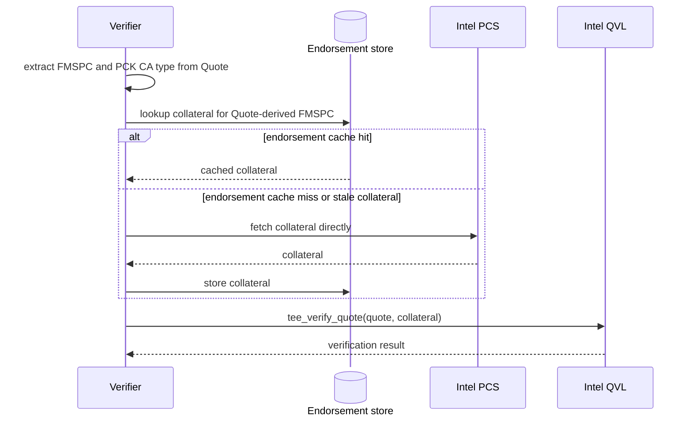
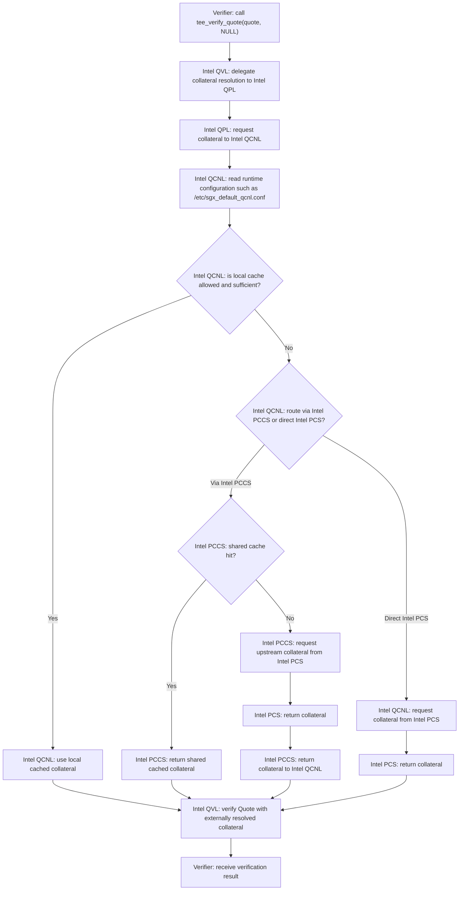

# SGX Quote Verification

## Purpose
This document describes the current AttesTAM implementation policy for Intel SGX Quote verification.

AttesTAM is primarily a Relying Party in [RFC 9334](https://datatracker.ietf.org/doc/rfc9334/) RATS Architecture terms.
However, in the current implementation, AttesTAM also embeds the Verifier-side functionality needed to verify Intel SGX Quotes.

Readers can use this document in different ways depending on their interests.
For terminology and the SGX-to-RATS mapping, start with [Terminology](#terminology).
For the high-level design direction and the resulting constraints, read [Design Policy](#design-policy) and [Limitations](#limitations).
For the external behavior of the verification path, read [SGX Quote Verification Flow](#sgx-quote-verification-flow).
For the detailed motivation behind the design, read [Main Design Intent](#main-design-intent) and [Architecture Comparison](#architecture-comparison).
For code-oriented details, continue to [Current Implementation Structure](#current-implementation-structure).

## Terminology

### Intel SGX Terms and RFC 9334 RATS Terms

This document uses both Intel SGX/DCAP terms and RFC 9334 RATS terms.
The rough correspondence is as follows.

| Intel / SGX term | Rough RATS term | Notes |
| ---- | ---- | ---- |
| SGX Quote | Evidence | The Quote mainly contains the state of the CPU platform, the Quoting Enclave, the Enclave App, and the ECDSA signature produced by the Quoting Enclave. It also carries the PCK Cert chain and the certification data for the ECDSA Attestation Key. |
| Quoting Enclave (QE) | Attesting Environment | The QE collects platform and enclave state and signs the Quote with the ECDSA Attestation Key. |
| ECDSA Attestation key | Attestation Key (AK) | Used by QE and certified by PCE. |
| Provisioning Certification Enclave (PCE) | Endorser | Certifies the AK in the same CPU platform and is itself certified by Intel. |
| Enclave App | Target Environment (TE) | The environment in which the TEEP Agent runs. |
| (verification) collateral | Endorsement | In practice this groups the CRLs, `TCB Info`, and `QE Identity` that are fetched from Intel PCS and passed into Intel QVL. |
| Intel Quote Verification Library (QVL) | N/A | Intel's verification library, used by the Verifier as the implementation of the SGX Quote verification procedure. |
| SGX Root CA Certificate | trust anchor | Certifies Intel's collateral and the PCK Cert chain, and is pinned in Intel QVL. |
| Intel PCS | Endorser | Intel PCS is the source from which the Verifier obtains Intel-generated Endorsements (collateral). |

For Intel SGX Quote verification, the Verifier receives a Quote as Evidence, then uses Quote-derived information such as `FMSPC` (Family-Model-Stepping-Platform-CustomSKU) as a key to obtain Endorsements from the Intel PCS.

## Design Policy

The AttesTAM-embedded Verifier only covers the scope of core SGX Quote verification:

1. verifying the integrity and authenticity of the Evidence
2. verifying the validity of the Quote with respect to Intel-supplied collateral
3. producing a verification result from that Evidence-and-collateral check

Thus, the Verifier does **not** appraise the Target Environment by itself; that appraisal is left to the Relying Party or another Verifier.

Additionally, the Verifier fully manages collateral in its own Endorsement store for simplicity, avoiding reliance on the more complex Intel QPL / QCNL / PCCS stack (see [Architecture Comparison](#architecture-comparison)).

These points are intentional design choices, not incidental implementation details.

## Limitations

- This implementation does not aim to support every SGX Quote format.
  The current Intel QVL verification path is effectively limited to the DCAP ECDSA Quote formats for which collateral extraction and PCK certificate chain handling are implemented, currently Quote version 3 and Quote version 4.
- Endorsements are not received in a CoRIM-based format.
  Instead, AttesTAM uses Intel's native collateral structure and passes data shaped for `sgx_ql_qve_collateral_t` into Intel QVL.
- AttesTAM does not proactively cache the latest collateral for every possible `FMSPC`.
  As a result, first-time verification for a given `FMSPC` can be slower, and verification latency can become unstable when Intel PCS access is slow or unavailable.
- Target Environment appraisal is intentionally left outside this implementation.
  In particular, appraisal of Target Environment-related values such as `MRENCLAVE`, `MRSIGNER`, `ISV_SVN`, and application-specific `REPORT_DATA` remains the responsibility of the Relying Party or a higher-layer Verifier policy.

## SGX Quote Verification Flow

### Conceptual Data Flow

As shown in the data flow below (cf. [Conceptual Data Flow of RATS Architecture](https://datatracker.ietf.org/doc/html/rfc9334#figure-1)), the Verifier receives an SGX Quote with a PCK Cert chain and obtains the corresponding collateral ultimately from Intel PCS.


Note that the SGX Root CA trust anchor looks like an input to Intel QVL, but in practice its public key is pinned in Intel QVL source code (`INTEL_ROOT_PUB_KEY` in [`ae/QvE/qve/qve.cpp`](https://github.com/intel/confidential-computing.tee.dcap/blob/main/ae/QvE/qve/qve.cpp)).

### Implementation Flow

The sequence diagram below shows the concrete verification path owned by the Verifier.
It derives identifiers such as `FMSPC` and the PCK CA type, uses `FMSPC` to determine the Endorsement store lookup key, checks the Endorsement store first, and only queries Intel PCS when suitable collateral is not already cached.
The Verifier stores fetched collateral back into its own Endorsement store before passing it to Intel QVL.

The Verifier verifies the Quote with the Intel QVL function `tee_verify_quote(quote, collateral)` to produce Attestation Results.

This Verifier currently does not apply an explicit Appraisal Policy to Target Environment identity values in the Evidence.
Instead, it only verifies the authenticity, integrity, and validity of the SGX Quote.

The Verifier does **NOT** by itself appraise Target Environment identity values taken from the SGX Quote, such as `MRENCLAVE`, `MRSIGNER`, the Target Environment security version number (`ISV_SVN`), or the application-specific field `REPORT_DATA`.
Such appraisal usually depends on Relying Party-specific policy, so in AttesTAM it belongs conceptually above the Intel QVL-based Quote verification step.



## Main Design Intent

The current implementation embeds a Verifier-side Intel SGX Quote verification path inside AttesTAM.

That embedded Verifier is responsible for:

- obtaining the collateral needed to verify the SGX Quote
- passing the Quote and collateral into Intel QVL
- determining whether the Quote is valid with respect to Intel's verification logic and the supplied collateral

That embedded Verifier is **not** responsible, by itself, for appraising Target Environment identity values such as `MRENCLAVE` and `MRSIGNER`.
Those checks usually depend on Relying Party-specific policy, so in AttesTAM they belong conceptually above the Intel QVL-based Quote verification step.

### 1. Use Intel QVL, but do not rely on Intel QPL / QCNL / PCCS

AttesTAM uses the native Intel DCAP quote verification library (QVL) through `tee_verify_quote()` in [`internal/infra/rats/intel_qvl_verifier.go`](../internal/infra/rats/intel_qvl_verifier.go).

However, AttesTAM does not delegate collateral acquisition policy to Intel QPL / QCNL / PCCS at verification time.
The implementation policy is:

- use Intel QVL for the core SGX Quote verification logic that this Verifier is responsible for
- do not use Intel QPL as the runtime provider layer for collateral resolution
- do not use Intel QCNL for collateral retrieval policy
- do not use Intel PCCS as the normal collateral-management component
- keep collateral lookup, fetch, cache, and reuse decisions in AttesTAM Go code

In practice:

- The TAM process prepares the collateral in Go code.
- The TAM process always passes the prepared collateral to `tee_verify_quote()`.
- Quote verification is performed only within the scope of the collateral explicitly supplied by AttesTAM.
- The collateral fetch path, cache lookup path, and reuse policy are all decided in Go code in the AttesTAM process.
- AttesTAM intentionally does not call `tee_verify_quote()` with `collateral = NULL`, because the Verifier-side Endorsement store is meant to directly control collateral selection and reuse.

This means that the verification path is intentionally split as follows:

- Native verification logic: Intel QVL / `tee_verify_quote()`
- Collateral retrieval, cache control, and reuse policy: Verifier's Endorsement store

This choice is intended to keep collateral lifecycle control in the AttesTAM Verifier implementation.
For the more common Intel deployment model using QPL / QCNL / PCCS, see [Common Intel DCAP deployment model](#common-intel-dcap-deployment-model).
For why AttesTAM considers that structure too complex to leave outside the Verifier code, see [Why the difference matters](#why-the-difference-matters).

### 2. Derive FMSPC from the Quote, then use Endorsement store and Intel PCS

AttesTAM derives the FMSPC from the externally supplied Quote and uses that value as the main key for collateral lookup.
The Endorsement store sits between Quote parsing and Intel PCS access as a Verifier-managed cache for that collateral.

The current flow is:

1. The TEEP Agent sends an SGX Quote.
2. AttesTAM extracts `FMSPC` from the Quote.
3. AttesTAM derives the Endorsement store key from that Quote, using `FMSPC`.
4. AttesTAM checks the Endorsement store.
5. If cached collateral is available, AttesTAM uses it for verification.
6. If cached collateral is missing, or if the cached collateral is no longer acceptable for use, AttesTAM fetches collateral from Intel PCS.
7. The fetched collateral is stored in the Endorsement store.
8. AttesTAM calls `tee_verify_quote()` with the Quote and the explicitly prepared collateral.

The key point is that collateral management is owned by the Verifier, not by Intel PCCS and not implicitly by the QVL library.

## Architecture Comparison

### Trade-off Summary

The current AttesTAM policy is not presented as universally better than using Intel QPL/QCNL/PCCS.
The goal is to make the trade-offs explicit.

| Viewpoint | Use Intel QPL/QCNL/PCCS | Current AttesTAM policy |
| ---- | ---- | ---- |
| Maintenance ownership | More of the collateral retrieval and cache behavior is maintained by Intel-provided components. | AttesTAM must maintain its own Go implementation for collateral retrieval, cache handling, and policy decisions. |
| Configuration flexibility | Intel-specific configuration can support multiple deployment patterns through files such as `/etc/sgx_default_qcnl.conf`. | Behavior is concentrated in one implementation path, which reduces hidden branches and can make environment setup easier to understand. |
| Operational simplicity | A standard Intel-style deployment may fit environments already using QCNL/PCCS. | Fewer Intel-specific runtime components are required in the normal Verifier path. |
| Visibility from Verifier code | Collateral source selection and cache behavior can be harder to see because they may be externalized into QCNL/PCCS configuration and runtime behavior. | Collateral source selection, cache lookup, and reuse policy are visible in the Verifier implementation. |
| Scaling collateral management | PCCS can act as a shared service and shared cache across multiple Verifier hosts. | The Verifier can apply an AttesTAM-specific Endorsement store policy, but distributed/shared cache strategy must be designed and maintained by AttesTAM. |
| Local host behavior | QPL/QCNL can use host-local cache and host-local policy such as `local_cache_only`. | The Verifier directly controls host-local collateral behavior instead of inheriting QCNL policy. |
| Runtime adaptability | Intel components may support different routing and caching topologies without changing Verifier code. | Fewer moving parts can make runtime behavior easier to reason about, but new topologies usually require code changes or explicit AttesTAM design work. |
| Verification input control | Convenient when the Verifier is comfortable delegating collateral management to Intel's runtime stack. | Better fit when the Verifier wants to directly control which collateral is fetched, cached, reused, and passed to Intel QVL. |

In short:

- using Intel QCNL/PCCS reduces the amount of Verifier-owned collateral management code, but pushes more behavior into Intel runtime components and configuration
- the current AttesTAM policy keeps behavior concentrated in the Verifier implementation, but requires AttesTAM to maintain more custom code

### Common Intel DCAP deployment model

A common deployment model is:

- Verifier
- Intel QVL
- Intel QPL
- Intel QCNL
- Intel PCCS
- Intel PCS

In that model:

- the Verifier calls Intel QVL APIs
- the Verifier commonly passes `collateral = NULL` to `tee_verify_quote()`
- Intel QVL commonly relies on QPL as the provider layer around collateral resolution
- QPL commonly relies on QCNL for configuration, cache handling, and network retrieval
- QCNL behavior is influenced by `/etc/sgx_default_qcnl.conf`
- QPL/QCNL can maintain a local cache on the Verifier host
- QCNL may obtain collateral through PCCS
- Intel PCCS, commonly deployed as Intel's Node.js reference service, can also maintain its own shared cache
- PCCS may in turn obtain or proxy data from Intel PCS

That structure can be summarized as:

```text
Verifier -> Intel QVL -> Intel QPL -> Intel QCNL -> Intel PCCS -> Intel PCS
```

Here:

- QVL is the core verification library
- QPL is the provider layer used around QVL for collateral-related plumbing
- QCNL is the configuration / local-cache / network-retrieval layer commonly used underneath QPL
- PCCS is a shared service-side cache and proxy
- PCS is the Intel upstream source of collateral

When `tee_verify_quote()` is called with `collateral = NULL`, the practical behavior is commonly understood as:

- the Verifier asks Intel QVL to verify the Quote without explicitly supplying collateral
- Intel's surrounding provider stack becomes responsible for deciding how collateral is found
- QPL/QCNL consults its own runtime configuration
- QPL/QCNL may use local cache, local-cache-only mode, retry rules, PCCS, or direct collateral service settings
- Intel QVL verifies the Quote using collateral that was resolved through that external path

That means the verification input path is no longer fully described by the Verifier code alone.

### Typical `collateral = NULL` flow

The flowchart below shows the same situation as a decision flow rather than a call sequence.
The important point is that, once the Verifier passes `collateral = NULL`, collateral selection and retrieval policy are no longer decided by the Verifier code itself, but by Intel runtime components and their configuration.



In this flow, the Verifier sees the Quote and the final result, but the collateral selection and retrieval policy are mostly externalized into the Intel stack and its configuration.
The complexity is not only that policy exists outside the Verifier; it is also that multiple Intel-specific layers participate in resolution before QVL receives the collateral used for verification.

Here, "local cached collateral" refers to the QCNL-managed host-local cache, while "shared cached collateral" refers to the PCCS-side cache held by the PCCS service.

### Why the difference matters

The difference is not only packaging. It changes who owns the verification inputs.

In the common Intel stack:

- Intel QVL still contains the core SGX Quote verification logic
- QPL/QCNL/PCCS add provider, retrieval, cache, and configuration layers around that core logic
- collateral source selection is largely delegated to the Intel retrieval stack
- runtime behavior can depend on QCNL configuration
- the Verifier host may need QPL/QCNL-related components and configuration in addition to Intel QVL
- the Verifier host may also need PCCS deployment or access to a PCCS service
- QPL/QCNL can keep host-local cache files
- PCCS can keep a service-side shared cache
- collateral cache behavior, retry policy, local-cache-only mode, and service routing can be controlled outside the Verifier code
- the actual endorsement inputs used by Intel QVL can become harder to inspect from the Verifier implementation itself

In the AttesTAM stack:

- collateral source selection is implemented by the Verifier in Go code
- the endorsement cache is owned by the Verifier
- Intel PCS is contacted directly by the Verifier-side Go implementation
- Intel QVL only consumes the collateral already selected by the Verifier
- the Verifier code explicitly determines when cached collateral is reused and when Intel PCS is queried
- the endorsement path is visible in the Verifier implementation, rather than hidden behind Intel-specific runtime configuration

This distinction matters for two separate reasons.

First, operational dependency:

- if collateral management is delegated to QCNL/PCCS, the machine running the Verifier may need Intel-specific runtime components, configuration, and in many cases PCCS deployment or access

Second, implementation visibility:

- if collateral and policy are controlled through Intel-specific configuration, the Verifier source code no longer fully describes which collateral source, cache policy, and retrieval behavior are actually in effect
- AttesTAM wants to avoid that situation and keep those decisions visible in Go code

## Current Implementation Structure

### Quote verification entrypoint

- [`internal/infra/rats/intel_qvl_verifier.go`](../internal/infra/rats/intel_qvl_verifier.go)

Responsibilities:

- accept the Quote bytes from TAM
- resolve collateral using the Go-managed path
- call `tee_verify_quote()` with explicit collateral
- interpret the Intel QVL result and map it into AttesTAM verifier output

### Intel PCS client

- [`internal/infra/rats/intel_qvl_pcs.go`](../internal/infra/rats/intel_qvl_pcs.go)

Responsibilities:

- extract `FMSPC` from the Quote
- extract the PCK CA identity from the Quote certification data
- call Intel PCS endpoints needed for `sgx_ql_qve_collateral_t`
- construct the collateral object passed into Intel QVL

The current implementation fetches:

- `PCK CRL`
- `PCK CRL issuer chain`
- `Root CA CRL`
- `TCB Info`
- `TCB Info issuer chain`
- `QE Identity`
- `QE Identity issuer chain`

Note that Intel's `sgx_ql_qve_collateral_t` does not contain the trusted Root CA certificate itself.
AttesTAM therefore distinguishes between:

- collateral data that maps naturally to `sgx_ql_qve_collateral_t`
- trust-anchor material such as the Intel SGX Root CA certificate, which is related but is not stored as a field in that collateral structure

### Endorsement store

- [`internal/infra/rats/intel_qvl_collateral.go`](../internal/infra/rats/intel_qvl_collateral.go)

Responsibilities:

- derive the cache key from the Quote
- persist collateral in a Verifier-controlled Endorsement store directory
- reload cached collateral for later verification

The cache key is derived from `FMSPC`, so collateral is reused across Quotes from the same platform family.
Each cache entry also carries an AttesTAM-managed expiration time.
The effective expiration is the earlier of:

- `now + 7 days`
- the nearest `nextUpdate` value carried by the cached collateral
