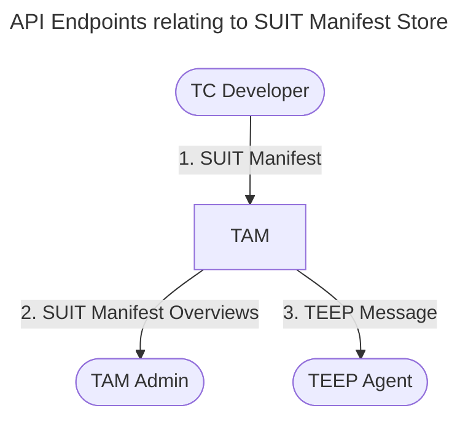

# SUIT Manifest Store Design <!--addManifest-->

## Purpose
This document explains how SUIT manifests are validated, stored, and retrieved in TAM.
It focuses on the path from HTTP API to TAM logic and SQLite persistence.

For internal storage and runtime flow details, see [TAM Status SUIT Manifest Store (Internal Design)](./TAM_STATUS_SUIT_MANIFEST_STORE.md).

## Scope



- Register SUIT manifests from TC Developers (`POST /SUITManifestService/RegisterManifest`)
- Read latest manifest metadata (`GET /SUITManifestService/ListManifests`)
- Resolve manifests for Update generation during QueryResponse handling (`POST /tam`) (see [TEEP_MESSAGE_HANDLE.md](./TEEP_MESSAGE_HANDLE.md) for detail)

## 1) Specification of /SUITManifestService/RegisterManifest Web API

  -  The TC Developer signing public key must be registered in TAM in advanced. <!--Prerequirements?-->

This API registers a SUIT manifest to TAM's manifest store.

URL | Method | Authorized Requester | Request Headers | Request Body | Response
--|--|--|--|--|--
`/SUITManifestService/RegisterManifest` | `POST` | TC Developer | `Content-Type: application/suit-envelope+cose` | SUIT Envelope (COSE-signed) | `200 OK` with `OK` (text/plain)

Validation overview:
1. HTTP method and content-type are validated.
2. `SUIT_Envelope` is parsed and signature is verified.
3. TAM verifies that manifest sequence and signer continuity are valid for the target Trusted Component.
4. On success, manifest bytes and metadata are stored in the DB.

> [!NOTE]
> Requirements for accepting `/SUITManifestService/RegisterManifest`:
> 2. The SUIT `authentication-wrapper` must include `kid` for that signing key, encoded as an [RFC 9679 COSE Key Thumbprint](https://datatracker.ietf.org/doc/html/rfc9679).

## 2) Specification of /SUITManifestService/ListManifests Web API

This API returns SUIT manifest overviews as CBOR.

URL | Method | Authorized Requester | Request Headers | Request Body | Response
--|--|--|--|--|--
`/SUITManifestService/ListManifests` | `GET` | TAM Admin | `Accept: application/cbor` | none | `200 OK` with CBOR array of `suit-manifest-overview` or `204 No Content`

Output format in CDDL:
```cddl
; requires SUIT Manifest CDDL

get-manifests-output = [
  * suit-manifest-overview,
]

suit-manifest-overview = [
  component: bstr .cbor SUIT_Component_Identifier,
  manifest-sequence-number: uint,
]
```

Example output in CBOR Diagnostic Notation:
```cbor-diag
[
  [
    / component: / << ['app1.wasm'] >>,
    / manifest-sequence-number: / 3
  ],
  [
    / component: / << ['app2.wasm'] >>,
    / manifest-sequence-number: / 2
  ]
]
```

Current behavior:
1. Handler currently queries fixed demo component IDs.
2. For each component, TAM loads latest manifest metadata.
3. Missing components are skipped; empty result returns `204`.

## Error Mapping
- Parsing/signature errors in handler return `400 Bad Request`.
- Unknown/untrusted signing key is treated as authentication failure (`400` in current API).
- Internal DB failures return `500 Internal Server Error`.

## Notes and Current Limitations
- Authorization for TC Developers is TODO in handler; trust currently relies on signature key registration.
- `SetEnvelope` and lookup are cleanly separated, but multi-step write path is not wrapped in an explicit transaction at TAM layer.
- Manifests are stored as BLOBs and replayed as-is in TEEP Update generation.
