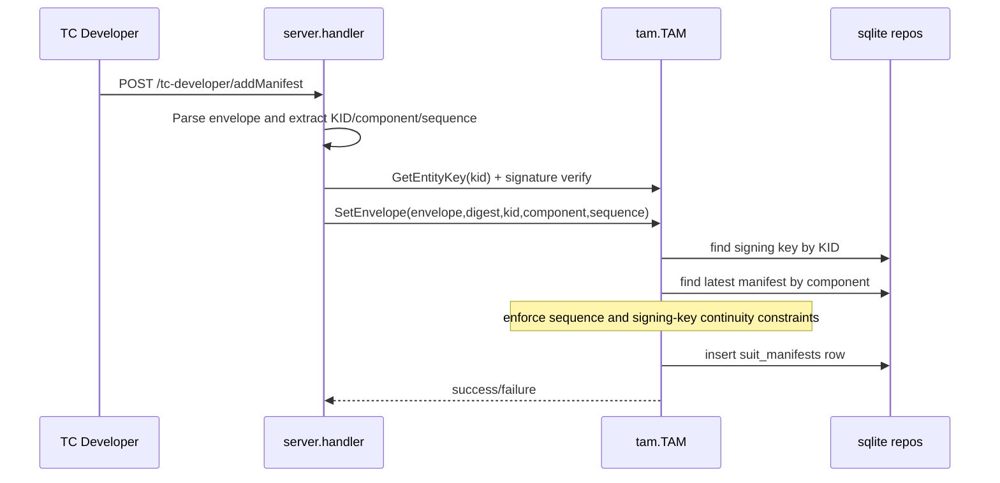
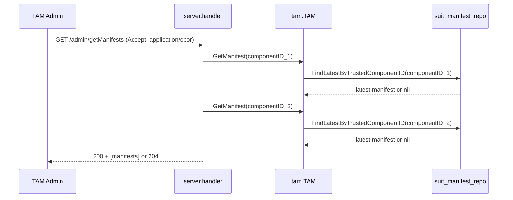
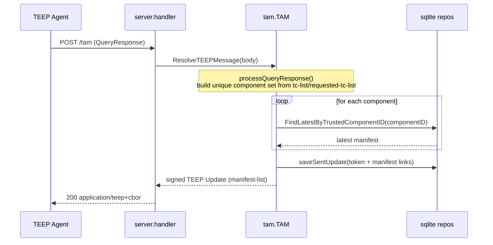

- [SUIT Manifest Store Design](#suit-manifest-store-design)
  - [Purpose](#purpose)
  - [Scope](#scope)
  - [External Design](#external-design)
    - [Specification of /getManifests Web API](#specification-of-getmanifests-web-api)
    - [Specification of /addManifest Web API](#specification-of-addmanifest-web-api)
    - [Error Mapping](#error-mapping)
    - [Notes and Current Limitations](#notes-and-current-limitations)
  - [Internal Design](#internal-design)
    - [Components](#components)
    - [Data Model](#data-model)
    - [Write Flow (Register Manifest)](#write-flow-register-manifest)
    - [Read Flow](#read-flow)
      - [A) Admin view (`GET /admin/getManifests`)](#a-admin-view-get-admingetmanifests)
      - [B) Runtime resolution (`POST /tam` with QueryResponse)](#b-runtime-resolution-post-tam-with-queryresponse)

# SUIT Manifest Store Design

## Purpose
This document explains how SUIT manifests are validated, stored, and retrieved in TAM.
It focuses on the path from HTTP API to TAM logic and SQLite persistence.

## Scope
- Register SUIT manifests from TC Developers (`POST /tc-developer/addManifest`)
- Read latest manifest metadata (`GET /admin/getManifests`)
- Resolve manifests for Update generation during QueryResponse handling (`POST /tam`)

## External Design

### Specification of /getManifests Web API

This API returns SUIT manifest overviews as CBOR.

URL | Method | Authorized Requester | Request Headers | Request Body | Response
--|--|--|--|--|--
`/admin/getManifests` | `GET` | TAM Admin | `Accept: application/cbor` | none | `200 OK` with CBOR array of `suit-manifest-overview` or `204 No Content`

Output format in CDDL:
```cddl
; requires SUIT Manifest CDDL

get-manifests-output = [
  * suit-manifest-overview,
]

suit-manifest-overview = [
  component: bstr .cbor SUIT_Component_Identifier,
  manifest-sequence-number: uint,
]
```

Example output in CBOR Diagnostic Notation:
```cbor-diag
[
  [
    / component: / << ['app1.wasm'] >>,
    / manifest-sequence-number: / 3
  ],
  [
    / component: / << ['app2.wasm'] >>,
    / manifest-sequence-number: / 2
  ]
]
```

Current behavior:
1. Handler currently queries fixed demo component IDs.
2. For each component, TAM loads latest manifest metadata.
3. Missing components are skipped; empty result returns `204`.

### Specification of /addManifest Web API

This API registers a SUIT manifest to TAM's manifest store.

URL | Method | Authorized Requester | Request Headers | Request Body | Response
--|--|--|--|--|--
`/tc-developer/addManifest` | `POST` | TC Developer | `Content-Type: application/suit-envelope+cose` | SUIT Envelope (COSE-signed) | `200 OK` with `OK` (text/plain)

Validation overview:
1. HTTP method and content-type are validated.
2. `SUIT_Envelope` is parsed and signature is verified.
3. TAM verifies that manifest sequence and signer continuity are valid for the target Trusted Component.
4. On success, manifest bytes and metadata are stored in the DB.

> [!NOTE]
> Requirements for accepting `/tc-developer/addManifest`:
> 1. The TC Developer signing public key must already be registered in TAM (`manifest_signing_keys`).
> 2. The SUIT `authentication-wrapper` must include `kid` for that signing key, encoded as an [RFC 9679 COSE Key Thumbprint](https://datatracker.ietf.org/doc/html/rfc9679).

### Error Mapping
- Parsing/signature errors in handler return `400 Bad Request`.
- Unknown/untrusted signing key is treated as authentication failure (`400` in current API).
- Internal DB failures return `500 Internal Server Error`.

### Notes and Current Limitations
- Authorization for TC Developers is TODO in handler; trust currently relies on signature key registration.
- `SetEnvelope` and lookup are cleanly separated, but multi-step write path is not wrapped in an explicit transaction at TAM layer.
- Manifests are stored as BLOBs and replayed as-is in TEEP Update generation.

## Internal Design

### Components
- `internal/server/handler.go`
  - Parses `application/suit-envelope+cose`
  - Verifies request method/headers and converts HTTP payload to SUIT structures
- `internal/tam/manifest_store.go`
  - `SetEnvelope(...)`: validation + persistence entrypoint
  - `GetManifest(...)`: latest manifest lookup by trusted component ID
- `internal/infra/sqlite/suit_manifest_repo.go`
  - SQL operations for `suit_manifests`
- `internal/infra/sqlite/database.go`
  - Schema and indexes

### Data Model
Table: `suit_manifests`
- `manifest` (BLOB): untagged SUIT envelope bytes used in TEEP Update
- `digest` (BLOB): encoded `SUIT_Digest`
- `signing_key_id` (FK -> `manifest_signing_keys.id`)
- `trusted_component_id` (BLOB): encoded component identifier
- `sequence_number` (INTEGER): monotonic version for a component

Key indexes:
- `idx_suit_manifests_tc_seq (trusted_component_id, sequence_number)`
- `idx_suit_manifests_digest (digest)`

### Write Flow (Register Manifest)


Validation rules in `SetEnvelope`:
1. Signing key (`kid`) must already be trusted (`manifest_signing_keys`).
2. If a manifest already exists for same `trusted_component_id`:
   - new `sequence_number` must be greater than existing one.
   - `signing_key_id` must match existing chain owner.

This prevents downgrade and key-switch attacks within one component stream.

### Read Flow
#### A) Admin view (`GET /admin/getManifests`)
Current implementation uses fixed demo component IDs in handler, then fetches the latest manifest for each component.



Behavior:
1. Handler validates method and `Accept` header.
2. For each target component ID, TAM requests latest version only.
3. Response body includes only overview (`trusted_component_id`, `sequence_number`), not full manifest bytes.

#### B) Runtime resolution (`POST /tam` with QueryResponse)
This path is independent from admin listing. It is used to build an Update message for a specific TEEP session.



Behavior:
1. QueryResponse contributes requested components via `tc-list` and `requested-tc-list`.
2. TAM deduplicates the component set, then loads latest manifest per component.
3. Unknown components are logged and skipped; known components are appended to `manifest-list`.
4. The sent Update and related manifests are persisted for later response correlation.

See [TEEP_MESSAGE_HANDLE.md](TEEP_MESSAGE_HANDLE.md#handling-queryresponse-with-tc-list).
