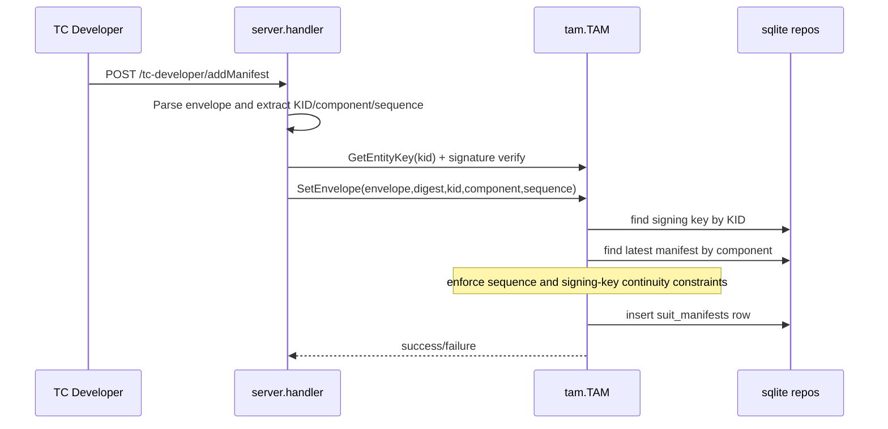
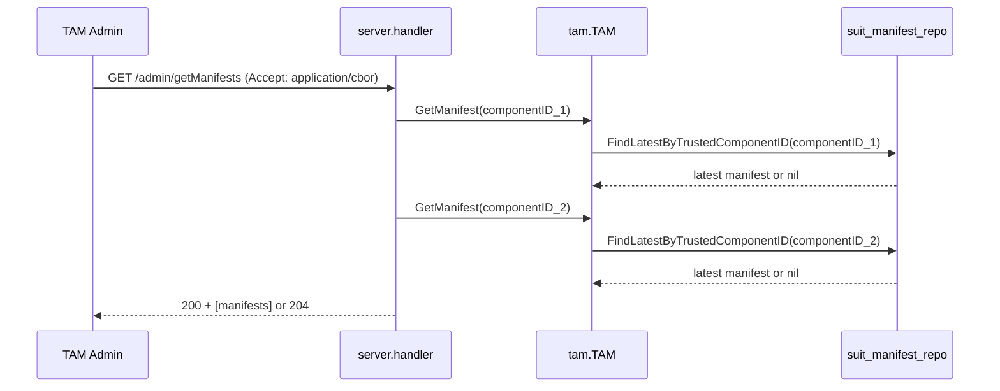
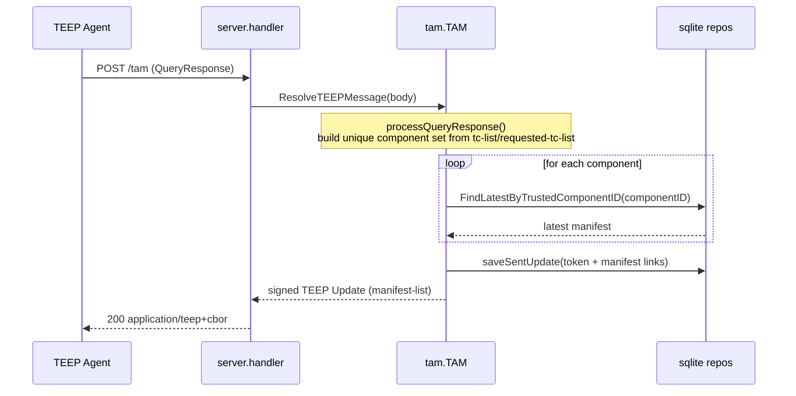

# TAM Status SUIT Manifest Store (Internal Design)

## Purpose
This document explains the internal implementation of SUIT manifest storage in TAM.
It covers code-level components, persistence model, and runtime read/write flows.

## Components
- `internal/server/handler.go`
  - Parses `application/suit-envelope+cose`
  - Verifies request method/headers and converts HTTP payload to SUIT structures
- `internal/tam/manifest_store.go`
  - `SetEnvelope(...)`: validation + persistence entrypoint
  - `GetManifest(...)`: latest manifest lookup by trusted component ID
- `internal/infra/sqlite/suit_manifest_repo.go`
  - SQL operations for `suit_manifests`
- `internal/infra/sqlite/database.go`
  - Schema and indexes

## Data Model
Table: `suit_manifests`
- `manifest` (BLOB): untagged SUIT envelope bytes used in TEEP Update
- `digest` (BLOB): encoded `SUIT_Digest`
- `signing_key_id` (FK -> `manifest_signing_keys.id`)
- `trusted_component_id` (BLOB): encoded component identifier
- `sequence_number` (INTEGER): monotonic version for a component

Key indexes:
- `idx_suit_manifests_tc_seq (trusted_component_id, sequence_number)`
- `idx_suit_manifests_digest (digest)`

## Write Flow (Register Manifest)

Validation rules in `SetEnvelope`:
1. Signing key (`kid`) must already be trusted (`manifest_signing_keys`).
2. If a manifest already exists for same `trusted_component_id`:
   - new `sequence_number` must be greater than existing one.
   - `signing_key_id` must match existing chain owner.

This prevents downgrade and key-switch attacks within one component stream.

## Read Flow
### A) Admin view (`GET /admin/getManifests`)
Current implementation uses fixed demo component IDs in handler, then fetches the latest manifest for each component.

Behavior:
1. Handler validates method and `Accept` header.
2. For each target component ID, TAM requests latest version only.
3. Response body includes only overview (`trusted_component_id`, `sequence_number`), not full manifest bytes.

### B) Runtime resolution (`POST /tam` with QueryResponse)
This path is independent from admin listing. It is used to build an Update message for a specific TEEP session.

Behavior:
1. QueryResponse contributes requested components via `tc-list` and `requested-tc-list`.
2. TAM deduplicates the component set, then loads latest manifest per component.
3. Unknown components are logged and skipped; known components are appended to `manifest-list`.
4. The sent Update and related manifests are persisted for later response correlation.

See [TEEP_MESSAGE_HANDLE.md](TEEP_MESSAGE_HANDLE.md#handling-queryresponse-with-tc-list).
