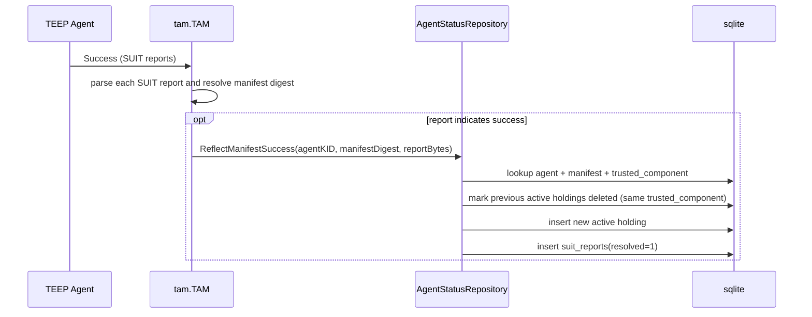
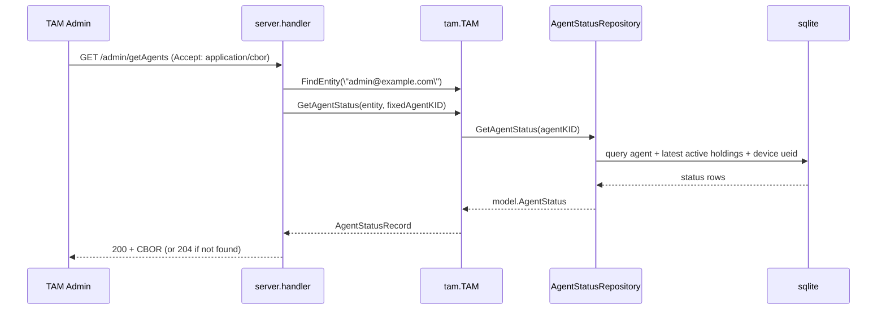

# TAM Status TEEP Agent Status (Internal Design)

## Purpose
This document describes the internal implementation of TEEP Agent status handling in TAM.
It focuses on persistence model, update paths (mainly TEEP Success), and read paths for `/*/getAgents`.

## Components
- `internal/server/handler.go`
  - Handles `GET /admin/getAgents` and encodes status response as CBOR
- `internal/tam/agent_status.go`
  - `GetAgentStatus(...)` / `GetAgentStatuses(...)`
  - `updateAgentStatusOnManifestSuccess(...)`
  - `updateAgentStatusOnManifestError(...)`
- `internal/tam/tam.go`
  - Calls status update routines while processing TEEP `Success`/`Error` messages with SUIT reports
- `internal/infra/sqlite/agent_status_repo.go`
  - SQL read/write implementation for holdings and report records

## Data Model
Core tables used by agent status logic:

- `agents`
  - agent identity (`kid`), optional device binding (`device_id`), key material
- `devices`
  - optional device identity (`ueid`) and admin ownership
- `suit_manifests`
  - source of trusted component and sequence metadata
- `agent_holding_suit_manifests`
  - current active manifest holdings per agent (`deleted=0` means active)
- `suit_reports`
  - processing result records from TEEP `Success` / `Error` flows

Key behavior:
1. Holdings are versioned logically by inserting a new active row and marking old rows deleted for same trusted component.
2. `GetAgentStatus` returns the latest active holding per trusted component.

## Write Flow (TEEP Success Path)
Main status update path is executed when TAM receives authenticated TEEP `Success` containing SUIT reports.

Notes:
- `ReflectManifestSuccess` is transactional (delete old active rows + insert new holding + insert report).
- Failure-report path exists via `RecordManifestProcessingFailure(...)` and inserts unresolved records into `suit_reports`.

## Read Flow (`/*/getAgents`)

### A) Implemented: `GET /admin/getAgents`

Current implementation note:
- Handler currently returns status for one fixed demo agent KID.

### B) Planned: `GET /device-admin/getAgents`

Planned behavior:
1. Authenticate/authorize device admin entity.
2. Filter returned agents by device ownership (`devices.admin_id`).
3. Reuse the same status assembly logic (`GetAgentStatus`/`GetAgentStatuses`) with role-based filtering.

## Output Record Shape
Returned status is mapped to `AgentStatusRecord`:
- `[agent-kid, status]`
- `status.attributes.256` (UEID) when available
- `status.wapp_list`: list of `[trusted-component-id, sequence-number]`

See [TEEP_AGENT_STATUS.md](./TEEP_AGENT_STATUS.md) for CDDL and API-level output semantics.
