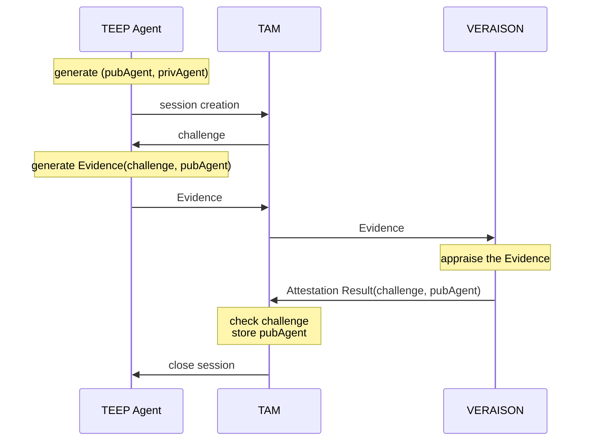
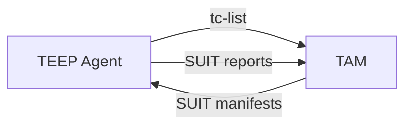

# Handling TEEP Agent's Status in the TAM

## Why Is This Required?

This TAM manages the following status of each TEEP Agent:
- **the public key of a TEEP Agent**, used in the security wrapper of TEEP Protocol (COSE_Sign1, ESP256)
- **which Trusted Components a TEEP Agent has**
- what kind of errors occurred in a TEEP Agent, and how was it resolved (or not)

## Specification of /getAgents Web API

This TAM provides HTTP GET API for the TAM Admin and Device Manager Admin.

URL | Method | Authorized Requester | Input | Output
--|--|--|--|--
`/admin/getAgents` | `GET` | TAM Admin | no query | Status of All TEEP Agents, see the CDDL below
`/device-admin/getAgents` | `GET` | Device Manager Admin | no query | TEEP Agents bind to its Device, see the CDDL below

```cddl
;# import rfc9711 as eat

get-agent-status-output = [
  * agent-status-record,
]

agent-status-record = [
  kid: bstr .size 32,
  status: agent-status,
]

agent-status = {
  "attributes": agent-attributes,
  "wapp_list": [ * component-list ],
}

agent-attributes = {
  eat.ueid-label => eat.ueid-type,
}

component-list = [
  component: bstr .cbor SUIT_Component_Identifier,
  manifest-sequence-number: uint,
]
```

See [example output in CBOR diagnostic notation](example-agent.status.diag).

## Public Key of TEEP Agent

This TAM authenticates the public key of TEEP Agent with Remote Attestation.
For now, [VERAISON](https://github.com/veraison) is used as a Verifier with Background-Check Model.
Other Verifiers or Passport Model may be used.



This TAM requires the TEEP Agent to prove
- are you running in the TEE with genuine hardware?
- is your Evidence fresh, i.e. generated after my challenge?
- which key do you use in the TEEP Protocol messages?

After successfull Remote Attestation, the TAM receives the challenge and the public key of TEEP Agent from Verifier.

## Trusted Components Held by the TEEP Agent

This TAM also records the Trusted Components (and its SUIT Manifest) stored in TEEP Agents.
Such records are beneficial for the Device Owner (or Device Manager Admin) who wants to keep the Trusted Components up to date.

However, this is **NOT always complete** because of some reasons.
- some TEEP Agent may not report the processing result on a SUIT manifest with a SUIT report
- even the TEEP Agent aims to send SUIT reports to the TAM, some entities between the TEEP Agent and the TAM such as the untrusted TEEP Broker may drop the message
- the TEEP Agent possibly loses the Trusted Component and/or its SUIT Manifest because not all TEE provides availability-ensured storage for them
- some TEEP Agent may remove the Trusted Component via `UnrequestTA` API without communicating the TAM

As a result, the TEEP Agent's status in the TAM only means "expected Trusted Components held by TEEP Agents" or "the Trusted Components a TEEP Agent should have".
It is constructed from following information:
- TAM's Messages
  - which Trusted Components had the TAM sent to the TEEP Agent
- Agent's Messages
  - SUIT reports recording how did the SUIT manifests are processed in the `suit-reports` of TEEP Success or Error messages
    - with successfull SUIT Report, the Trusted Components in the corresponding SUIT manifest should be held by the TEEP Agent
    - additionally, those in the SUIT manifests with lower `suit-manifest-sequence-number` are removed
    - with failure SUIT Report, the Trusted Components should be kept
  - `tc-list` of TEEP QueryResponse message contains current Trusted Components



As a result, the TAM may have the TEEP Agent's status like following table:

TEEP Agent | SUIT Manifest | Trusted Component | Status
--|--|--|--
Agent-1 | Manifest-A-seq1 | Component-a0 | Installed reported with a SUIT Report
Agent-1 | Manifest-B-seq0 | Component-b0 | Sent but not reported
Agent-1 | Manifest-A-seq0 | Component-a0 | Updated with Manifest-A-seq1
Agent-1 | Manifest-A-seq0 | Component-a1 | Removed on successful update with Manifest-A-seq1
Agent-2 | Manifest-A-seq1 | Component-a0 | Reported with tc-list in QueryResponse
Agent-2 | Manifest-B-seq0 | Component-b0 | Removed reported a with SUIT Report
Agent-2 | Manifest-C-seq0 | Component-c0 | Installed but not in `tc-list`

> [!WARNING]
> As you can see the table above, the status of TEEP Agents could be complicated.
> For now, the TAM only accepts SUIT Manifest with exactly ONE Trusted Component and reports the Trusted Components with explicit successful SUIT Report to avoid implementation complexity.
> That's why the example-agent-status.diag does not contain the details.
