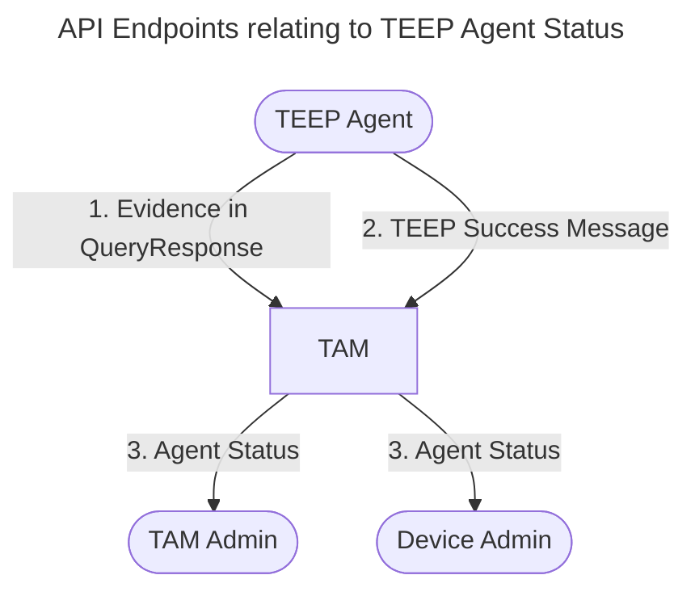
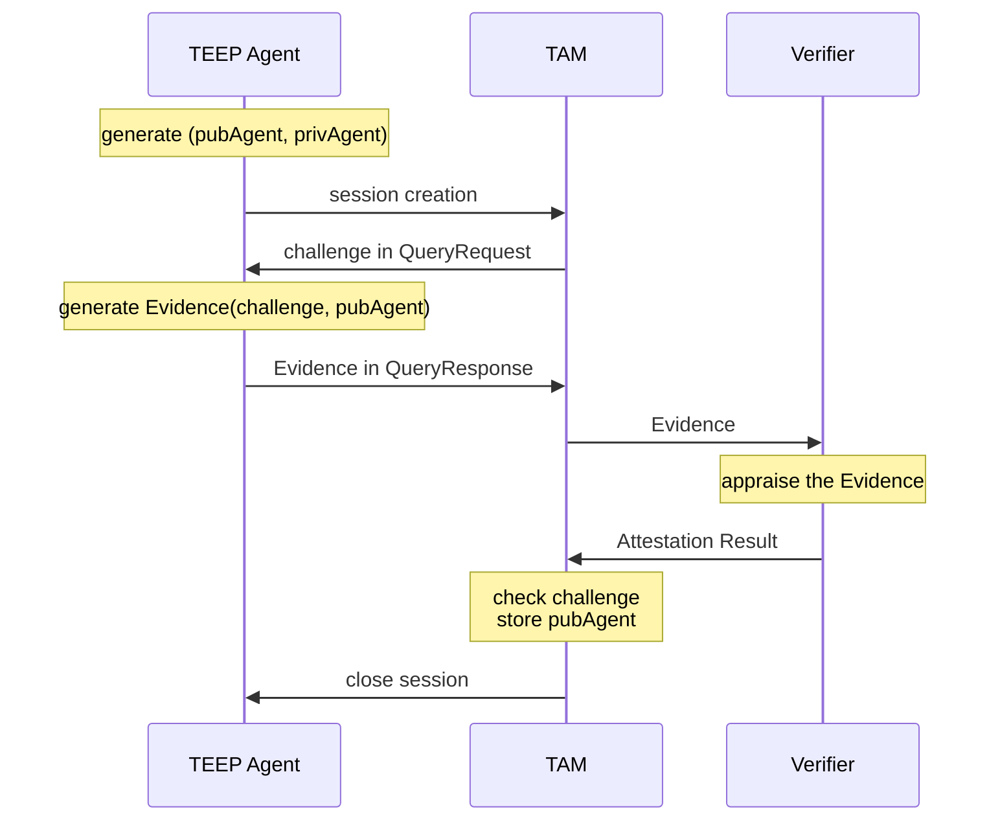
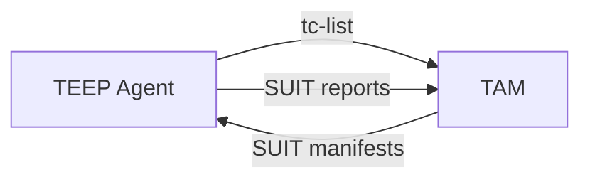

# TEEP Agent Status Handling in TAM

This document describes how TEEP Agent status is updated and retrieved in TAM.



For internal implementation details, see [TAM Status TEEP Agent Status (Internal Design)](./TAM_STATUS_TEEP_AGENT_STATUS.md).

## Why Is This Required?

This TAM manages the following status for each TEEP Agent:
- **the public key of a TEEP Agent**, used in the TEEP Protocol security wrapper (COSE_Sign1, ESP256)
- **which Trusted Components a TEEP Agent has**
- what kind of errors occurred in a TEEP Agent, and how they were resolved (or not)

## 1. TEEP Agent's Public Key Registration

As explained in [TEEP_MESSAGE_HANDLE.md](./TEEP_MESSAGE_HANDLE.md#handling-queryresponse-with-attestation-payload), the TEEP Agent's public key is trusted by the TAM via Remote Attestation.
Here is a summary of the flow.



After successful Remote Attestation, an entry for the TEEP Agent is created, and will be served from `/AgentService` endpoints (see [AgentService API](#3-specification-of-agentservice-web-api) below).

## 2. Updating TEEP Agent Status

This TAM records Trusted Components (and their SUIT manifests) stored in TEEP Agents.
These records are useful for Device Admins who want to keep Trusted Components up to date.
On TEEP Success messages with SUIT reports, the TAM updates the list of Trusted Components that the TEEP Agent has.

Here is the SUIT Report definition extracted from the document.
```cddl
SUIT_Report = {
  suit-reference              => SUIT_Reference,
  ? suit-report-nonce         => bstr,
  suit-report-records         => [
    * SUIT_Record / system-property-claims ],
  suit-report-result          => true / {
    suit-report-result-code   => int,
    suit-report-result-record => SUIT_Record,
    suit-report-result-reason => SUIT_Report_Reasons,
  },
  ? suit-report-capability-report => SUIT_Capability_Report,
  $$SUIT_Report_Extensions
}

SUIT_Reference = [
    suit-report-manifest-uri : tstr,
    suit-report-manifest-digest : SUIT_Digest
]
```

The TAM extracts the `suit-report-manifest-digest` to identify the SUIT manifest, and `suit-report-result` to know its processing result.
If the latter value is `true` or `suit-report-result-reason` is `suit-report-reason-ok`, the TAM considers that the Trusted Component(s) in the SUIT manifest are successfully installed.

## 3. Specification of AgentService Web API

URL | Method | Authorized Requester | Input | Output
--|--|--|--|--
`/AgentService/ListAgents` | `GET` | TAM Admin/<br/>Device Admin | no query | 200 OK: `[+agent-kid-and-last-updated]`<br/>204 No Content<br/>400 Bad Request
`/AgentService/GetAgentStatus` | `POST` | TAM Admin/<br/>Device Admin | `[+kid]` | 200 OK: `[+agent-status-record]`<br/> 204 No Content<br/>400 Bad Request

### A) ListAgents Web API

This endpoint serves the `(kid, last_updated)` pairs for TAM Admin and Device Admin lookups.
They can decide to obtain more detailed information from GetAgentStatus API.
The TAM Admin can acquire the full TEEP Agent list, while the Device Admin can acquire only the agents running on devices managed by the same admin (TODO).

#### Output Format

```cddl
list-agents-output = [
  + agent-kid-and-last-updated
]

agent-kid-and-last-updated = [
  kid: bstr .size 32,
  last-updated: ~time,
]
```

#### Example Output

```cbor-diag
[
  [
    'dummy-teep-agent-kid-for-dev-123',
    1771338065
  ]
]
```

### B) GetAgentStatus Web API

This endpoint provides detailed TEEP Agent status for the input `[+kid]`.

#### Output Format

```cddl
;# import rfc9711 as eat

get-agent-status-output = [
  + agent-status-record,
]

agent-status-record = [
  kid: bstr .size 32,
  status: agent-status,
]

agent-status = {
  attributes-label => agent-attributes,
  installed-tc-label => [ * suit-manifest-overview ],
}

attributes-label = 1
installed-tc-label = 2

agent-attributes = {
  eat.ueid-label => eat.ueid-type,
}
```

You can find CDDL definitions for dependencies in:
- [RFC 9711](https://datatracker.ietf.org/doc/html/rfc9711#name-payload-cddl) for `eat.ueid-*`
- [SUIT Manifest Repository](./SUIT_MANIFEST_REPOSITORY.md#specification-of-suitmanifestserviceregistermanifest-web-api)

#### Example Output
```cbor-diag
[
  [
    'dummy-teep-agent-kid-for-dev-123',
    {
      / attributes / 1: {
        / ueid / 256: h'016275696C64696E672D6465762D313233' / 0x01 + 'building-dev-123' /
      },
      / installed-tc / 2: [
        [
          / SUIT_Component_Identifier: / << ['app1.wasm'] >>,
          / manifest-sequence-number: / 3
        ],
        [
          / SUIT_Component_Identifier: / << ['app2.wasm'] >>,
          / manifest-sequence-number: / 2
        ]
      ]
    }
  ]
]
```

### Trusted Components Held by the TEEP Agent

## Limitations

The installed TC list in TEEP Agent status **DOES NOT always match the actual TEEP Agent instance in real time** for several reasons.
- some TEEP Agents may not report SUIT manifest processing results
- even when an agent sends SUIT reports, intermediaries between the TEEP Agent and TAM (such as an untrusted TEEP Broker) may drop the message
- a TEEP Agent may lose the Trusted Component and/or SUIT manifest because not all TEEs provide durable storage
- a TEEP Agent may remove a Trusted Component via `UnrequestTA` without notifying TAM

As a result, the TEEP Agent status in TAM means "expected Trusted Components held by TEEP Agents" or "the Trusted Components a TEEP Agent should have."

This TAM implementation prioritizes the trustworthiness of the list:
1. `tc-list` in TEEP Agent's QueryResponse message
2. `suit-reports` in TEEP Agent's Success messages
3. sent manifest data in TAM's Update messages



To manage the installed-tc list from those messages, TAM may store TEEP Agent status like the following table:

TEEP Agent | SUIT Manifest | Trusted Component | Status
--|--|--|--
Agent-1 | Manifest-A-seq1 | Component-a0 | Installation reported with a SUIT Report
Agent-1 | Manifest-B-seq0 | Component-b0 | Sent but not reported
Agent-1 | Manifest-A-seq0 | Component-a0 | Updated with Manifest-A-seq1
Agent-1 | Manifest-A-seq0 | Component-a1 | Removed on successful update with Manifest-A-seq1
Agent-2 | Manifest-A-seq1 | Component-a0 | Reported with tc-list in QueryResponse
Agent-2 | Manifest-B-seq0 | Component-b0 | Removal reported with a SUIT Report
Agent-2 | Manifest-C-seq0 | Component-c0 | Installed but not in `tc-list`

> [!WARNING]
> As you can see the table above, the status of TEEP Agents could be complicated.
> For now, the TAM only accepts SUIT Manifest with exactly ONE Trusted Component and reports the Trusted Components with explicit successful SUIT Report to avoid implementation complexity.
> That's why [example-agent-status.diag](./examples/example-agent-status.diag) does not contain the details.
