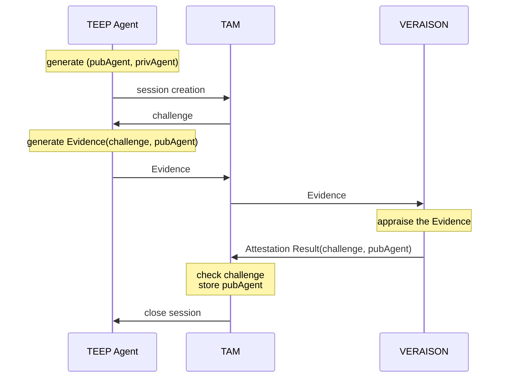
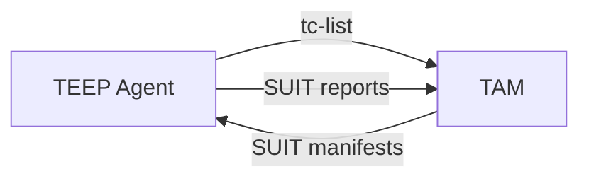

# TEEP Agent Status Handling in TAM

For internal implementation details, see [TAM Status TEEP Agent Status (Internal Design)](./TAM_STATUS_TEEP_AGENT_STATUS.md).

## Why Is This Required?

This TAM manages the following status for each TEEP Agent:
- **the public key of a TEEP Agent**, used in the TEEP Protocol security wrapper (COSE_Sign1, ESP256)
- **which Trusted Components a TEEP Agent has**
- what kind of errors occurred in a TEEP Agent, and how they were resolved (or not)

## Specification of /getAgents Web API

This TAM currently exposes one implemented status API and one planned API.

### Implemented

URL | Method | Authorized Requester | Input | Output
--|--|--|--|--
`/admin/getAgents` | `GET` | TAM Admin | no query | Status of all TEEP Agents, see the CDDL below

### Planned (not implemented yet)

URL | Method | Authorized Requester | Input | Output
--|--|--|--|--
`/device-admin/getAgents` | `GET` | Device Manager Admin | no query | TEEP Agents bound to its device, see the CDDL below

### Output Format

```cddl
;# import rfc9711 as eat

get-agent-status-output = [
  * agent-status-record,
]

agent-status-record = [
  kid: bstr .size 32,
  status: agent-status,
]

agent-status = {
  "attributes": agent-attributes,
  "wapp_list": [ * component-list ],
}

agent-attributes = {
  eat.ueid-label => eat.ueid-type,
}

component-list = [
  component: bstr .cbor SUIT_Component_Identifier,
  manifest-sequence-number: uint,
]
```

Example output:
```cbor-diag
[
  [
    'dummy-teep-agent-kid-for-dev-123',
    {
      "wapp_list": [
        [
          / SUIT_Component_Identifier: / << ['app1.wasm'] >>,
          / manifest-sequence-number: / 3
        ],
        [
          / SUIT_Component_Identifier: / << ['app2.wasm'] >>,
          / manifest-sequence-number: / 2
        ]
      ],
      "attributes": {
        / ueid / 256: h'016275696C64696E672D6465762D313233' / 0x01 + 'building-dev-123' /
      }
    }
  ]
]
```

## Public Key of TEEP Agent

This TAM authenticates the TEEP Agent public key using remote attestation.
For now, [VERAISON](https://github.com/veraison) is used as a Verifier with Background-Check Model.
Other Verifiers or Passport Model may be used.



This TAM requires the TEEP Agent to prove
- are you running in the TEE with genuine hardware?
- is your Evidence fresh, i.e. generated after my challenge?
- which key do you use in the TEEP Protocol messages?

After successful remote attestation, TAM receives the challenge and the TEEP Agent public key from the verifier.

## Trusted Components Held by the TEEP Agent

This TAM also records Trusted Components (and their SUIT manifests) stored in TEEP Agents.
These records are useful for Device Owners (or Device Manager Admins) who want to keep Trusted Components up to date.

However, this is **NOT always complete** for several reasons.
- some TEEP Agents may not report SUIT manifest processing results
- even when an agent sends SUIT reports, intermediaries between the TEEP Agent and TAM (such as an untrusted TEEP Broker) may drop the message
- a TEEP Agent may lose the Trusted Component and/or SUIT manifest because not all TEEs provide durable storage
- a TEEP Agent may remove a Trusted Component via `UnrequestTA` without notifying TAM

As a result, the TEEP Agent status in TAM means "expected Trusted Components held by TEEP Agents" or "the Trusted Components a TEEP Agent should have."
It is constructed from the following information:
- TAM's Messages
  - which Trusted Components had the TAM sent to the TEEP Agent
- Agent's Messages
  - SUIT reports recording how SUIT manifests were processed in `suit-reports` of TEEP Success or Error messages
    - with successful SUIT Report, the Trusted Components in the corresponding SUIT manifest should be held by the TEEP Agent
    - additionally, those in SUIT manifests with lower `suit-manifest-sequence-number` are removed
    - with failure SUIT Report, existing Trusted Components should be kept
  - `tc-list` of TEEP QueryResponse message contains current Trusted Components



As a result, TAM may store TEEP Agent status like the following table:

TEEP Agent | SUIT Manifest | Trusted Component | Status
--|--|--|--
Agent-1 | Manifest-A-seq1 | Component-a0 | Installation reported with a SUIT Report
Agent-1 | Manifest-B-seq0 | Component-b0 | Sent but not reported
Agent-1 | Manifest-A-seq0 | Component-a0 | Updated with Manifest-A-seq1
Agent-1 | Manifest-A-seq0 | Component-a1 | Removed on successful update with Manifest-A-seq1
Agent-2 | Manifest-A-seq1 | Component-a0 | Reported with tc-list in QueryResponse
Agent-2 | Manifest-B-seq0 | Component-b0 | Removal reported with a SUIT Report
Agent-2 | Manifest-C-seq0 | Component-c0 | Installed but not in `tc-list`

> [!WARNING]
> As you can see the table above, the status of TEEP Agents could be complicated.
> For now, the TAM only accepts SUIT Manifest with exactly ONE Trusted Component and reports the Trusted Components with explicit successful SUIT Report to avoid implementation complexity.
> That's why [example-agent-status.diag](./examples/example-agent-status.diag) does not contain the details.
