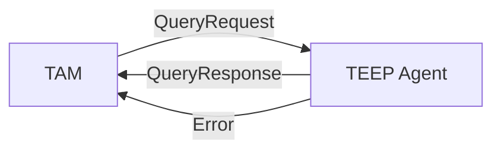
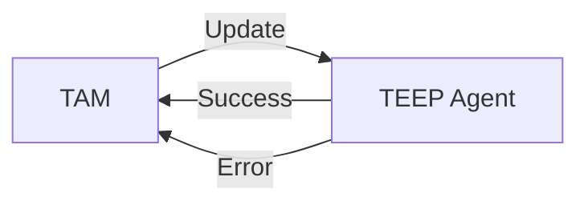
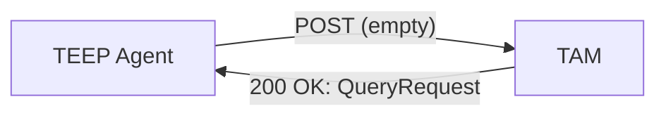
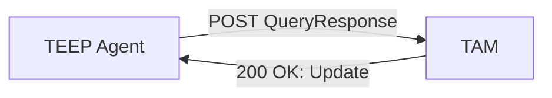
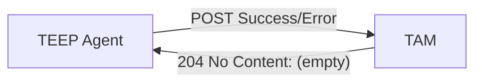
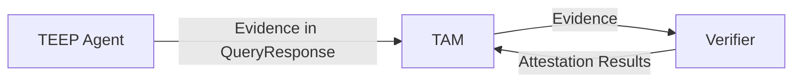
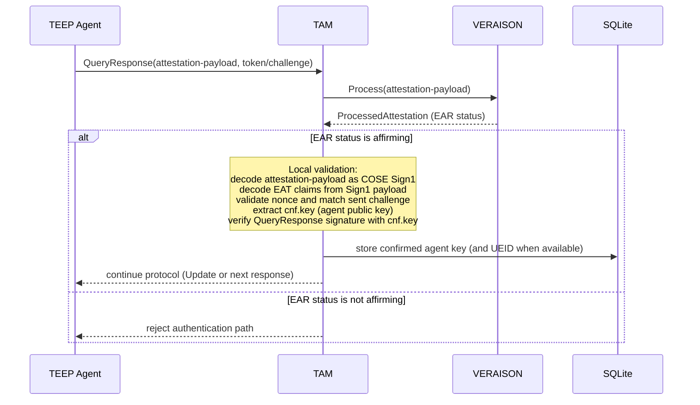
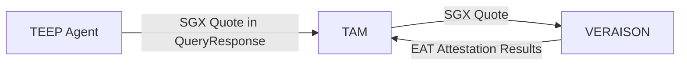
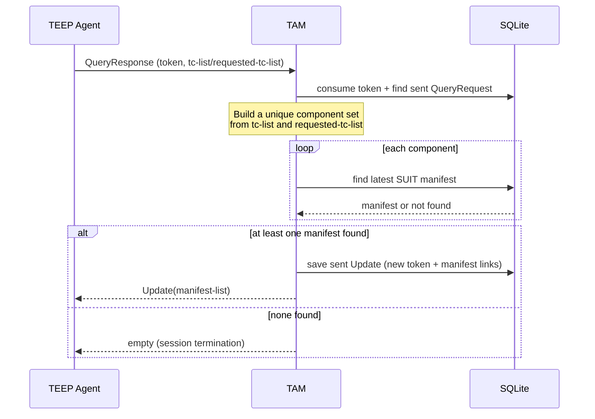

# TAM TEEP Message Handling

## TEEP Protocol Interactions Defined in Draft RFCs

[Section 3 of the TEEP Protocol draft](https://datatracker.ietf.org/doc/html/draft-ietf-teep-protocol-21#section-3) defines how TEEP Agents reply to TAM messages:

However, in some cases the TAM cannot initiate messages, for example:
the TEEP Agent (or the TEEP Broker) does not provide listening sockets,
the TAM cannot reach the TEEP Agent due to NAT traversal issues, etc.

[TEEP over HTTP](https://datatracker.ietf.org/doc/draft-ietf-teep-otrp-over-http) resolves this by having TAM expose an HTTP server that accepts messages from TEEP Agents:

## Requirements for TEEP Protocol Messages from TEEP Agent

This TAM implementation enforces the following requirements for incoming `POST /tam` messages:

1. HTTP-level requirements
   - Method must be `POST`.
   - `Content-Type` must be `application/teep+cbor`.
   - Body size must be within the server limit (`maxRequestBodyBytes`).

2. Message format and signature requirements
   - Non-empty messages are expected to be COSE Sign1-encoded TEEP messages.
   - For normal authenticated flow, the COSE unprotected header `kid` (label `4`) is required.
   - `kid` is treated as an RFC 9679 SHA-256 COSE_Key thumbprint and expected to be 32 bytes.
   - TAM looks up the corresponding agent public key from DB and verifies the COSE signature.

3. Correlation and replay-protection requirements
   - Query/Update correlation relies on one-time `token` and `challenge`.
   - Received `token` is marked consumed before sent-message lookup.
   - A message must match a previously sent TAM message (by token/challenge); otherwise it is rejected.

4. Remote attestation fallback path
   - If QueryResponse cannot be authenticated with stored agent keys, attestation payload is required.
   - Attestation result must be `affirming`.
   - QueryResponse signature is re-verified using the key extracted from attestation result.
   - Confirmed key is stored for future message authentication.

## TEEP with Remote Attestation

For the TAM to securely manage the Trusted Components inside TEEs, our TAM implementation requires Remote Attestation of TEEP Agents.
The TAM wants to confirm the following points:
1. the TEEP Agent is running inside a genuine TEE
2. the TEE software including the TEEP Agent keeps integrity and authenticity
3. the TEEP Agent signing key was securely generated inside the TEE

To achieve these requirements,
the TEEP Agent requests the Attesting Environment (e.g. Intel SGX Quoting Enclave) to generate Evidence (e.g. SGX Quote) and sends it in QueryResponse message,
and the TAM requests the Verifier to verify it.

> [!NOTE]
> The above chart is based on background-check model

In this section, we'll explain two verification schemes: EAT-based and Intel SGX DCAP Quote-based.
You can find the customized [VERAISON](https://github.com/kentakayama/services), and the original one is under the [VERAISON project repository](https://github.com/veraison).

### With RFC 9711 EAT + Measured Component

In this scheme, the `attestation-payload` in QueryResponse is a COSE Sign1 object whose payload is EAT (CBOR).
TAM delegates the most part of verification to VERAISON, and locally checks the claims before trusting the TEEP Agent key.

Expected EAT/attestation inputs:
1. `eat.eat_nonce`
   - must be present and valid.
   - must match the challenge previously sent by TAM.
2. `cwt.cnf.key`
   - must contain the public key to authenticate subsequent TEEP messages.
3. `eat.ueid` (optional but recommended)
   - when available, TAM can bind agent key to device identity in persistence.

Validation layers:
1. Verifier appraisal layer (`IRAVerifier.Process`)
   - validates evidence and returns attestation result (`affirming` required).
   - for VERAISON challenge-response endpoint, `verifier_client.go` implements the `Process` routine
2. TAM local binding layer
   - validates nonce/challenge correspondence.
   - extracts `cwt.cnf.key` and verifies QueryResponse COSE signature using that key.
3. Persistence/update layer
   - stores newly confirmed key.
   - continues normal QueryResponse handling (manifest resolution and Update generation).

This two-step model avoids trusting attestation output alone: TAM also proves that the same key in EAT actually signed the live QueryResponse bound to TAM-issued freshness.

### With Intel SGX DCAP Remote Attestation (TODO)

Our customized VERAISON verifies that:
1. the SGX Quote has been generated by the authorized Quoting Enclave under the certificate chain from Intel Certificate Authority (CA)
2. MRENCLAVE and MRSIGNER are expected values, respectively
3. the TEEP Agent bound to the MRENCLAVE is programmed generating its signing key inside TEE

While SGX Quote format is product-specific, our customized VERAISON produces Attestation Results in [EAT Attestation Results](https://datatracker.ietf.org/doc/draft-ietf-rats-ear/) format based on the [EAT Profile of TEEP Protocol](https://datatracker.ietf.org/doc/html/draft-ietf-teep-protocol#section-5).
Due to the limitation of 64-byte `report_data` in SGX Quote, TEEP Agents and TAM agree on this rule:
1. TEEP Agent encodes an EAT raw Evidence with `{eat_nonce: challenge in QueryRequest, cnf: generated TEEP Agent public key}`,
2. hashes on it with SHA-256 and stores it into `report_data`, and
3. stores it in `raw-report-data` and the SGX Quote to `attestation-payload` in QueryResponse.
4. TAM extracts the SGX Quote from `attestation-payload` and requests VERAISON to verify, and
5. on affirming Attestation Results, the TAM extracts the hash from `report_data` in SGX Quote and compares the one calculated on `raw-report-data`.

> [!NOTE]
> [Key Confirmation Claim of CWT](https://datatracker.ietf.org/doc/rfc8747/) is used by TEEP Agent to prove possession of a key.

## Handling QueryResponse with tc-list

When TAM receives an authenticated `QueryResponse`, it generates `Update` from requested Trusted Components.

Detailed behavior:
1. `QueryResponse.token` must match the token from TAM's previously sent `QueryRequest`.
2. TAM builds a unique component set from:
   - `requested-tc-list[*].component-id`
   - `tc-list[*].system-component-id`
3. For each component ID, TAM loads latest manifest (`FindLatestByTrustedComponentID`).
4. Unknown component IDs are logged and skipped (not fatal).
5. If resulting manifest list is empty, TAM returns no response body (`204` from HTTP layer).
6. If manifests exist, TAM signs an `Update`, saves sent-update metadata for later correlation, and returns it.

## How This TAM Implementation Acts

Based on these draft RFCs, this TAM over HTTP currently behaves as follows:

