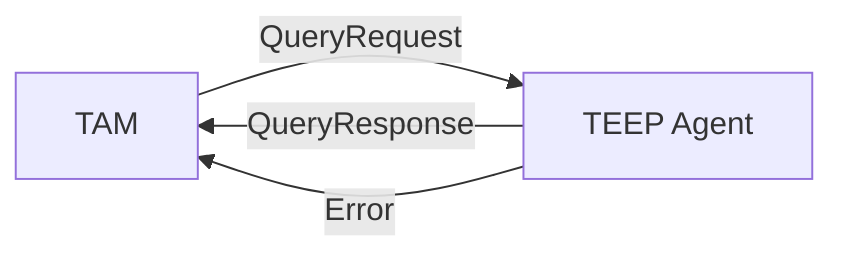
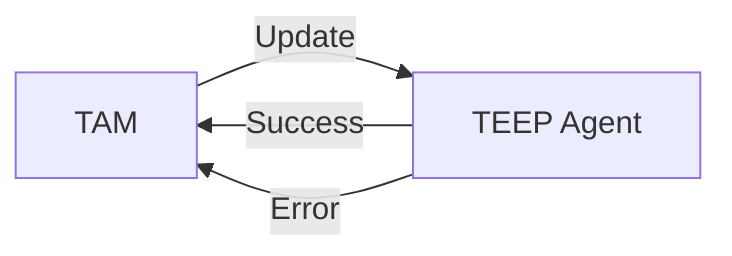
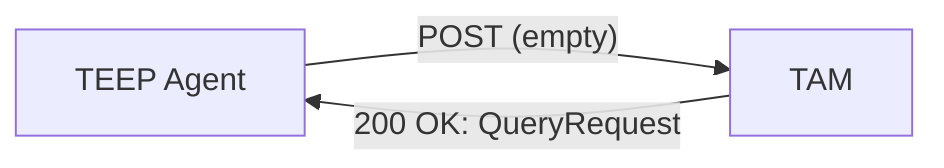
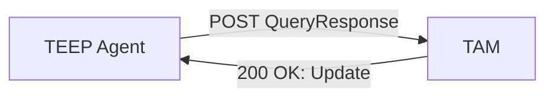
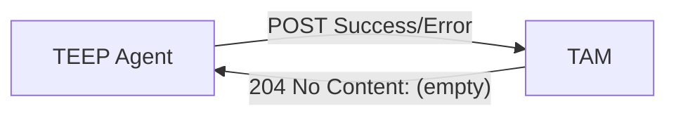
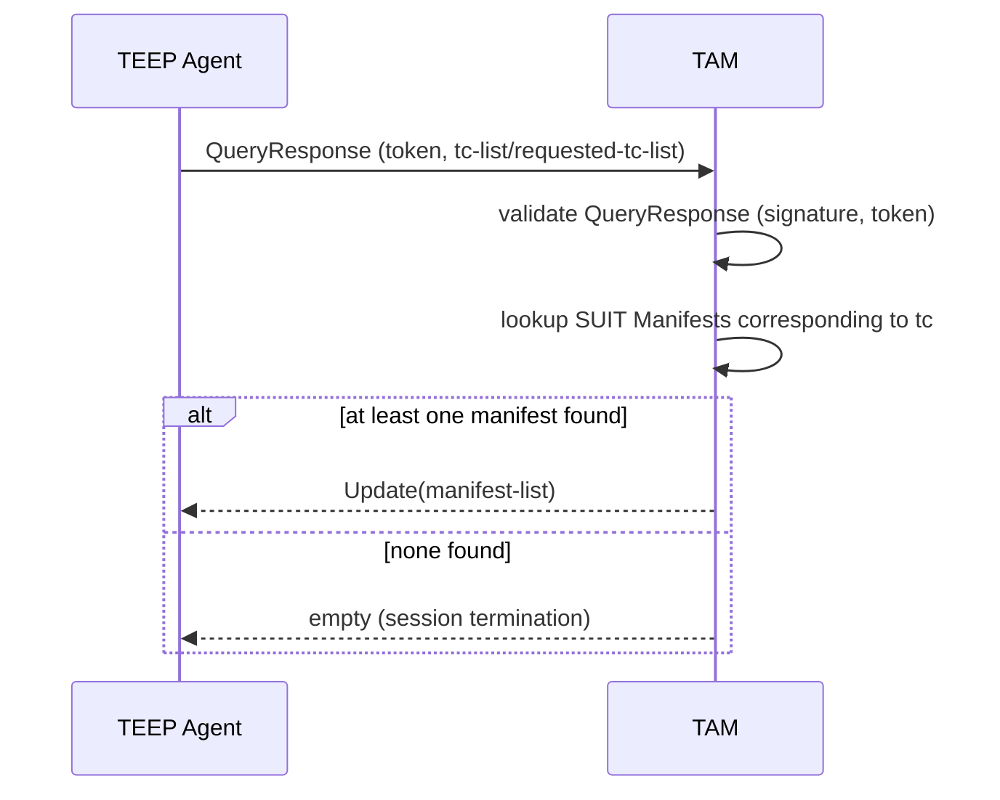
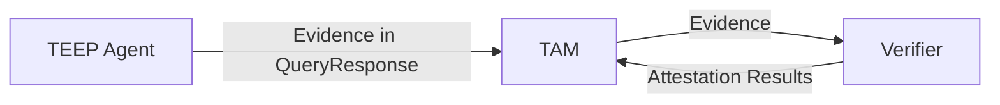
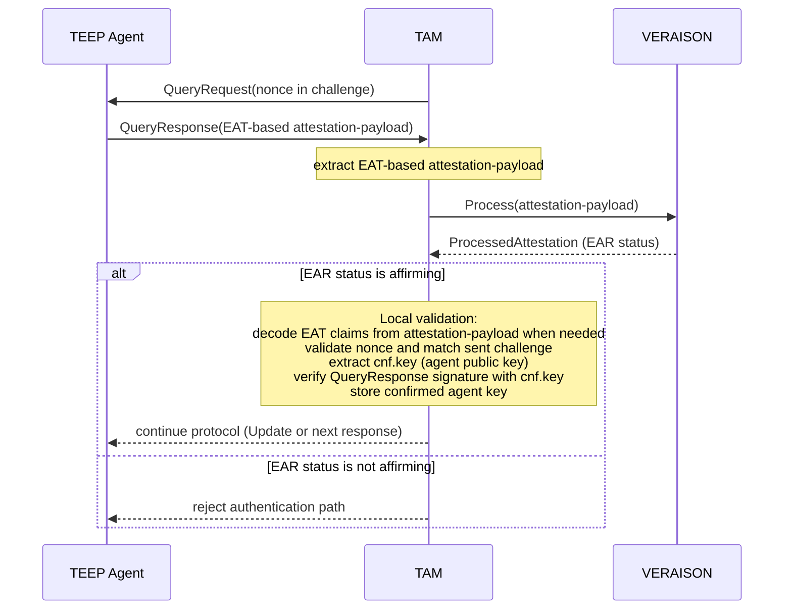
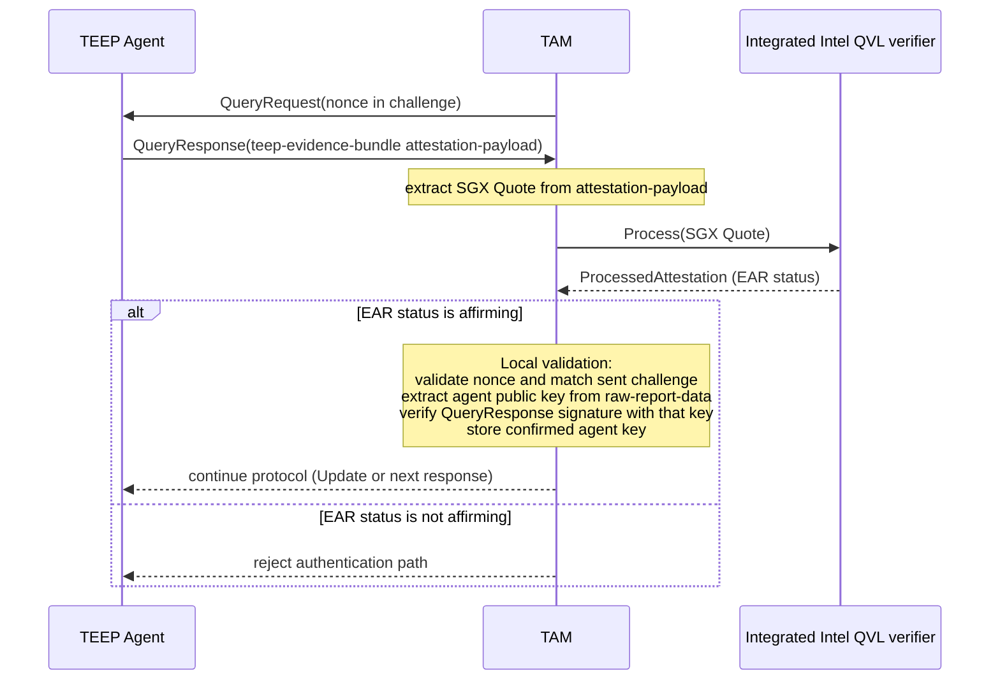
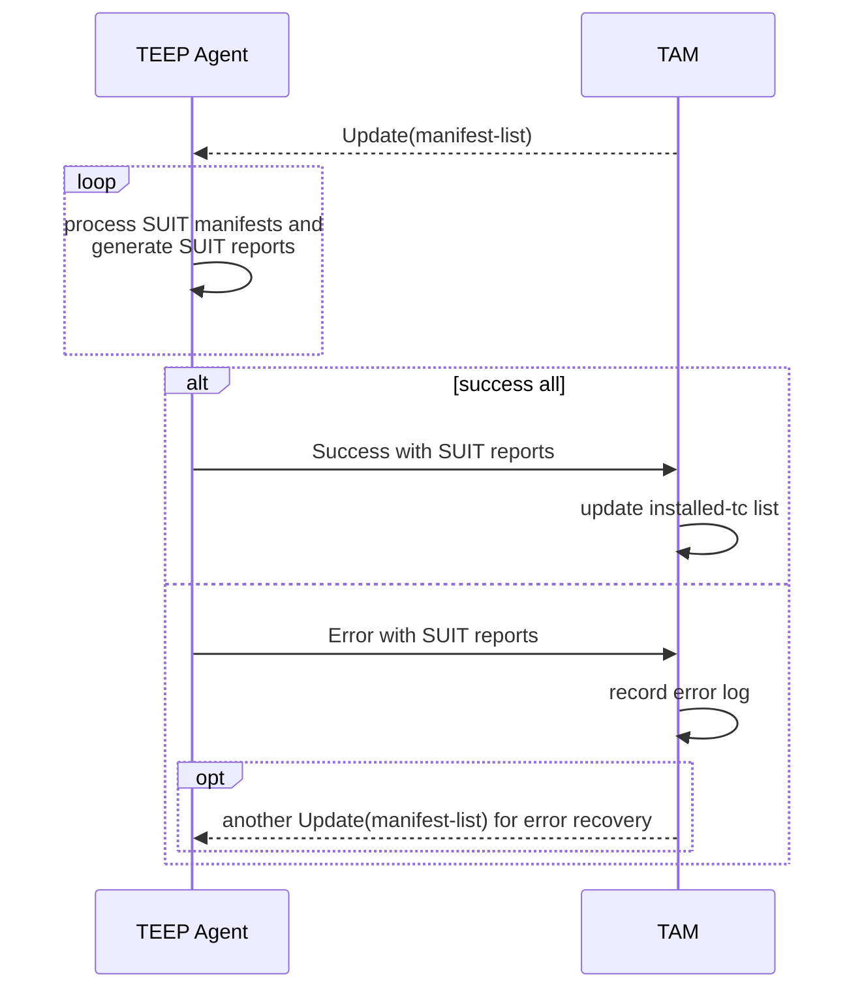

# TAM TEEP Message Handling

## TEEP Protocol Interactions Defined in Draft RFCs

[Section 3 of the TEEP Protocol draft](https://datatracker.ietf.org/doc/html/draft-ietf-teep-protocol-26#section-3) defines how TEEP Agents reply to TAM messages:


```mermaid
flowchart LR
    TAM[TAM] -- QueryRequest --> TEEPAgent[TEEP Agent]
    TEEPAgent -- QueryResponse --> TAM
    TEEPAgent -- Error --> TAM
```


```mermaid
flowchart LR
    TAM[TAM] -- Update --> TEEPAgent[TEEP Agent]
    TEEPAgent -- Success --> TAM
    TEEPAgent -- Error --> TAM
```

However, in some cases the TAM cannot initiate messages, for example:
the TEEP Agent (or the TEEP Broker) does not provide listening sockets,
the TAM cannot reach the TEEP Agent due to NAT traversal issues, etc.

[TEEP over HTTP](https://datatracker.ietf.org/doc/draft-ietf-teep-otrp-over-http) resolves this by having TAM expose an HTTP server that accepts messages from TEEP Agents:


```mermaid
flowchart LR
    TEEPAgent[TEEP Agent] -- "POST (empty)" --> TAM[TAM]
    TAM -- 200 OK: QueryRequest --> TEEPAgent
```


```mermaid
flowchart LR
    TEEPAgent[TEEP Agent] -- "POST QueryResponse" --> TAM[TAM]
    TAM -- 200 OK: Update --> TEEPAgent
```


```mermaid
flowchart LR
    TEEPAgent[TEEP Agent] -- "POST Success/Error" --> TAM[TAM]
    TAM -- 204 No Content: (empty) --> TEEPAgent
```

## Requirements for TEEP Protocol Messages from TEEP Agent

This TAM implementation enforces the following requirements for incoming `POST /tam` messages:

1. HTTP-level requirements based on [TEEP over HTTP](https://datatracker.ietf.org/doc/draft-ietf-teep-otrp-over-http):
   - Method must be `POST`.
   - `Content-Type` must be `application/teep+cbor`.
   - For the implementation limitation, body size must be within the server limit (`maxRequestBodyBytes = 1MiB`).

2. COSE security wrapper requirements based on [TEEP Protocol](https://datatracker.ietf.org/doc/html/draft-ietf-teep-protocol)
   - Non-empty messages should be wrapped with *COSE security wrapper*, especially COSE Sign1-encoded TEEP messages.
   - For the implementation optimization, this TAM requires the COSE unprotected header `kid` (label `4`) for looking up the corresponding agent public key from Agent Status Repository.
   - `kid` value should be encoded with SHA-256 [RFC 9679 COSE_Key thumbprint](https://datatracker.ietf.org/doc/html/rfc9679), and expected to be 32 bytes.

3. Correlation and replay-protection requirements of TEEP Protocol messages and Attestation Payload based on [TEEP Protocol](https://datatracker.ietf.org/doc/html/draft-ietf-teep-protocol)
   - `(QueryRequest with tc-list request, QueryResponse)` and `(Update, Success/Error)` correlation relies on one-time `token`
   - `(QueryRequest with attestation request, QueryResponse)` correlation relies on `challenge`.
   - In TEEP, `challenge` is the protocol field name and is not required to be a nonce; the protocol can allow Evidence reuse depending on deployment policy.
   - AttesTAM intentionally uses a stricter policy: it generates a fresh one-time nonce as `challenge`, requires the attestation to bind that exact value, and rejects replayed / reused Evidence.
   - Received `token` and `challenge` are marked consumed before sent-message lookup respectively.
   - A message must match a previously sent TAM message (by token/challenge); otherwise it is rejected.

4. Remote attestation fallback path (our TAM original requirement, see next section for details)
   - If QueryResponse cannot be authenticated with stored agent keys, attestation payload is required.
   - The TEEP Agent must reply on QueryRequest with attestation request and challenge, sending back QueryResponse with Evidence using `challenge`
   - The TAM asks the Verifier for an attestation result, and it must be `affirming`.
   - If the verifier client is not configured, attestation-required `POST /tam` requests fail with HTTP `503 Service Unavailable`.
   - QueryResponse signature is re-verified using the key extracted from Attestation Result.
   - Confirmed key is stored for future message authentication.

## Handling QueryResponse with tc-list

When TAM receives an authenticated `QueryResponse`, it generates `Update` from requested Trusted Components.


```mermaid
sequenceDiagram
    participant Agent as TEEP Agent
    participant TAM as TAM

    Agent->>TAM: QueryResponse (token, tc-list/requested-tc-list)
    TAM->>TAM: validate QueryResponse (signature, token)
    TAM->>TAM: lookup SUIT Manifests corresponding to tc

    alt at least one manifest found
        TAM-->>Agent: Update(manifest-list)
    else none found
        TAM-->>Agent: empty (session termination)
    end
```

Detailed behavior:
1. `QueryResponse.token` must match the token from TAM's previously sent `QueryRequest`.
2. TAM builds a unique component set from:
   - `requested-tc-list[*].component-id`
   - `tc-list[*].system-component-id`
3. For each component ID, TAM loads latest manifest (`FindLatestByTrustedComponentID`).
4. Unknown component IDs are logged and skipped (not fatal).
5. If resulting manifest list is empty, TAM returns no response body (`204` from HTTP layer).
6. If manifests exist, TAM signs an `Update`, saves sent-update metadata for later correlation, and returns it.

## Handling QueryResponse with Attestation Payload

For the TAM to securely manage the Trusted Components inside TEEs, our TAM implementation requires Remote Attestation of TEEP Agents.
The TAM wants to confirm the following points:
1. the TEEP Agent is running inside a genuine TEE
2. the TEE software including the TEEP Agent keeps integrity and authenticity
3. the TEEP Agent signing key was securely generated inside the TEE

To achieve these requirements,
the TEEP Agent requests the Attesting Environment (e.g. Intel SGX Quoting Enclave) to generate Evidence (e.g. SGX Quote) and sends it in QueryResponse message,
and the TAM requests the Verifier to verify it.


```mermaid
flowchart LR
    TEEPAgent[TEEP Agent] -- Evidence in QueryResponse --> TAM
    TAM -- Evidence --> Verifier
    Verifier -- Attestation Results --> TAM
```

> [!NOTE]
> The above chart is based on background-check model

In this section, we'll explain two verification schemes: EAT-based and Intel SGX DCAP Quote-based.
You can find the customized [VERAISON](https://github.com/kentakayama/services), and the original one is under the [VERAISON project repository](https://github.com/veraison).

### With RFC 9711 EAT + Measured Component

In this scheme, the `attestation-payload` in QueryResponse is a COSE Sign1 object whose payload is EAT (CBOR).
TAM delegates the most part of verification to VERAISON, and locally checks the claims before trusting the TEEP Agent key.

Verifier / Relying Party split in AttesTAM:
- Verifier responsibility (`VERAISON` for this path)
  - verify the authenticity of the Attesting Environment.
  - verify the integrity and appraisal result of the Evidence.
- TAM responsibility as Relying Party
  - interpret TEEP `challenge` as a one-time nonce in this implementation, even though TEEP itself does not require that policy.
  - validate that the attested TEEP Agent verifying key is the one AttesTAM should trust for this protocol exchange.
  - validate that the attested key is bound to TAM freshness (`challenge` / nonce).
  - validate that the same key signs the live `QueryResponse` message before storing it as a trusted agent key.


```mermaid
sequenceDiagram
    participant Agent as TEEP Agent
    participant TAM as TAM
    participant V as VERAISON

    TAM->>Agent: QueryRequest(nonce in challenge)
    Agent->>TAM: QueryResponse(EAT-based attestation-payload)
    note over TAM: extract EAT-based attestation-payload
    TAM->>V: Process(attestation-payload)
    V-->>TAM: ProcessedAttestation (EAR status)
    alt EAR status is affirming
        note over TAM: Local validation:<br/>decode EAT claims from attestation-payload when needed<br/>validate nonce and match sent challenge<br/>extract cnf.key (agent public key)<br/>verify QueryResponse signature with cnf.key<br/>store confirmed agent key
        TAM-->>Agent: continue protocol (Update or next response)
    else EAR status is not affirming
        TAM-->>Agent: reject authentication path
    end
```

Expected EAT/attestation inputs:
1. `eat.Nonce` (or `eat.eat_nonce`, see RFC 9711 and its errata)
   - must be present and valid.
   - must match the challenge previously sent by TAM.
   - in AttesTAM, that challenge is a one-time nonce, so reused Evidence is rejected even though the TEEP protocol term `challenge` is broader than nonce.
2. `cwt.cnf.key`
   - must contain the public key to authenticate subsequent TEEP messages.
3. `eat.ueid` (optional but recommended)
   - when available, TAM can bind agent key to device identity in persistence.

Validation layers:
1. Attestation Result appraisal layer
   - posts the Evidence in the `attestation-payload` field in the QueryResponse message to the VERAISON challenge-response endpoint.
   - confirms the Attestation Result is `affirming`.
   - if the verifier endpoint is not configured, the HTTP handler returns `503 Service Unavailable` instead of continuing the attestation flow.
2. Evidence appraisal layer
   - validates `eat.Nonce` field in EAT contains TAM's `challenge` value.
   - extracts `cwt.cnf.key` and verifies QueryResponse COSE signature using that key.
   - ensures the key carried by the attestation is the same key AttesTAM trusts for the live TEEP exchange.
3. Persistence/update layer
   - stores newly confirmed key.
   - continues normal QueryResponse handling (manifest resolution and Update generation).

For Veraison-routed formats that do not carry a TEEP Agent public key, such as `application/psa-attestation-token`, AttesTAM can still use the verifier result to confirm the challenge only when the QueryResponse was already authenticated by a previously trusted agent key. Those formats cannot establish a new TEEP Agent key because they do not provide `cwt.cnf.key`.

This two-step model avoids trusting attestation output alone: TAM also proves that the same key in EAT actually signed the live QueryResponse bound to TAM-issued freshness.

> [!NOTE]
> [Key Confirmation Claim of CWT](https://datatracker.ietf.org/doc/rfc8747/) is used by TEEP Agent to prove possession of a key.

### With Intel SGX DCAP Remote Attestation

Verifier / Relying Party split in AttesTAM:
- Verifier responsibility (`Intel QVL verifier` for this path)
  - verify that the SGX Quote has been generated by a valid SGX attesting stack rooted in Intel's certificate chain.
  - verify the integrity of the SGX Quote and return whether the Quote is appraised as acceptable.
- TAM responsibility as Relying Party
  - interpret TEEP `challenge` as a one-time nonce in this implementation and require the SGX attested material to bind that exact value.
  - verify the AttesTAM-defined `report_data` binding against the TEEP Agent's attested material.
  - recover the TEEP Agent verifying key from the AttesTAM-defined `raw-report-data` layout.
  - verify that the same recovered key signs the live `QueryResponse`.
  - store that key as trusted only after both the verifier result and the live message signature check succeed.


```mermaid
sequenceDiagram
    participant Agent as TEEP Agent
    participant TAM as TAM
    participant V as Integrated Intel QVL verifier

    TAM->>Agent: QueryRequest(nonce in challenge)
    Agent->>TAM: QueryResponse(teep-evidence-bundle attestation-payload)
    note over TAM: extract SGX Quote from attestation-payload
    TAM->>V: Process(SGX Quote)
    V-->>TAM: ProcessedAttestation (EAR status)
    alt EAR status is affirming
        note over TAM: Local validation:<br/>validate nonce and match sent challenge<br/>extract agent public key from raw-report-data<br/>verify QueryResponse signature with that key<br/>store confirmed agent key
        TAM-->>Agent: continue protocol (Update or next response)
    else EAR status is not affirming
        TAM-->>Agent: reject authentication path
    end
```

While SGX Quote format is product-specific, AttesTAM defines how the TEEP Agent's key material and freshness are bound into the Quote shown below.

```cddl
; attestation-payload content for "application/sgx-quote3-teep-bundle"

sgx-quote3-teep-bundle = [
    quote: bstr ; report_data = SHA-384(raw-report-data content)
    raw-report-data: bstr ; 32-bytes x || 32-bytes y || TAM's challenge
]
```

`report_data` in SGX Quote is opaque to the CPU, so TEEP Agents and TAM define how AttesTAM uses the 64-byte field:
1. TEEP Agent stores its generated verifying key coordinates as `x || y` in the first 64 bytes of `raw-report-data`,
2. appends the TAM challenge value to the remaining bytes of `raw-report-data`,
3. hashes `raw-report-data` with SHA-384 and stores that digest into `report_data`, and
4. stores `raw-report-data` and the SGX Quote to `attestation-payload` in QueryResponse.
5. TAM extracts the SGX Quote from `attestation-payload` and requests Intel QVL to verify the Quote, and
6. on affirming Attestation Results, TAM verifies that Quote `report_data` equals `SHA-384(raw-report-data)`, uses `raw-report-data` to recover the attested TEEP Agent public key, matches the appended nonce to the sent challenge, and verifies the QueryResponse signature with that key.

In other words, AttesTAM narrows the TEEP `challenge` semantics to nonce-style freshness for this SGX flow: the Quote-bound attested material must carry the exact fresh challenge from TAM, and an older reused Evidence object is not accepted.

## Handling TEEP Success / Error with SUIT Report

This TAM manages TEEP Agent Status and provides it to the Device Admin.
The entry is created when the agent key is validated [here](#handling-queryresponse-with-attestation-payload), and extended with SUIT Report in TEEP Success or Error messages.
[SUIT Report](https://datatracker.ietf.org/doc/html/draft-ietf-suit-report) is the processing result of SUIT Manifest generated inside TEE, so that the TAM can confirm which Trusted Components are successfully installed.


```mermaid
sequenceDiagram
    participant Agent as TEEP Agent
    participant TAM as TAM

    TAM-->>Agent: Update(manifest-list)
    loop
    Agent->>Agent: process SUIT manifests and<br/>generate SUIT reports
    end
    alt success all
    Agent->>TAM: Success with SUIT reports
    TAM->>TAM: update installed-tc list
    else
    Agent->>TAM: Error with SUIT reports
    TAM->>TAM: record error log
    opt
    TAM-->>Agent: another Update(manifest-list) for error recovery
    end
    end
```
