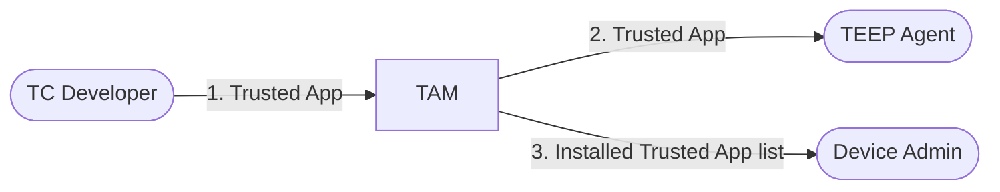

# User Manual

## Purpose
This document explains how to run `tam-over-http` and use the currently exposed APIs during local development.

## Quick Flow

1. Start TAM server (`go run ./cmd/tam-over-http -insecure-demo-mode`).
2. Start TAM admin console (`go run ./cmd/admin-console`)

## Start the Server

### Native
```bash
go run ./cmd/tam-over-http -insecure-demo-mode
```

TODO: add TAM Admin Console start up

### Docker
```bash
docker build -t tam-over-http .
docker run --rm \
  -p 8080:8080 -p 9090:9090 \
  -e TAM4WASM_INSECURE_DEMO_MODE=true \
  -e ADMIN_CONSOLE_PORT=9090 \
  -e ADMIN_CONSOLE_TAM_API_BASE=http://127.0.0.1:8080 \
  tam-over-http
```

With verifier settings:
```bash
docker run --rm \
  -p 8080:8080 -p 9090:9090 \
  -e TAM4WASM_ADDR=":8080" \
  -e TAM4WASM_CHALLENGE_SERVER="https://verifier.example.com" \
  -e TAM4WASM_CHALLENGE_CONTENT_TYPE='application/eat+cwt; eat_profile="urn:ietf:rfc:rfc9711"' \
  -e TAM4WASM_INSECURE_DEMO_MODE=true \
  -e ADMIN_CONSOLE_PORT=9090 \
  -e ADMIN_CONSOLE_TAM_API_BASE=http://127.0.0.1:8080 \
  tam-over-http
```

## TAM Admin Console User Manual

TODO: list agents, post manifest, ...

## TAM Server Command Options

`tam-over-http` accepts CLI flags (also configurable by environment variables):

| Flag | Env Var | Default | Description |
| ---- | ------- | ------- | ----------- |
| `-addr` | `TAM4WASM_ADDR` | `localhost:8080` | Listen address for the HTTP server. By default, it accepts only local (loopback) connections. To allow connections from outside the device, set `:8080`. |
| `-tam-teep-private-key-path` | `TAM4WASM_TAM_TEEP_PRIVATE_KEY_PATH` | (empty) | File path to the TAM's private key in COSE_Key format. Required unless demo mode is enabled. |
| `-insecure-demo-mode` | `TAM4WASM_INSECURE_DEMO_MODE` | `false` | Enable insecure demo mode with fixed TAM/TC keys and dummy data (not for production). |
| `-challenge-server` | `TAM4WASM_CHALLENGE_SERVER` | `https://localhost:8443` | Base URL for the verifier challenge-response endpoint. Leave empty to disable verifier submission. |
| `-challenge-content-type` | `TAM4WASM_CHALLENGE_CONTENT_TYPE` | `application/eat+cwt; eat_profile="urn:ietf:rfc:rfc9711"` | `Content-Type` used when posting attestation payloads to the verifier. |
| `-challenge-insecure-tls` | `TAM4WASM_CHALLENGE_INSECURE_TLS` | `true` | Skip TLS verification when contacting the verifier. Set `false` for stricter environments. |
| `-challenge-timeout` | `TAM4WASM_CHALLENGE_TIMEOUT` | `1m` | Timeout for verifier challenge-response interactions. |

Print live defaults with:
```bash
go run ./cmd/tam-over-http -h
```

### TAM Admin Console Command Options

TODO: move content from ADMIN_CONSOLE_USER_MANUAL.md

## TAM Server API Summary

There are four main API endpoints for TC Developer, TEEP Agent, and Device Admin:



Section | Method | Endpoint | Notes
--|--|--|--
[1](#1-get-manifest-overviews-cbor) | `GET` | `/SUITManifestService/ListManifests` | Returns SUIT manifest overviews in CBOR.
[2](#2-register-suit-manifests-delivering-trusted-components) | `POST` | `/SUITManifestService/RegisterManifest` | Registers a signed SUIT envelope.
[3](#3-get-agent-status) | `POST` | `/AgentService/GetAgentStatus` | Returns agent status in CBOR. Request body: CBOR array of agent KIDs (`[+ bstr]`).
[4](#4-update-teep-agent-status) | `POST` | `/tam` | TEEP over HTTP endpoint. Body is empty or TEEP message (COSE/CBOR).

### Prerequisites

To test the TAM Server directly, you need these commands below:

- `curl` for API calls (or any other HTTP client)
- [`cbor-diag`](https://rubygems.org/gems/cbor-diag/) (or equivalent CBOR diagnostic tool) for readable output

### 1) Get Manifest Overviews (CBOR)

```bash
curl -X GET http://localhost:8080/SUITManifestService/ListManifests \
  -H "Accept: application/cbor" -s | cbor2diag.rb
```

Example output (formatted for readability):
```cbor-diag
[
  [
    / component: / << ['hello.txt'] >>,
    / manifest-sequence-number: / 0
  ]
]
```

### 2) Register SUIT Manifests Delivering Trusted Components

To securely deliver Trusted Components to a TEEP Agent, [TEEP Protocol](https://datatracker.ietf.org/doc/html/draft-ietf-teep-protocol) uses [SUIT Manifest](https://datatracker.ietf.org/doc/html/draft-ietf-suit-manifest), a concise format for software update instructions.
A SUIT Manifest tells the TEEP Agent how to fetch and verify Trusted Component binaries, who created the manifest (and often the Trusted Component), and what dependencies exist.

For TC Developers, the TAM provides the `/SUITManifestService/RegisterManifest` endpoint, which accepts signed SUIT Manifests.

There is an example SUIT Manifest [text.1.envelope.diag](./examples/text.1.envelope.diag) signed with the demo purpose key to be accepted by the TAM.
You can post it with the following command from the repository root:
```bash
curl -X POST http://localhost:8080/SUITManifestService/RegisterManifest \
  -H "Content-Type: application/suit-envelope+cose" \
  --data-binary "@./doc/examples/text.1.envelope.cbor"
```

Example output:
```
OK
```

Now the SUIT Manifest Store is updated:

```bash
curl -X GET http://localhost:8080/SUITManifestService/ListManifests \
  -H "Accept: application/cbor" -s | cbor2diag.rb
```

Example output (formatted for readability):
```cbor-diag
[
  [
    / component: / << ['hello.txt'] >>,
    / manifest-sequence-number: / 1
  ]
]
```

For protocol details, see [`SUIT_MANIFEST_REPOSITORY.md`](./SUIT_MANIFEST_REPOSITORY.md).

> [!NOTE]
> If you want to register your own SUIT Manifest, the manifest signing key must be registered in advance.

### 3) Get Agent Status

Prepare a CBOR request body that contains an array of KIDs:

```bash
echo "['dummy-teep-agent-kid-for-dev-123']" | diag2cbor.rb > /tmp/agent-kids.cbor
```

```bash
curl -X POST http://localhost:8080/AgentService/GetAgentStatus \
  -H "Accept: application/cbor" \
  -H "Content-Type: application/cbor" \
  --data-binary "@/tmp/agent-kids.cbor" -s | cbor2diag.rb
```

The output is equivalent to:
```cbor-diag
[
  [
    'dummy-teep-agent-kid-for-dev-123',
    {
      / attributes / 1: {256: h'016275696C64696E672D6465762D313233'},
      / installed-tc / 2: [
        [<< ['hello.txt'] >>, 0]
      ]
    }
  ]
]
```

### 4) Update TEEP Agent Status

This requires a TEEP Agent implementation that communicates with the `/tam` endpoint.
See [`TEEP_MESSAGE_HANDLE.md`](./TEEP_MESSAGE_HANDLE.md), [TEEP Protocol](https://datatracker.ietf.org/doc/html/draft-ietf-teep-protocol), and [TEEP over HTTP](https://datatracker.ietf.org/doc/html/draft-ietf-teep-otrp-over-http).
For working examples, reference `TestTAMResolveTEEPMessage_AgentAttestation_OK` and `TestTAMResolveTEEPMessage_AgentUpdate_OK` in [`../internal/tam/tam_test.go`](../internal/tam/tam_test.go).

One implementation is [SGX-based Implementation of a TEEP Agent](https://github.com/yuma-nishi/sgx-teep-agent), so consider trying it.

## Planned Management APIs

Planned: add API endpoints to manage entities, keys, and related resources.

## Run Tests

Basic tests:
```bash
go test ./...
```

Integration tests with VERAISON (you need to run VERAISON on localhost):
```bash
go test -tags=integration ./...
```

Equivalent Make targets:
```bash
make test
make test-integrated
```

## Troubleshooting

- `415 Unsupported Media Type`:
  - check request headers (`Content-Type` for `POST`; `Accept` is required for both `GET` and `POST /AgentService/GetAgentStatus`).
- `400 Bad Request` on `/SUITManifestService/RegisterManifest`:
  - verify SUIT envelope encoding and signature.
  - verify signer key is pre-registered in TAM.
- Unexpected `204 No Content`:
  - current admin/manifests behavior is demo-oriented and may return no content when no matching records are found.
