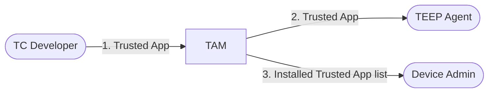

# User Manual

## Purpose
This document explains how to start the AttesTAM server (`cmd/attestam`) and the AttesTAM Console server (`admin-console`), and how to use the AttesTAM Console UI.

## Quick Flow (for Demo)

### Docker

1. Start both AttesTAM and the TAM Admin Console with Docker.
2. Open `http://127.0.0.1:9090` in a browser.
3. Use the admin console to inspect managed devices / TCs and register manifests.

### Native

1. Start AttesTAM server (`go run ./cmd/attestam -insecure-demo-mode`).
2. Start AttesTAM Console server (`go run ./cmd/admin-console`).
3. Open `http://127.0.0.1:9090` in a browser.
4. Use the AttesTAM Console to inspect managed devices / TCs and register manifests.

## Prerequisites

- Go toolchain (`go run`)
- Browser (Chrome/Safari/Firefox, etc.)

## Start with Docker

The Docker image starts both the AttesTAM server and the TAM Admin Console in one container.

```bash
docker build -t attestam .
docker run --rm \
  -p 8080:8080 -p 9090:9090 \
  -e ATTESTAM_INSECURE_DEMO_MODE=true \
  -e ATTESTAM_DB_PATH=tam_state.db \
  -e ADMIN_CONSOLE_PORT=9090 \
  -e ADMIN_CONSOLE_TAM_API_BASE=http://127.0.0.1:8080 \
  attestam
```

This starts:

- AttesTAM server on `http://127.0.0.1:8080`
- TAM Admin Console on `http://127.0.0.1:9090`

This default image configuration also sets `ATTESTAM_CHALLENGE_SERVER=https://localhost:8443`, so attestation verification expects a verifier reachable from inside the container.

With verifier settings:
```bash
docker run --rm \
  --net=host \
  -e ATTESTAM_ADDR=":8080" \
  -e ATTESTAM_CHALLENGE_SERVER="https://localhost:8443" \
  -e ATTESTAM_CHALLENGE_CONTENT_TYPE='application/eat+cwt; eat_profile="urn:ietf:rfc:rfc9711"' \
  -e ATTESTAM_INSECURE_DEMO_MODE=true \
  -e ADMIN_CONSOLE_PORT=9090 \
  -e ADMIN_CONSOLE_TAM_API_BASE=http://127.0.0.1:8080 \
  attestam
```

`--net=host` is used here so the container can reach a verifier running on `https://localhost:8443` on the host.

## Start Natively

### Start the AttesTAM Server

```bash
go run ./cmd/attestam -insecure-demo-mode
```

The SQLite state database defaults to `tam_state.db` in the current working directory. Override it with `-db-path` or `ATTESTAM_DB_PATH` when you want the server state elsewhere.

Example:
```bash
ATTESTAM_DB_PATH=/var/lib/attestam/tam_state.db go run ./cmd/attestam -insecure-demo-mode
```

### Start the AttesTAM Server with Intel QVL

To enable Intel QVL support in a native run, AttesTAM must be built with both cgo and the `intel_qvl` build tag:

```bash
make run-demo-qvl
```

This target runs:

```bash
CGO_ENABLED=1 go run -tags=intel_qvl ./cmd/attestam -insecure-demo-mode
```

> [!NOTE]
> `intel_qvl` support depends on the native Intel DCAP quote verification library (`sgx_dcap_quoteverify`).
> If `make run-demo-qvl` fails at link time or startup, ensure the library is installed and reachable from your shell environment.
> On Debian/Ubuntu systems, install it first with:
>
> ```bash
> sudo apt-get update
> sudo apt-get install -y libsgx-dcap-quote-verify-dev
> ```
>
> Depending on your system, you may need to export `LD_LIBRARY_PATH` so the dynamic loader can find it.

Example:

```bash
LD_LIBRARY_PATH=/usr/lib/x86_64-linux-gnu make run-demo-qvl
```

AttesTAM does not use Intel QVL for every attestation. The QVL backend is selected only when the incoming `QueryResponse.attestation-payload-format` is `application/sgx-quote3-teep-bundle`.

### AttesTAM Server Command Options

The AttesTAM server (`cmd/attestam`) accepts CLI flags (also configurable by environment variables).

| Flag | Env Var | Default | Description |
| ---- | ------- | ------- | ----------- |
| `-addr` | `ATTESTAM_ADDR` | `localhost:8080` | Listen address for the HTTP server. By default, it accepts only local (loopback) connections. To allow connections from outside the device, set `:8080`. |
| `-tam-teep-private-key-path` | `ATTESTAM_TAM_TEEP_PRIVATE_KEY_PATH` | (empty) | File path to the TAM's private key in COSE_Key format. Required unless demo mode is enabled. |
| `-db-path` | `ATTESTAM_DB_PATH` | `tam_state.db` | File path to the SQLite state database. Relative paths are resolved from the current working directory. |
| `-insecure-demo-mode` | `ATTESTAM_INSECURE_DEMO_MODE` | `false` | Enable insecure demo mode with the public insecure demo TAM key, demo TC Developer key, and demo seed data (not for production). |
| `-challenge-server` | `ATTESTAM_CHALLENGE_SERVER` | `https://localhost:8443` | Base URL for the verifier challenge-response endpoint. If set to an empty string, requests that require attestation verification return HTTP `503 Service Unavailable`. |
| `-challenge-content-type` | `ATTESTAM_CHALLENGE_CONTENT_TYPE` | `application/eat+cwt; eat_profile="urn:ietf:rfc:rfc9711"` | `Content-Type` used when posting attestation payloads to the verifier. |
| `-challenge-insecure-tls` | `ATTESTAM_CHALLENGE_INSECURE_TLS` | `true` | Skip TLS verification when contacting the verifier. Set `false` for stricter environments. |
| `-challenge-timeout` | `ATTESTAM_CHALLENGE_TIMEOUT` | `1m` | Timeout for verifier challenge-response interactions. |

> [!WARNING]
> The insecure demo TAM private key is public and is embedded only for explicit demo/test flows.
> If `-insecure-demo-mode` is `false`, AttesTAM refuses to start unless `-tam-teep-private-key-path` or `ATTESTAM_TAM_TEEP_PRIVATE_KEY_PATH` is set.

Print live defaults with:
```bash
go run ./cmd/attestam -h
```

## Start the AttesTAM Console Server

Start the AttesTAM Console in another terminal:
```bash
go run ./cmd/admin-console
```

If TAM is not running on the default endpoint, set the console's TAM API base URL explicitly:
```bash
go run ./cmd/admin-console --port=9090 --tam-api-base=http://127.0.0.1:8080/
```

If you want to inspect AttesTAM Console <-> AttesTAM API traffic on the CLI:
```bash
go run ./cmd/admin-console --tam-api-base=http://127.0.0.1:8080/ --tam-api-debug
```
`--tam-api-debug` logs request and response headers and bodies to stderr. For `Register TC`, the uploaded manifest body is not printed; the log shows the uploaded filename instead.

### AttesTAM Console Command Options

Use command-line flags:

| Setting | Flag | Default | Description |
| ---- | ---- | ---- | ---- |
| Listen port | `--port` | `9090` | HTTP port for AttesTAM Console |
| TAM API base URL | `--tam-api-base` | `http://127.0.0.1:8080/` | AttesTAM Console calls TAM APIs for device/manifest listing and manifest upload |
| TAM API debug log | `--tam-api-debug` | `false` | Log AttesTAM API request/response details to stderr; `Register TC` request body is replaced by the uploaded filename |

Example:

```bash
go run ./cmd/admin-console --port=9090 --tam-api-base=http://127.0.0.1:8080/
```

## Admin Console Usage


### View Managed Devices

- Click `View Managed Devices` in the sidebar.
- Agent table is loaded from `GET /console/view-managed-devices`.
- `Agent KID` is displayed as a Base64URL string without padding.
- Click an `Agent KID` row to open the detail panel.
- Detail panel shows installed TC list (`name`, `version`) for the selected agent.
- Clicking the selected agent again closes the detail panel.

### View Managed TCs

- Click `View Managed TCs`.
- Manifest table is loaded from `GET /console/view-managed-tcs`.
- Columns:
  - `TC Name`
  - `Version`

### Register TC

- Click `Register TC`.
- Select a file and click `Upload`.
- Browser sends `multipart/form-data` to `POST /console/register-tc`.
- On success, UI displays `Upload complete.` and refreshes manifest list.
- When admin-console is started with `--tam-api-debug`, the relay log for AttesTAM `RegisterManifest` shows the uploaded filename instead of the binary request body.

## TAM Server API Summary

There are five main API endpoints for TC Developer, TEEP Agent, and Device Admin:


```mermaid
flowchart LR
    TCDeveloper([TC Developer]) -- 1. Trusted App--> TAM
    TAM -- 2. Trusted App --> TEEPAgent([TEEP Agent])
    TAM -- 3. Installed Trusted App list --> DeviceAdmin([Device Admin])
```

Section | Method | Endpoint | Notes
--|--|--|--
[1](#1-get-manifest-overviews-cbor) | `GET` | `/SUITManifestService/ListManifests` | Returns SUIT manifest overviews in CBOR.
[2](#2-register-suit-manifests-delivering-trusted-components) | `POST` | `/SUITManifestService/RegisterManifest` | Registers a signed SUIT envelope.
[3](#3-get-agent-list) | `GET` | `/AgentService/ListAgents` | Returns agent list in CBOR.
[4](#4-get-agent-status) | `POST` | `/AgentService/GetAgentStatus` | Returns agent status in CBOR. Request body: CBOR array of agent KIDs (`[+ bstr]`).
[5](#5-update-teep-agent-status) | `POST` | `/tam` | TEEP over HTTP endpoint. Body is empty or TEEP message (COSE/CBOR).

### Prerequisites

To test the TAM Server directly, you need these commands below:

- `curl` for API calls (or any other HTTP client)
- [`cbor-diag`](https://rubygems.org/gems/cbor-diag/) (or equivalent CBOR diagnostic tool) for readable output

### 1) Get Manifest Overviews (CBOR)

```bash
curl -X GET http://localhost:8080/SUITManifestService/ListManifests \
  -H "Accept: application/cbor" -s | cbor2diag.rb
```

Example output (formatted for readability):
```cbor-diag
[
  [
    / component: / << ['hello.txt'] >>,
    / manifest-sequence-number: / 0
  ]
]
```

### 2) Register SUIT Manifests Delivering Trusted Components

To securely deliver Trusted Components to a TEEP Agent, [TEEP Protocol](https://datatracker.ietf.org/doc/html/draft-ietf-teep-protocol) uses [SUIT Manifest](https://datatracker.ietf.org/doc/html/draft-ietf-suit-manifest), a concise format for software update instructions.
A SUIT Manifest tells the TEEP Agent how to fetch and verify Trusted Component binaries, who created the manifest (and often the Trusted Component), and what dependencies exist.

For TC Developers, the TAM provides the `/SUITManifestService/RegisterManifest` endpoint, which accepts signed SUIT Manifests.

There is an example SUIT Manifest [text.1.envelope.diag](./examples/manifests/text.1.envelope.diag) signed with the demo purpose key to be accepted by the TAM.
You can post it with the following command from the repository root:
```bash
curl -X POST http://localhost:8080/SUITManifestService/RegisterManifest \
  -H "Content-Type: application/suit-envelope+cose" \
  --data-binary "@./doc/examples/manifests/text.1.envelope.cbor"
```

Example output:
```
OK
```

Now the SUIT Manifest Store is updated:

```bash
curl -X GET http://localhost:8080/SUITManifestService/ListManifests \
  -H "Accept: application/cbor" -s | cbor2diag.rb
```

Example output (formatted for readability):
```cbor-diag
[
  [
    / component: / << ['hello.txt'] >>,
    / manifest-sequence-number: / 1
  ]
]
```

For protocol details, see [`SUIT_MANIFEST_REPOSITORY.md`](./SUIT_MANIFEST_REPOSITORY.md).

> [!NOTE]
> If you want to register your own SUIT Manifest, the manifest signing key must be registered in advance.

### 3) Get Agent List

Get Agent list with the following command:

```bash
curl -X GET http://localhost:8080/AgentService/ListAgents \
  -H "Accept: application/cbor" -s | cbor2diag.rb
```

You will get some `[agent kid in bytes, last updated integer]` data array, and you can get their details with the next API.

### 4) Get Agent Status

Here let's get the agent status with kid `h'76E9A6CBEB5E7A9F9A81E9EDFA489DFA87FE6EE8A57629E0F9D7AFFB5DB7FB4D'` (with base64url encode, this is `"dummy-teep-agent-kid-of-building-dev-123-00"`).

```bash
echo "[h'76E9A6CBEB5E7A9F9A81E9EDFA489DFA87FE6EE8A57629E0F9D7AFFB5DB7FB4D']" | diag2cbor.rb > /tmp/agent-kids.cbor
```

```bash
curl -X POST http://localhost:8080/AgentService/GetAgentStatus \
  -H "Accept: application/cbor" \
  -H "Content-Type: application/cbor" \
  --data-binary "@/tmp/agent-kids.cbor" -s | cbor2diag.rb
```

The output is equivalent to:
```cbor-diag
[
  [
    h'76E9A6CBEB5E7A9F9A81E9EDFA489DFA87FE6EE8A57629E0F9D7AFFB5DB7FB4D',
    {
      / attributes / 1: {256: h'016275696C64696E672D6465762D313233'},
      / installed-tc / 2: [
        [<< ['hello.txt'] >>, 0]
      ]
    }
  ]
]
```

### 5) Update TEEP Agent Status

This requires a TEEP Agent implementation that communicates with the `/tam` endpoint.
See [`TEEP_MESSAGE_HANDLE.md`](./TEEP_MESSAGE_HANDLE.md), [TEEP Protocol](https://datatracker.ietf.org/doc/html/draft-ietf-teep-protocol), and [TEEP over HTTP](https://datatracker.ietf.org/doc/html/draft-ietf-teep-otrp-over-http).
For working examples, reference `TestTAMResolveTEEPMessage_AgentAttestation_OK` and `TestTAMResolveTEEPMessage_AgentUpdate_OK` in [`../internal/tam/tam_test.go`](../internal/tam/tam_test.go).

One implementation is [SGX-based Implementation of a TEEP Agent](https://github.com/yuma-nishi/taws), so consider trying it.
